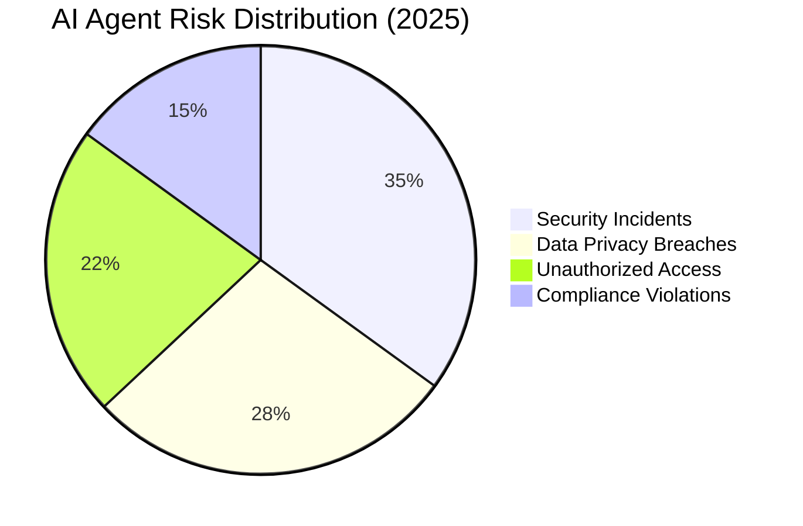
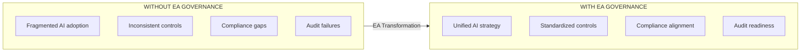

# The Hidden Compliance Crisis: Why AI-Generated Code Demands Enterprise Architecture Governance

  

    PUBLISHED
    January 27, 2026
  

  

    AUTHOR
    Nilay Parikh
  

  

    READ TIME
    15 minutes
  

  

    CATEGORY
    Governance & Compliance
  

---

> **"80% of organizations have encountered risky behaviors from AI agents, including improper data exposure and unauthorized access to sensitive systems."**
> — <a href="https://www.pwc.com/us/en/industries/tmt/library/trust-and-safety-outlook/rise-and-risks-of-agentic-ai.html" target="_blank" rel="noopener">PwC Trust and Safety Outlook, 2025</a>

The enterprise software development landscape is undergoing a seismic shift. AI coding assistants have moved from experimental curiosities to production tools embedded in every major IDE. According to <a href="https://www.mckinsey.com/capabilities/quantumblack/our-insights/the-state-of-ai" target="_blank" rel="noopener">McKinsey's 2025 State of AI Report</a>, generative AI adoption in software development has reached unprecedented levels, with organizations reporting significant productivity gains. But beneath these efficiency metrics lies a growing crisis that few organizations have adequately addressed: **compliance**.

This article examines why AI-generated code poses existential risks to regulatory compliance across every major framework—from PCI-DSS to SOX, HIPAA to GDPR—and why only mature Enterprise Architecture (EA) design principles can bridge the governance gap.

---

## Table of Contents

1. [The Scale of the Problem](#the-scale-of-the-problem)
2. [Understanding AI Agent Risks in Development](#understanding-ai-agent-risks-in-development)
3. [The Compliance Framework Challenge](#the-compliance-framework-challenge)
4. [PCI-DSS: When AI Writes Payment Code](#pci-dss-when-ai-writes-payment-code)
5. [SOX: Internal Controls Meet Autonomous Agents](#sox-internal-controls-meet-autonomous-agents)
6. [HIPAA: Protected Health Information at Risk](#hipaa-protected-health-information-at-risk)
7. [GDPR: Privacy by Design Requires Human Design](#gdpr-privacy-by-design-requires-human-design)
8. [ISO 27001: Secure Development Lifecycle Gaps](#iso-27001-secure-development-lifecycle-gaps)
9. [FDA 21 CFR Part 11: Regulated Software Industries](#fda-21-cfr-part-11-regulated-software-industries)
10. [DORA: Financial Services Operational Resilience](#dora-financial-services-operational-resilience)
11. [Global Compliance Landscape: Beyond Europe and US](#global-compliance-landscape-beyond-europe-and-us)
12. [The Case for Enterprise Architecture Governance](#the-case-for-enterprise-architecture-governance)
13. [Building Mature AI Development Principles](#building-mature-ai-development-principles)
14. [Conclusion: The Path Forward](#conclusion-the-path-forward)
15. [References](#references)

---

## The Scale of the Problem

The adoption of AI coding agents has outpaced the development of governance frameworks to manage them. Consider these statistics from leading research organizations:

| Statistic                                                            | Source                                                                                                                                                                            |
| -------------------------------------------------------------------- | --------------------------------------------------------------------------------------------------------------------------------------------------------------------------------- |
| **80%** of organizations encountered risky AI agent behaviors        | <a href="https://www.pwc.com/us/en/industries/tmt/library/trust-and-safety-outlook/rise-and-risks-of-agentic-ai.html" target="_blank" rel="noopener">PwC, 2025</a>                |
| **97%** of AI breach victims lack proper access controls             | <a href="https://www.knostic.ai/blog/ai-governance-statistics" target="_blank" rel="noopener">Knostic AI Governance Report, 2025</a>                                              |
| **45%** of enterprises run AI agents with access to critical systems | <a href="https://www.obsidiansecurity.com/blog/ai-agent-market-landscape" target="_blank" rel="noopener">Obsidian Security, 2025</a>                                              |
| **Only 20%** of companies have AI risk policies                      | <a href="https://www.insight.com/en_US/content-and-resources/blog/the-truth-about-ai-agent-risks-and-what-to-do-about-them.html" target="_blank" rel="noopener">Insight, 2025</a> |
| **85%** of AI projects fail to deliver business value                | <a href="https://medium.com/@shaowngp/why-over-85-of-ai-projects-fail-and-how-to-turn-the-tide-8058069b2d37" target="_blank" rel="noopener">Industry Analysis, 2025</a>           |
| **Over 40%** of agentic AI projects predicted to be canceled by 2027 | <a href="https://www.klover.ai/ai-agents-in-enterprise-market-survey-mckinsey-pwc-deloitte-gartner" target="_blank" rel="noopener">Gartner via Klover AI, 2025</a>                |

Perhaps most alarming: **33% of workers admit to pasting sensitive client or company data into external AI platforms**, creating data leakage vectors that bypass every traditional security control.

---

## Understanding AI Agent Risks in Development

AI agents in software development introduce risk categories that traditional security frameworks were never designed to address. The <a href="https://airc.nist.gov/" target="_blank" rel="noopener">NIST AI Risk Management Framework</a> identifies core characteristics of AI systems that create unique governance challenges:

### The Autonomy Problem

Unlike traditional tools, AI coding agents operate with degrees of autonomy. They don't simply execute instructions—they interpret context, generate novel solutions, and make decisions about code structure and implementation. This autonomy creates:

1. **Attribution gaps** - Who authored the code: the developer, the AI, or both?
2. **Traceability breaks** - Traditional audit trails assume human authorship
3. **Review bypasses** - Speed of AI generation can outpace human review capacity
4. **Knowledge boundaries** - AI may not understand regulatory constraints

### Third-Party Risk Amplification

According to <a href="https://mitsloan.mit.edu/ideas-made-to-matter/third-party-ai-tools-pose-increasing-risks-organizations" target="_blank" rel="noopener">MIT Sloan research</a>, **55% of all AI failures stem from third-party tools**. When AI coding assistants become embedded in development workflows:

- Training data provenance becomes your compliance concern
- Model updates can silently change code generation behavior
- Data sent to cloud-based AI services may violate data residency requirements
- Vendor security posture directly impacts your compliance posture

### The Shadow AI Crisis

<a href="https://hbr.org/2025/06/organizations-arent-ready-for-the-risks-of-agentic-ai" target="_blank" rel="noopener">Harvard Business Review</a> warns that organizations "aren't ready for the risks of agentic AI." Shadow AI—unauthorized use of AI tools by developers—creates compliance blind spots:

- Developers install browser extensions or IDE plugins without approval
- Code generated by unapproved tools enters production systems
- Compliance teams have no visibility into AI-assisted changes
- Audit evidence becomes unreliable

---

## The Compliance Framework Challenge

Every major compliance framework was designed under a fundamental assumption: **humans write and review code**. This assumption is now obsolete.

```mermaid
flowchart TD
    subgraph Traditional["TRADITIONAL MODEL"]
        H1["Human Developer"] --> C1["Code Written"]
        C1 --> R1["Human Review"]
        R1 --> A1["Audit Trail"]
        A1 --> CM1["Compliance Evidence"]
    end

    subgraph AI["AI-ASSISTED MODEL"]
        H2["Human Developer"] --> AI2["AI Agent"]
        AI2 --> C2["Code Generated"]
        C2 --> R2["Human Review?"]
        R2 -.->|Gap| A2["Attribution?"]
        A2 -.->|Gap| CM2["Compliance?"]
    end

    style R2 fill:#ff9999,stroke:#ff0000
    style A2 fill:#ff9999,stroke:#ff0000
    style CM2 fill:#ff9999,stroke:#ff0000
```

The challenge isn't that compliance is impossible with AI—it's that **existing compliance interpretations assume manual processes that AI disrupts**.

---

## PCI-DSS: When AI Writes Payment Code

The <a href="https://www.pcisecuritystandards.org/" target="_blank" rel="noopener">PCI Security Standards Council</a> maintains the Payment Card Industry Data Security Standard (PCI-DSS), the global standard for organizations handling cardholder data. PCI-DSS v4.0, effective March 2024, introduced significant changes that intersect directly with AI-generated code concerns.

### Relevant Requirements

| Requirement | Description                                                    | AI Risk                                       |
| ----------- | -------------------------------------------------------------- | --------------------------------------------- |
| **6.2.1**   | Bespoke and custom software are developed securely             | AI may generate insecure patterns             |
| **6.2.2**   | Software development personnel trained in secure coding        | Does training cover AI tool usage?            |
| **6.2.3**   | Bespoke software reviewed prior to release                     | Review must cover AI-generated code           |
| **6.2.4**   | Software engineering techniques prevent common vulnerabilities | AI may reintroduce known vulnerabilities      |
| **6.3.1**   | Security vulnerabilities identified and addressed              | AI-generated vulnerabilities harder to detect |
| **6.3.2**   | Inventory of custom software                                   | AI complicates software inventory             |

### The PCI-DSS AI Gap

PCI-DSS requires that **"bespoke and custom software is developed securely"** (Requirement 6.2.1). But what constitutes "development" when an AI agent generates 40% of the code?

The <a href="https://blog.pcisecuritystandards.org/the-ai-exchange-innovators-in-payment-security-featuring-jscrambler" target="_blank" rel="noopener">PCI SSC's AI Exchange blog series</a> has begun exploring how AI impacts payment security, but **no formal guidance exists** on AI code generation in payment environments.

Key compliance gaps include:

1. **Secure Coding Training (6.2.2)**: Training requirements don't address AI tool proficiency
2. **Code Review (6.2.3)**: Review processes may not adequately assess AI-generated code
3. **Vulnerability Management (6.3)**: AI may generate code with subtle vulnerabilities that pass initial review
4. **Software Inventory (6.3.2)**: Tracking AI contributions to custom software is complex

### Risk Scenario

Consider a fintech company using AI coding assistants to accelerate development of payment processing modules. The AI generates code that:

- Logs transaction data at debug level (potentially exposing PAN in logs)
- Uses deprecated encryption functions from training data
- Implements retry logic that could create duplicate charges
- Stores temporary card data in memory longer than necessary

Each of these patterns could result in PCI-DSS non-compliance and potential breach.

---

## SOX: Internal Controls Meet Autonomous Agents

The <a href="https://www.sec.gov/spotlight/sarbanes-oxley.htm" target="_blank" rel="noopener">Sarbanes-Oxley Act (SOX)</a>, administered by the U.S. Securities and Exchange Commission, requires public companies to maintain internal controls over financial reporting. Section 404 specifically mandates management assessment of these controls.

### IT General Controls Under SOX

SOX compliance relies heavily on IT General Controls (ITGCs), which include:

| Control Area              | Purpose                                                      | AI Risk                                              |
| ------------------------- | ------------------------------------------------------------ | ---------------------------------------------------- |
| **Change Management**     | Ensure changes are authorized, tested, approved              | AI generates changes that may bypass formal approval |
| **Access Controls**       | Limit system access to authorized personnel                  | AI agents may have excessive permissions             |
| **Segregation of Duties** | Prevent single individuals from controlling entire processes | AI may combine roles that should be separated        |
| **Audit Trails**          | Maintain evidence of control operation                       | AI attribution creates audit gaps                    |

### The Material Weakness Problem

Under <a href="https://pcaobus.org/oversight/standards/auditing-standards/details/AS2201" target="_blank" rel="noopener">PCAOB Auditing Standard 2201</a>, a **material weakness** exists when there is a reasonable possibility that a material misstatement would not be prevented or detected on a timely basis.

AI-generated code in financially significant systems creates material weakness risk when:

- Changes to financial calculation logic aren't properly documented
- AI-generated code affects revenue recognition, expense calculation, or reporting
- Audit trails cannot definitively attribute code changes to authorized personnel
- Testing evidence doesn't specifically validate AI-generated components

### SEC Disclosure Requirements

According to <a href="https://www.knostic.ai/blog/ai-governance-statistics" target="_blank" rel="noopener">recent analysis</a>, **76% of S&P 500 firms expanded AI-risk disclosures in their 2025 10-K filings**. This indicates growing board-level awareness that AI risks are material to investors.

Organizations must now consider:

- Whether AI coding tools pose material risks requiring disclosure
- How AI usage affects ICFR (Internal Control over Financial Reporting)
- What controls exist over AI tool deployment in development environments

---

## HIPAA: Protected Health Information at Risk

The <a href="https://www.hhs.gov/hipaa/for-professionals/security/index.html" target="_blank" rel="noopener">HIPAA Security Rule</a> (45 CFR Part 164) requires covered entities and business associates to implement safeguards protecting electronic Protected Health Information (ePHI).

### Security Rule Requirements

| Requirement            | Citation              | AI Implication                                 |
| ---------------------- | --------------------- | ---------------------------------------------- |
| **Risk Analysis**      | §164.308(a)(1)(ii)(A) | Must assess AI-introduced risks                |
| **Risk Management**    | §164.308(a)(1)(ii)(B) | Must implement measures to reduce AI risks     |
| **Workforce Training** | §164.308(a)(5)        | Training must cover AI tool security           |
| **Audit Controls**     | §164.312(b)           | Must log AI-related system activity            |
| **Access Controls**    | §164.312(a)(1)        | Must control AI access to ePHI                 |
| **Integrity Controls** | §164.312(c)(1)        | AI-generated code must preserve data integrity |

### The ePHI Exposure Risk

AI coding assistants in healthcare development environments create multiple exposure vectors:

1. **Training Data Leakage**: Developers may paste ePHI into AI prompts for debugging
2. **Code Suggestion Risks**: AI may generate code patterns that insufficiently protect PHI
3. **Third-Party Transmission**: Cloud-based AI services may receive PHI-containing code
4. **Inadequate Validation**: AI-generated HIPAA compliance features may be incomplete

### HHS OCR Enforcement Trends

The HHS Office for Civil Rights (OCR) has increasingly focused on technical safeguards in enforcement actions. Organizations that cannot demonstrate adequate controls over AI tool usage in PHI-handling systems face significant enforcement risk.

<a href="https://www.nist.gov/privacy-framework" target="_blank" rel="noopener">NIST Special Publication 800-66 Rev. 2</a> provides implementation guidance for HIPAA but does not yet specifically address AI code generation—creating an interpretation gap organizations must navigate.

---

## GDPR: Privacy by Design Requires Human Design

The <a href="https://gdpr.eu/" target="_blank" rel="noopener">General Data Protection Regulation (GDPR)</a> establishes comprehensive data protection requirements for organizations processing EU personal data.

### Article 25: Data Protection by Design

GDPR Article 25 requires:

> "The controller shall... implement appropriate technical and organizational measures... which are designed to implement data-protection principles... in an effective manner."

This **"by design"** requirement assumes intentional, human-driven implementation of privacy principles. AI-generated code challenges this assumption because:

- AI doesn't inherently understand GDPR principles
- Training data may contain privacy-violating patterns
- Generated code may not implement data minimization
- Consent mechanisms may be incorrectly implemented

### Data Protection Impact Assessment (DPIA)

Article 35 requires DPIAs for processing "likely to result in a high risk to the rights and freedoms of natural persons." The <a href="https://www.edpb.europa.eu/" target="_blank" rel="noopener">European Data Protection Board (EDPB)</a> has indicated that new technologies—including AI—may trigger DPIA requirements.

Organizations should consider:

| DPIA Trigger           | AI Code Context                                  |
| ---------------------- | ------------------------------------------------ |
| New technology         | AI coding tools are new technology               |
| Automated processing   | AI generates automated processing logic          |
| Large-scale processing | AI enables faster large-scale system development |
| Systematic monitoring  | AI may generate monitoring features              |

### Article 22: Automated Decision-Making

If AI-generated code implements automated decision-making with legal effects, special protections under Article 22 apply. This includes:

- Right to human intervention
- Right to express point of view
- Right to contest the decision
- Right to explanation of logic

AI-generated code implementing loan approvals, insurance underwriting, or employment decisions must incorporate these rights—something AI coding assistants don't automatically do.

---

## ISO 27001: Secure Development Lifecycle Gaps

<a href="https://www.iso.org/standard/27001" target="_blank" rel="noopener">ISO/IEC 27001:2022</a> provides the framework for information security management systems (ISMS). The 2022 revision introduced enhanced software development security controls.

### Annex A Controls for Development

| Control    | Requirement                       | AI Gap                                   |
| ---------- | --------------------------------- | ---------------------------------------- |
| **A.8.25** | Secure development lifecycle      | Must include AI tool governance          |
| **A.8.26** | Application security requirements | Must define AI-specific requirements     |
| **A.8.27** | Secure architecture principles    | AI may generate insecure architectures   |
| **A.8.28** | Secure coding                     | AI-generated code requires validation    |
| **A.8.29** | Security testing                  | Must specifically test AI-generated code |
| **A.8.31** | Environment separation            | AI tools may bridge environments         |

### The A.8.28 Secure Coding Challenge

Control A.8.28 requires:

> "Secure coding principles shall be applied to software development."

Implementation guidance specifies secure coding rules, design patterns, and banned functions. But AI coding assistants:

- May not be trained on organization-specific secure coding standards
- Cannot be "instructed" in the same way human developers can
- May generate banned patterns from historical training data
- Require different validation approaches than human-written code

### Third-Party Supplier Risk (A.5.19-A.5.22)

ISO 27001 requires managing information security in supplier relationships. AI coding tool providers are suppliers whose security posture affects your ISMS:

- Where is AI training data stored?
- How are prompts and code snippets handled?
- What security certifications does the AI provider hold?
- How are updates to AI models communicated?

---

## FDA 21 CFR Part 11: Regulated Software Industries

The <a href="https://www.fda.gov/regulatory-information/search-fda-guidance-documents/part-11-electronic-records-electronic-signatures-scope-and-application" target="_blank" rel="noopener">FDA's 21 CFR Part 11</a> establishes requirements for electronic records and electronic signatures in FDA-regulated industries (pharmaceuticals, medical devices, biologics).

### Validation Requirements

Part 11 Section 11.10(a) requires:

> "Validation of systems to ensure accuracy, reliability, consistent intended performance, and the ability to discern invalid or altered records."

For AI-generated code in regulated systems:

| Requirement              | Traditional Approach        | AI Challenge                      |
| ------------------------ | --------------------------- | --------------------------------- |
| **Accuracy**             | Code review validates logic | AI logic may be subtle/unexpected |
| **Reliability**          | Testing validates behavior  | AI patterns may fail edge cases   |
| **Intended performance** | Requirements tracing        | AI may not trace to requirements  |
| **Discern alterations**  | Version control             | AI contributions hard to isolate  |

### FDA Guidance on AI/ML

The FDA has published specific guidance on AI in medical devices:

| Document                                                                                                                                                                                                                       | Date     | Key Points                               |
| ------------------------------------------------------------------------------------------------------------------------------------------------------------------------------------------------------------------------------ | -------- | ---------------------------------------- |
| <a href="https://www.fda.gov/medical-devices/software-medical-device-samd/good-machine-learning-practice-medical-device-development-guiding-principles" target="_blank" rel="noopener">Good ML Practice Guiding Principles</a> | Oct 2021 | Developed with Health Canada and UK MHRA |
| Predetermined Change Control Plans                                                                                                                                                                                             | Oct 2023 | Addresses ML model modifications         |
| Transparency for ML Devices                                                                                                                                                                                                    | Jun 2024 | User communication requirements          |
| AI-Enabled Device Software Functions                                                                                                                                                                                           | Jan 2025 | Lifecycle management                     |

### Computer Software Assurance (CSA)

The FDA's evolving approach to software validation emphasizes risk-based assurance. For AI-generated code:

- **Critical Thinking**: Assessors must evaluate AI-specific risks
- **Risk-Based Decisions**: AI contributions may increase risk levels
- **Documentation**: AI usage must be documented in validation packages
- **Intended Use**: AI-generated code must support intended use

---

## DORA: Financial Services Operational Resilience

The <a href="https://eur-lex.europa.eu/eli/reg/2022/2554/oj" target="_blank" rel="noopener">Digital Operational Resilience Act (DORA)</a> (EU Regulation 2022/2554) establishes requirements for ICT risk management in financial services, effective January 2025.

### Key DORA Requirements

| Article        | Requirement                   | AI Implication                        |
| -------------- | ----------------------------- | ------------------------------------- |
| **Article 6**  | ICT risk management framework | Must address AI coding tool risks     |
| **Article 8**  | Identification of ICT risks   | AI tools are an ICT risk source       |
| **Article 9**  | Protection and prevention     | Controls must cover AI-generated code |
| **Article 10** | Detection capabilities        | Must detect AI-introduced anomalies   |
| **Article 17** | Incident management           | AI-related incidents must be managed  |
| **Article 25** | Testing requirements          | AI-generated code requires testing    |
| **Article 28** | Third-party risk              | AI vendors are ICT third parties      |

### ICT Third-Party Risk Management

DORA Article 28 requires financial entities to manage ICT third-party risk, including:

- Pre-contractual assessment of AI tool providers
- Ongoing monitoring of AI service security
- Exit strategies for AI tool dependencies
- Sub-outsourcing chains (AI providers' infrastructure)

### The European Supervisory Authorities (ESAs)

The ESAs (EBA, EIOPA, ESMA) have published regulatory technical standards implementing DORA. Financial institutions must ensure AI coding tools fit within these requirements for:

- Operational continuity
- Business continuity planning
- ICT asset management
- Change management

---

## Global Compliance Landscape: Beyond Europe and US

While this article focuses on major frameworks like PCI-DSS, SOX, HIPAA, and GDPR, organizations operating globally face additional AI-related compliance requirements. The following jurisdictions have enacted or are developing frameworks with similar challenges for AI-generated code:

### International AI Regulatory Overview

| Country/Region | Framework | Status | Key AI Code Implications |
|----------------|-----------|--------|--------------------------|
| **EU** | <a href="https://eur-lex.europa.eu/legal-content/EN/TXT/?uri=CELEX:32024R1689" target="_blank" rel="noopener">EU AI Act</a> | Enacted | Risk classification, conformity assessment, human oversight |
| **Singapore** | <a href="https://www.pdpc.gov.sg/help-and-resources/2020/01/model-ai-governance-framework" target="_blank" rel="noopener">Model AI Governance Framework</a> | Voluntary | Explainable AI, AI Verify testing framework |
| **China** | PIPL + Generative AI Measures | Enacted | Algorithm registration, content moderation, data localization |
| **Canada** | AIDA (Bill C-27) | Proposed | High-impact AI assessment, algorithmic impact assessment |
| **Australia** | AI Ethics Framework | Voluntary | 8 AI ethics principles, proposed mandatory guardrails |
| **Japan** | Social Principles for Human-Centric AI | Voluntary | Human-centric design, education requirements |
| **Brazil** | LGPD + AI Bill | Mixed | GDPR-style protection, AI governance under development |
| **South Korea** | PIPA + AI Basic Act | Proposed | AI impact assessments, transparency requirements |
| **India** | DPDP Act 2023 | Enacted | Digital data protection, sector-specific AI guidance developing |
| **UK** | Pro-Innovation AI Approach | Framework | Principles-based, existing regulators apply AI standards |
| **International** | <a href="https://www.iso.org/standard/81230.html" target="_blank" rel="noopener">ISO/IEC 42001:2023</a> | Standard | AI Management System certification |

### Key Observation

Regardless of jurisdiction, **all frameworks share common requirements** that affect AI-generated code:

1. **Human Oversight** - AI decisions must have human review mechanisms
2. **Transparency** - AI usage must be documented and disclosed
3. **Risk Assessment** - Potential harms must be evaluated before deployment
4. **Audit Trails** - AI contributions must be traceable for accountability
5. **Data Governance** - Training data and outputs must comply with privacy laws

Organizations operating in multiple jurisdictions should design AI governance frameworks that meet the **highest common denominator** of requirements—ensuring compliance across all applicable regulations.

---

## The Case for Enterprise Architecture Governance

The compliance frameworks examined above share a common gap: **they were designed for human-driven processes**. Enterprise Architecture (EA) governance provides the structured approach needed to bridge this gap.

### Why EA Principles Matter

Enterprise Architecture principles provide:

| Capability          | Compliance Benefit                                  |
| ------------------- | --------------------------------------------------- |
| **Standardization** | Consistent AI tool controls across the organization |
| **Governance**      | Clear accountability for AI-generated code          |
| **Traceability**    | Attribution and audit trail requirements            |
| **Risk Management** | Systematic identification of AI risks               |
| **Maturity Models** | Progressive adoption with appropriate controls      |

### The Three Pillars of AI Development Governance

Mature EA principles for AI-assisted development rest on three pillars:

1. **Human Agency** - Humans direct, AI assists—never the reverse
2. **Structured Interaction** - Methodology over "vibe coding"
3. **Continuous Validation** - Quality gates throughout the lifecycle

These align with frameworks from <a href="https://www.nist.gov/itl/ai-risk-management-framework" target="_blank" rel="noopener">NIST AI RMF</a>, <a href="https://genai.owasp.org/" target="_blank" rel="noopener">OWASP GenAI Security Project</a>, and enterprise governance standards.

---

## Building Mature AI Development Principles

Organizations need structured principles governing AI tool operations in development environments. Based on research synthesis from <a href="https://www.mckinsey.com/capabilities/quantumblack/our-insights/the-state-of-ai" target="_blank" rel="noopener">McKinsey</a>, <a href="https://www.gartner.com" target="_blank" rel="noopener">Gartner</a>, <a href="https://www.pwc.com" target="_blank" rel="noopener">PwC</a>, and <a href="https://www.deloitte.com" target="_blank" rel="noopener">Deloitte</a>, effective AI governance frameworks include:

### 1. Permission and Sandboxing Principles

| Maturity Level    | AI Permissions                                  |
| ----------------- | ----------------------------------------------- |
| **L1 Foundation** | Read-only access to approved repositories       |
| **L2 Enhanced**   | Create branches, submit PRs for review          |
| **L3 Advanced**   | Merge to non-protected branches with monitoring |

### 2. Review and Validation Principles

- All AI-generated code requires human review before production
- Review criteria explicitly address AI-specific risks
- Automated scanning detects common AI-generated vulnerabilities
- Compliance-specific validation for regulated code

### 3. Audit and Traceability Principles

- AI contributions are tagged and traceable in version control
- Prompt history is logged for compliance evidence
- Model versions are recorded alongside code changes
- Attribution is maintained for audit reconstruction

### 4. Training and Competency Principles

- Developers are trained on AI tool risks
- Security teams understand AI-specific vulnerabilities
- Compliance teams can assess AI-generated code
- Architects can design AI-integrated workflows

### 5. Third-Party Risk Principles

- AI tool providers are assessed as suppliers
- Data handling agreements address code snippets
- Security certifications are verified
- Exit strategies exist for AI tool dependencies

---

## Conclusion: The Path Forward

The statistics are clear: AI coding agents are simultaneously transforming software development and introducing compliance risks that existing frameworks don't adequately address.

Organizations face a choice:

1. **Ignore the problem** and hope regulators don't catch up (they will)
2. **Ban AI tools** and fall behind competitors (unsustainable)
3. **Build mature governance** through Enterprise Architecture principles (the only viable path)

### Key Takeaways

| Framework       | Primary Action                                                     |
| --------------- | ------------------------------------------------------------------ |
| **PCI-DSS**     | Extend secure coding requirements to AI-generated code             |
| **SOX**         | Ensure ITGC controls cover AI tool change management               |
| **HIPAA**       | Include AI tools in risk analysis and workforce training           |
| **GDPR**        | Conduct DPIAs for AI-assisted development of personal data systems |
| **ISO 27001**   | Apply A.8.25-A.8.31 controls to AI development lifecycle           |
| **FDA Part 11** | Validate AI-generated code per CSA principles                      |
| **DORA**        | Manage AI providers as ICT third parties                           |

### The LocalM AiD Framework

The LocalM™ AiD Framework provides Enterprise Architecture principles specifically designed for AI-assisted software development operations. Our principles address:

- Governance, Security & Compliance (GSC)
- Development & Coding (DC)
- Testing & Quality Control (TQC)
- Team Training & Adoption (TTA)
- Planning & Strategy (PS)
- Tool Selection & Integration (TSI)
- Deployment & Maintenance (DM)

Each principle follows TOGAF-aligned structure with maturity levels enabling progressive adoption.

**The time to act is now.** Regulators are watching, and the compliance gap between traditional frameworks and AI-assisted development grows wider each day. Mature Enterprise Architecture governance isn't optional—it's existential.

---

## References

### Regulatory and Standards Bodies

1. <a href="https://www.pcisecuritystandards.org/" target="_blank" rel="noopener">PCI Security Standards Council</a> - PCI-DSS Standards
2. <a href="https://www.sec.gov/spotlight/sarbanes-oxley.htm" target="_blank" rel="noopener">U.S. Securities and Exchange Commission</a> - Sarbanes-Oxley Act
3. <a href="https://www.hhs.gov/hipaa/for-professionals/security/index.html" target="_blank" rel="noopener">U.S. Department of Health and Human Services</a> - HIPAA Security Rule
4. <a href="https://gdpr.eu/" target="_blank" rel="noopener">European Union</a> - General Data Protection Regulation
5. <a href="https://www.iso.org/standard/27001" target="_blank" rel="noopener">ISO/IEC</a> - ISO 27001:2022
6. <a href="https://www.fda.gov/regulatory-information/search-fda-guidance-documents/part-11-electronic-records-electronic-signatures-scope-and-application" target="_blank" rel="noopener">U.S. Food and Drug Administration</a> - 21 CFR Part 11
7. <a href="https://eur-lex.europa.eu/eli/reg/2022/2554/oj" target="_blank" rel="noopener">European Union</a> - DORA Regulation 2022/2554
8. <a href="https://www.nist.gov/itl/ai-risk-management-framework" target="_blank" rel="noopener">NIST</a> - AI Risk Management Framework
9. <a href="https://genai.owasp.org/" target="_blank" rel="noopener">OWASP</a> - GenAI Security Project

### Research and Analysis

10. <a href="https://www.pwc.com/us/en/industries/tmt/library/trust-and-safety-outlook/rise-and-risks-of-agentic-ai.html" target="_blank" rel="noopener">PwC</a> - The Rise and Risks of Agentic AI
11. <a href="https://www.mckinsey.com/capabilities/quantumblack/our-insights/the-state-of-ai" target="_blank" rel="noopener">McKinsey</a> - The State of AI in 2025
12. <a href="https://www.deloitte.com/us/en/insights/topics/emerging-technologies/scaling-ai-agents.html" target="_blank" rel="noopener">Deloitte</a> - Scaling AI Agents in the Enterprise
13. <a href="https://hbr.org/2025/06/organizations-arent-ready-for-the-risks-of-agentic-ai" target="_blank" rel="noopener">Harvard Business Review</a> - Organizations Aren't Ready for Agentic AI
14. <a href="https://mitsloan.mit.edu/ideas-made-to-matter/third-party-ai-tools-pose-increasing-risks-organizations" target="_blank" rel="noopener">MIT Sloan</a> - Third-Party AI Tool Risks
15. <a href="https://www.weforum.org/stories/2024/12/ai-agents-risks-artificial-intelligence" target="_blank" rel="noopener">World Economic Forum</a> - AI Agent Risks
16. <a href="https://www.obsidiansecurity.com/blog/ai-agent-market-landscape" target="_blank" rel="noopener">Obsidian Security</a> - AI Agent Security Landscape
17. <a href="https://www.knostic.ai/blog/ai-governance-statistics" target="_blank" rel="noopener">Knostic</a> - AI Governance Statistics 2025
18. <a href="https://www.helpnetsecurity.com/2025/05/30/ai-agents-organizations-risk" target="_blank" rel="noopener">Help Net Security</a> - AI Agents Organization Risk

### Cloud Provider AI Governance Documentation

#### Microsoft Azure
19. <a href="https://learn.microsoft.com/en-us/azure/cloud-adoption-framework/scenarios/ai/govern" target="_blank" rel="noopener">Microsoft Azure</a> - Govern AI (Cloud Adoption Framework)
20. <a href="https://learn.microsoft.com/en-us/azure/cloud-adoption-framework/scenarios/ai/secure" target="_blank" rel="noopener">Microsoft Azure</a> - Secure AI Workloads
21. <a href="https://learn.microsoft.com/en-us/azure/cloud-adoption-framework/ai-agents/governance-security-across-organization" target="_blank" rel="noopener">Microsoft Azure</a> - AI Agent Governance and Security
22. <a href="https://www.microsoft.com/ai/responsible-ai" target="_blank" rel="noopener">Microsoft</a> - Responsible AI Principles

#### Google Cloud
23. <a href="https://cloud.google.com/responsible-ai" target="_blank" rel="noopener">Google Cloud</a> - Responsible AI
24. <a href="https://ai.google/principles/" target="_blank" rel="noopener">Google AI</a> - AI Principles
25. <a href="https://cloud.google.com/explainable-ai" target="_blank" rel="noopener">Google Cloud</a> - Explainable AI
26. <a href="https://ai.google/responsibilities/responsible-ai-practices/" target="_blank" rel="noopener">Google AI</a> - Responsible AI Practices

#### Amazon Web Services
27. <a href="https://aws.amazon.com/ai/responsible-ai/" target="_blank" rel="noopener">AWS</a> - Responsible AI
28. <a href="https://docs.aws.amazon.com/wellarchitected/latest/responsible-ai-lens/responsible-ai-lens.html" target="_blank" rel="noopener">AWS</a> - Well-Architected Responsible AI Lens
29. <a href="https://aws.amazon.com/bedrock/guardrails/" target="_blank" rel="noopener">AWS</a> - Amazon Bedrock Guardrails
30. <a href="https://aws.amazon.com/ai/responsible-ai/resources/#service" target="_blank" rel="noopener">AWS</a> - AI Service Cards

### International AI Standards
31. <a href="https://www.iso.org/standard/81230.html" target="_blank" rel="noopener">ISO/IEC</a> - ISO/IEC 42001:2023 AI Management System
32. <a href="https://eur-lex.europa.eu/legal-content/EN/TXT/?uri=CELEX:32024R1689" target="_blank" rel="noopener">European Union</a> - EU AI Act (Regulation 2024/1689)
33. <a href="https://www.pdpc.gov.sg/help-and-resources/2020/01/model-ai-governance-framework" target="_blank" rel="noopener">Singapore PDPC</a> - Model AI Governance Framework

---

## About

This article is part of the **LocalM™ AiD Framework** - Enterprise Architecture Principles for AI-Assisted Software Development.

<strong>Author:</strong> Nilay Parikh 
<strong>Framework:</strong> <a href="https://localm.ai/" target="_blank" rel="noopener">localm.ai</a> 
<strong>License:</strong> <a href="https://opensource.org/licenses/MPL-2.0" target="_blank" rel="noopener">MPL 2.0</a> + Attribution <em>or</em> <a href="{{ '/enterprise' | relative_url }}">Enterprise</a> 
 
<em>Developed with ❤️ by <a href="https://localm.ai/" target="_blank" rel="noopener">localm.ai</a></em>

<strong>Disclaimer:</strong> This content is provided "as is" without warranty of any kind, express or implied. The information contained herein is for general informational purposes only and does not constitute legal, compliance, or professional advice. Organizations should consult with qualified legal and compliance professionals for specific guidance. The authors and LocalM™ AiD Framework accept no liability for any actions taken based on this content.

---

[← Back to Blog](../)
