# Why AI Governance Must Integrate with Your Existing EA Framework

  

    PUBLISHED
    January 28, 2026
  

  

    AUTHOR
    Nilay Parikh
  

  

    READ TIME
    12 minutes
  

  

    CATEGORY
    Enterprise Architecture
  

---

> **"Organizations that treat AI governance as a separate initiative from enterprise architecture create governance gaps, duplicate efforts, and miss opportunities for synergy."**

Enterprise Architecture frameworks like TOGAF, Zachman, and SAFe have been refined over decades to provide comprehensive governance for technology decisions. Yet many organizations are treating AI governance as if it exists in a vacuum—creating separate AI policies, standalone AI review boards, and parallel governance structures. This approach is fundamentally flawed.

This article explains why AI governance for software development **must** integrate with your existing EA framework, and how LocalM™ AiD principles are designed specifically for this integration.

---

## Table of Contents

1. [The Integration Imperative](#the-integration-imperative)
2. [What Traditional EA Frameworks Miss](#what-traditional-ea-frameworks-miss)
3. [The Cost of Parallel Governance](#the-cost-of-parallel-governance)
4. [Integration Benefits](#integration-benefits)
5. [How LocalM™ AiD Enables Integration](#how-localm-aid-enables-integration)
6. [Framework-Specific Integration Patterns](#framework-specific-integration-patterns)
7. [Implementation Approach](#implementation-approach)
8. [Success Indicators](#success-indicators)
9. [Conclusion](#conclusion)

---

## The Integration Imperative

Your organization has invested years—often decades—building enterprise architecture governance. This investment includes:

- **Governance structures**: Architecture review boards, technology committees, approval workflows
- **Artifacts and repositories**: Architecture models, standards documents, pattern libraries
- **Processes**: ADM cycles, architecture compliance reviews, technology roadmapping
- **Skills**: Trained architects who understand your organization's context

Creating parallel AI governance structures ignores this investment and creates fragmentation.

```mermaid
flowchart TB
    subgraph wrong["❌ Fragmented Approach"]
        ea1["EA Governance"]
        ai1["AI Governance"]
        sec1["Security Governance"]
    end

    subgraph right["✅ Integrated Approach"]
        ea2["Unified EA Governance"]
        ai2["AI Extension"]
        sec2["Security Extension"]

        ai2 --> ea2
        sec2 --> ea2
    end

    style wrong fill:#331a1a,stroke:#ff453a
    style right fill:#1a331a,stroke:#00ff94
```

---

## What Traditional EA Frameworks Miss

TOGAF, Zachman, and SAFe were developed before AI coding assistants became mainstream. They excel at governing:

- Technology selection and standards
- Application architecture and integration
- Data architecture and governance
- Security architecture patterns

But they have gaps when it comes to AI-assisted development:

| Gap Area                 | Why Traditional EA Doesn't Cover It                      |
| :----------------------- | :------------------------------------------------------- |
| **AI Tool Permissions**  | No precedent for tools that read/write code autonomously |
| **Agent Boundaries**     | MCP servers, AGENTS.md didn't exist                      |
| **Prompt Security**      | Context injection is a new attack vector                 |
| **AI Audit Trails**      | Traditional change management assumes human authors      |
| **AI Quality Assurance** | Code review assumed human understanding                  |

LocalM™ AiD fills these gaps—not as a replacement, but as an **extension** to your existing framework.

---

## The Cost of Parallel Governance

Organizations that create separate AI governance face predictable problems:

### Governance Conflicts

When AI governance reports to a different structure than EA governance, conflicting decisions emerge:

- AI team approves a tool that EA architecture standards prohibit
- Security AI policies contradict data architecture classifications
- AI compliance requirements conflict with development velocity goals

### Duplicate Efforts

Parallel governance means parallel work:

- Two review boards assessing the same decisions
- Separate artifact repositories that drift out of sync
- Different compliance checklists that overlap

### Expertise Fragmentation

Your enterprise architects understand your organization deeply. Creating separate AI governance means either:

- **Option A**: Different people govern AI without organizational context
- **Option B**: Same people attend two governance structures (inefficiency)

### Change Fatigue

Development teams already navigate multiple governance requirements. Adding another layer creates friction:

- "Which review board handles this?"
- "Which standard applies?"
- "Who approves this decision?"

---

## Integration Benefits

When AI governance integrates into existing EA frameworks:

### Single Source of Truth

All technology governance—including AI—flows through established structures:

- One Architecture Repository
- One governance hierarchy
- One approval process

### Leveraged Expertise

Enterprise architects already understand:

- Your regulatory landscape
- Your technology portfolio
- Your organizational culture
- Your risk tolerance

They can apply this knowledge to AI governance without ramp-up.

### Reduced Friction

Development teams interact with one governance structure, not multiple competing authorities.

### Faster Adoption

Existing governance processes have been refined over time. AI governance inherits this maturity rather than starting from scratch.

---

## How LocalM™ AiD Enables Integration

LocalM™ AiD principles are **designed** for integration, not isolation.

### TOGAF-Aligned Structure

Every LocalM™ AiD principle follows TOGAF principle structure:

| Component              | Purpose                                    |
| :--------------------- | :----------------------------------------- |
| **Statement**          | Clear, actionable principle                |
| **Rationale**          | Business and technical justification       |
| **Implications**       | What this means for architecture decisions |
| **Maturity Levels**    | Progressive adoption path                  |
| **Governance**         | How to enforce compliance                  |
| **Related Principles** | Cross-references within framework          |

This structure means LocalM™ AiD principles can be added directly to your Architecture Principles catalog.

### Category Mapping to EA Domains

LocalM™ AiD categories map to standard EA domains:

| LocalM™ AiD Category                    | EA Domain                |
| :-------------------------------------- | :----------------------- |
| PS (Planning & Strategy)                | Business Architecture    |
| TSI (Tool Selection & Integration)      | Technology Architecture  |
| TTA (Team Training & Adoption)          | Business Architecture    |
| DC (Development & Coding)               | Application Architecture |
| TQC (Testing & Quality Control)         | Application Architecture |
| DM (Deployment & Maintenance)           | Technology Architecture  |
| GSC (Governance, Security & Compliance) | Security Architecture    |

### Maturity Model Alignment

LocalM™ AiD's three-level maturity model (L1: Foundation, L2: Enhanced, L3: Advanced) aligns with common EA maturity frameworks:

- **L1** corresponds to "Defined" maturity
- **L2** corresponds to "Managed" maturity
- **L3** corresponds to "Optimizing" maturity

---

## Framework-Specific Integration Patterns

### TOGAF Integration

LocalM™ AiD integrates with TOGAF through:

**ADM Integration Points:**

- **Phase A (Vision)**: Include AI governance in architecture vision
- **Phase D (Technology)**: Add AI tools to technology architecture
- **Phase G (Implementation)**: Apply AI governance in project oversight
- **Phase H (Change Management)**: Govern AI tool updates

**Artifact Extensions:**

- Add AI principles to Architecture Principles catalog
- Include AI tools in Technology Reference Model
- Add AI compliance to Architecture Contract templates

See our [TOGAF Alignment Guide](/guides/ea-alignment/togaf) for detailed mapping.

### Zachman Integration

LocalM™ AiD maps to Zachman cells:

- **What**: Data classification for AI exposure
- **How**: AI-assisted development workflows
- **Where**: AI tool deployment architecture
- **Who**: AI tool access and permissions
- **When**: AI audit and monitoring schedules
- **Why**: AI adoption business drivers

See our [Zachman Alignment Guide](/guides/ea-alignment/zachman) for cell-by-cell mapping.

### SAFe Integration

LocalM™ AiD integrates across SAFe levels:

- **Portfolio**: AI governance as Strategic Theme
- **Large Solution**: Cross-ART AI standards
- **Essential**: PI Planning AI considerations
- **Team**: Definition of Done AI extensions

See our [SAFe Alignment Guide](/guides/ea-alignment/safe) for level-specific guidance.

---

## Implementation Approach

### Stage 1: Assessment

**Identify your current state:**

1. Which EA framework(s) does your organization use?
2. What governance structures exist today?
3. Where do AI governance gaps exist?
4. What AI tools are already in use?

### Stage 2: Mapping

**Map LocalM™ AiD to your framework:**

1. Select relevant LocalM™ AiD principles
2. Identify integration points in your existing framework
3. Determine artifact extensions needed
4. Define governance process modifications

### Stage 3: Extension

**Extend existing governance:**

1. Add AI principles to Architecture Principles catalog
2. Update review board charters to include AI scope
3. Extend compliance checklists with AI items
4. Add AI artifacts to Architecture Repository

### Stage 4: Operationalization

**Make it operational:**

1. Train architects on AI governance principles
2. Update architecture compliance review procedures
3. Implement AI audit mechanisms
4. Establish AI governance metrics

---

## Success Indicators

How do you know integration is working?

### Process Indicators

- [ ] AI decisions flow through existing governance
- [ ] Single review board handles AI and non-AI architecture
- [ ] Architecture Repository includes AI artifacts
- [ ] Compliance reviews include AI criteria

### Outcome Indicators

- [ ] No governance conflicts between AI and non-AI standards
- [ ] Development teams report one governance process
- [ ] AI audit trails integrate with existing compliance
- [ ] Architecture maturity assessments include AI

### Risk Indicators

- [ ] AI security incidents decrease or remain zero
- [ ] Compliance audit findings don't cite AI governance gaps
- [ ] No "shadow AI" tools operating outside governance

---

## Conclusion

AI governance isn't optional—but it doesn't have to be separate. Organizations that integrate AI governance into existing EA frameworks will:

- **Move faster**: Leverage existing governance maturity
- **Reduce risk**: Apply organizational knowledge to AI decisions
- **Lower costs**: Avoid duplicate governance structures
- **Increase adoption**: Reduce governance friction for development teams

LocalM™ AiD provides the principles and integration guidance to make this possible. Start with our [EA Framework Alignment Guides](/guides/ea-alignment/) to map LocalM™ AiD to your specific framework.

---

## Related Resources

- [EA Framework Alignment Overview](/guides/ea-alignment/)
- [TOGAF Alignment Guide](/guides/ea-alignment/togaf)
- [Zachman Alignment Guide](/guides/ea-alignment/zachman)
- [SAFe Alignment Guide](/guides/ea-alignment/safe)
- [LocalM™ AiD Principles](/principles/)

---

This Source Code Form is subject to the terms of the Mozilla Public License, v. 2.0. 
If a copy of the MPL was not distributed with this file, You can obtain one at 
<a href="https://mozilla.org/MPL/2.0/" target="_blank" rel="noopener">https://mozilla.org/MPL/2.0/</a>.

