# Enterprise Architecture as Process Amalgamator: Integrating AI Governance Without Replacing Technical Mandates

<div class="page-meta-table">
  <div class="page-meta-item">
    <span class="page-meta-label">PUBLISHED</span>
    <span class="page-meta-value">January 28, 2026</span>
  </div>
  <div class="page-meta-item">
    <span class="page-meta-label">AUTHOR</span>
    <span class="page-meta-value">Nilay Parikh</span>
  </div>
  <div class="page-meta-item">
    <span class="page-meta-label">READ TIME</span>
    <span class="page-meta-value">25 minutes</span>
  </div>
  <div class="page-meta-item">
    <span class="page-meta-label">CATEGORY</span>
    <span class="page-meta-value">Enterprise Architecture</span>
  </div>
</div>

---

> **"Governance needs to be embedded at every phase of the generative AI lifecycle—not in functional silos but across the enterprise."**
> — <a href="https://www.ibm.com/thought-leadership/institute-business-value/en-us/report/ai-governance-ceo" target="_blank" rel="noopener">IBM Institute for Business Value, 2024</a>

The rapid adoption of AI coding tools has created an unprecedented challenge for enterprise technology organizations. According to <a href="https://www.mckinsey.com/capabilities/quantumblack/our-insights/the-state-of-ai" target="_blank" rel="noopener">McKinsey's State of AI 2025</a>, 88% of organizations now use AI in at least one business function—yet most lack the governance structures to manage AI-assisted development safely. The instinct is to create new AI governance committees, standalone AI policies, and parallel approval workflows.

This instinct is wrong.

Enterprise Architecture isn't just another governance framework—it's a **process amalgamator** that can unify new technical capabilities with existing organizational mandates. The key insight: we're not replacing technical mandates when adopting AI coding tools; we're executing those same mandates through fundamentally different mechanisms.

This article provides a comprehensive analysis of how EA frameworks serve as the integration layer for AI governance, drawing on industry research from McKinsey, Gartner, IBM, Deloitte, and The Open Group, with specific guidance for TOGAF, Zachman, and SAFe implementations.

---

## Table of Contents

1. [The AI Governance Crisis: By the Numbers](#the-ai-governance-crisis-by-the-numbers)
2. [Why Parallel Governance Fails](#why-parallel-governance-fails)
3. [EA as Process Amalgamator: A New Mental Model](#ea-as-process-amalgamator-a-new-mental-model)
4. [Executing Technical Mandates Through New Methods](#executing-technical-mandates-through-new-methods)
5. [Industry Perspectives on EA Evolution](#industry-perspectives-on-ea-evolution)
6. [The Integration Architecture](#the-integration-architecture)
7. [TOGAF ADM: AI-Extended Architecture Development](#togaf-adm-ai-extended-architecture-development)
8. [Zachman Framework: Classifying AI Governance Artifacts](#zachman-framework-classifying-ai-governance-artifacts)
9. [SAFe: Scaling AI Governance Across the Enterprise](#safe-scaling-ai-governance-across-the-enterprise)
10. [Case Studies: Successful EA-AI Integration](#case-studies-successful-ea-ai-integration)
11. [Implementation Roadmap](#implementation-roadmap)
12. [Measuring Success](#measuring-success)
13. [Conclusion](#conclusion)

---

## The AI Governance Crisis: By the Numbers

The gap between AI adoption and AI governance has reached critical proportions. Industry research paints a stark picture:

### Adoption Outpacing Governance

| Metric                                                      | Finding      | Source                                                                                                                                                   |
| :---------------------------------------------------------- | :----------- | :------------------------------------------------------------------------------------------------------------------------------------------------------- |
| Organizations using AI in at least one function             | **88%**      | <a href="https://www.mckinsey.com/capabilities/quantumblack/our-insights/the-state-of-ai" target="_blank" rel="noopener">McKinsey State of AI 2025</a>   |
| Organizations rating AI governance as "systemic/innovative" | **Only 21%** | <a href="https://www.ibm.com/thought-leadership/institute-business-value/en-us/report/ai-governance-ceo" target="_blank" rel="noopener">IBM IBV 2024</a> |
| Organizations that experienced negative AI consequences     | **51%**      | <a href="https://www.mckinsey.com/capabilities/quantumblack/our-insights/the-state-of-ai" target="_blank" rel="noopener">McKinsey State of AI 2025</a>   |
| Data leaders citing data governance as top priority         | **65%+**     | <a href="https://www.gartner.com/en/articles/3-key-priorities-for-chief-data-analytics-officers-in-2024" target="_blank" rel="noopener">Gartner 2024</a> |

### The Cost of Governance Failure

```mermaid
flowchart LR
    subgraph crisis["The Governance Crisis"]
        adoption["88%<br/>AI Adoption"]
        governance["21%<br/>Mature Governance"]
        gap["67%<br/>GOVERNANCE GAP"]
    end

    adoption --> gap
    governance --> gap

    style crisis fill:#1a1a2e,stroke:#ff453a
    style gap fill:#331a1a,stroke:#ff453a,stroke-width:3px
```

<a href="https://www.gartner.com/en/articles/what-agentic-ai-is-and-what-it-means-for-business" target="_blank" rel="noopener">Gartner predicts</a> that **40% of agentic AI projects will fail by 2027**—and the primary reason is instructive: organizations attempt to automate existing processes rather than redesigning them within proper governance frameworks.



### CEO-Level Recognition

The governance gap has reached executive attention. According to <a href="https://www.ibm.com/thought-leadership/institute-business-value/en-us/report/ai-governance-ceo" target="_blank" rel="noopener">IBM's CEO Guide to AI Governance</a>, **68% of CEOs say governance must be integrated upfront**—not retrofitted after deployment. This represents a fundamental shift from viewing governance as a compliance checkbox to recognizing it as a strategic enabler.

---

## Why Parallel Governance Fails

When organizations discover they need AI governance, the typical response is to create new structures:

- An AI Ethics Committee
- An AI Center of Excellence
- An AI Risk Assessment Board
- Standalone AI policies and standards

This approach fails for predictable, well-documented reasons.

### The Fragmentation Problem

<a href="https://www2.deloitte.com/us/en/insights/focus/tech-trends.html" target="_blank" rel="noopener">Deloitte's Tech Trends 2026</a> identifies governance fragmentation as a critical barrier to AI success:

> _"Organizations that attempt to govern AI separately from existing technology governance create competing authorities, conflicting standards, and governance arbitrage opportunities."_

Parallel governance creates:

| Problem                   | Impact                                                                       |
| :------------------------ | :--------------------------------------------------------------------------- |
| **Competing Authorities** | Which board decides? AI Committee or Architecture Review Board?              |
| **Conflicting Standards** | AI policy says X; Architecture standards say Y                               |
| **Governance Arbitrage**  | Teams shop for the most permissive approval path                             |
| **Expertise Dilution**    | Enterprise architects excluded from AI decisions lack organizational context |
| **Change Fatigue**        | Development teams navigate multiple overlapping governance processes         |

### The Integration Deficit

When AI governance operates separately from EA governance, critical integration points are missed:

```mermaid
flowchart TB
    subgraph separate["Separate Governance (Fragmented)"]
        direction TB
        ea_sep["EA Governance<br/>- Technology Standards<br/>- Architecture Review<br/>- Reference Models"]
        ai_sep["AI Governance<br/>- AI Policies<br/>- AI Ethics Review<br/>- AI Risk Assessment"]
        sec_sep["Security Governance<br/>- Security Standards<br/>- Access Controls<br/>- Audit Requirements"]

        ea_sep -.->|"No Integration"| ai_sep
        ai_sep -.->|"No Integration"| sec_sep
    end

    subgraph integrated["Integrated Governance (Unified)"]
        direction TB
        unified["Enterprise Architecture<br/>Governance Framework"]
        ai_ext["AI Extension<br/>(LocalM™ AiD)"]
        sec_ext["Security Extension"]

        ai_ext --> unified
        sec_ext --> unified
    end

    style separate fill:#331a1a,stroke:#ff453a
    style integrated fill:#1a331a,stroke:#00ff94
```



### The Redesign Imperative

<a href="https://www2.deloitte.com/us/en/insights/focus/tech-trends.html" target="_blank" rel="noopener">Deloitte's research</a> captures the essential insight:

> _"Redesign, don't automate. That's the pattern separating success from failure."_

Organizations that succeed with AI governance don't automate their existing governance processes—they redesign how governance integrates with technology adoption. This is precisely where EA serves as a process amalgamator.

---

## EA as Process Amalgamator: A New Mental Model

Enterprise Architecture's role is evolving. <a href="https://www.gartner.com/en/information-technology/insights/enterprise-architecture" target="_blank" rel="noopener">Gartner's EA Leadership Vision 2025</a> captures this evolution:

> _"As digital technologies and AI evolve, heads of enterprise architecture face new challenges. To maintain relevance, they must redesign operating models, modernize technology portfolios, and enhance skills."_

### Beyond Technology Governance

Traditional views position EA as technology governance—deciding which tools to use, how systems integrate, what standards apply. This view is incomplete.

EA frameworks are fundamentally about **process amalgamation**: unifying disparate concerns (business strategy, technology capability, security requirements, compliance obligations) into coherent governance that enables organizational outcomes.

```mermaid
flowchart TB
    subgraph inputs["Organizational Concerns"]
        business["Business Strategy"]
        tech["Technology Capability"]
        security["Security Requirements"]
        compliance["Compliance Obligations"]
        ai["AI Adoption Goals"]
    end

    subgraph ea["EA as Process Amalgamator"]
        governance["Unified Governance Framework"]
        principles["Architecture Principles"]
        processes["Governance Processes"]
        artifacts["Architecture Artifacts"]
    end

    subgraph outputs["Organizational Outcomes"]
        aligned["Strategic Alignment"]
        controlled["Controlled Risk"]
        enabled["Enabled Innovation"]
        compliant["Maintained Compliance"]
    end

    business --> governance
    tech --> governance
    security --> governance
    compliance --> governance
    ai --> governance

    governance --> principles
    governance --> processes
    governance --> artifacts

    principles --> aligned
    processes --> controlled
    artifacts --> enabled
    processes --> compliant

    style ea fill:#1a1a2e,stroke:#00ff94,stroke-width:2px
```



### The Amalgamation Function

When engineering and solution teams adopt new ways of working—whether Agile methodologies, cloud-native architectures, or AI-assisted development—EA serves as the **process amalgamator** that:

1. **Absorbs** new capabilities into existing governance frameworks
2. **Translates** new requirements into existing artifact structures
3. **Connects** new processes to existing approval workflows
4. **Preserves** organizational knowledge while enabling innovation

This is fundamentally different from creating new governance structures. The technical mandate (secure code, compliant systems, quality software) doesn't change—the methods of execution change.

---

## Executing Technical Mandates Through New Methods

The critical insight for AI governance: **technical mandates remain constant; execution methods evolve**.

Consider the mandate "all code must be reviewed before production deployment":

| Era                | Execution Method                                                                   | Mandate Status                           |
| :----------------- | :--------------------------------------------------------------------------------- | :--------------------------------------- |
| **Pre-AI**         | Human developer writes code → Human reviewer examines code                         | Mandate fulfilled                        |
| **AI-Assisted**    | AI generates code → Human developer reviews AI output → Human reviewer validates   | Mandate fulfilled differently            |
| **Agentic Future** | AI agents generate code → Automated testing gates → Human oversight at checkpoints | Mandate fulfilled through new mechanisms |

The mandate never changes. The execution method evolves. EA's role is to ensure the mandate continues to be fulfilled as methods change.

### Mapping Mandates to Methods

| Technical Mandate        | Traditional Method           | AI-Assisted Method                         | EA Integration Point             |
| :----------------------- | :--------------------------- | :----------------------------------------- | :------------------------------- |
| Code quality assurance   | Manual code review           | AI output validation + human review        | Quality gates, review checklists |
| Security compliance      | Security architecture review | AI tool sandboxing + context controls      | Security architecture extension  |
| Change traceability      | Commit messages, tickets     | AI audit trails + human attribution        | Audit architecture extension     |
| Architecture conformance | Architecture review board    | AI context boundaries + pattern compliance | Principle extensions             |
| Access control           | Role-based permissions       | AI tool permissions + agent boundaries     | Access control extension         |

### The Non-Replacement Principle

This is crucial: **EA integration means extension, not replacement**.

Organizations don't need to:

- Abandon existing architecture principles
- Discard proven governance processes
- Create parallel approval hierarchies
- Duplicate artifact repositories

Organizations need to:

- Extend principles to cover AI-specific concerns
- Add AI checkpoints to existing governance processes
- Include AI decisions in existing review boards
- Store AI artifacts in existing repositories

---

## Industry Perspectives on EA Evolution

Major analyst firms and standards bodies are converging on the need for EA-AI integration.

### Gartner: Evolving EA for AI

<a href="https://www.gartner.com/en/information-technology/insights/enterprise-architecture" target="_blank" rel="noopener">Gartner's analysis</a> identifies three imperatives for EA organizations:

1. **Redesign Operating Models**: EA must incorporate AI governance as a core function, not an adjacent responsibility
2. **Modernize Technology Portfolios**: Architecture reference models must include AI tools alongside traditional technology categories
3. **Enhance Skills**: Enterprise architects need AI literacy to make informed governance decisions

### IBM: Integrated Governance

<a href="https://www.ibm.com/thought-leadership/institute-business-value/en-us/report/ai-governance-ceo" target="_blank" rel="noopener">IBM's Institute for Business Value</a> emphasizes integration:

> _"Organizations that excel at AI governance don't create separate AI governance functions—they extend existing governance capabilities to address AI-specific requirements."_

Their research shows that organizations with integrated AI governance achieve:

- **2.3x faster** AI deployment to production
- **45% fewer** AI-related security incidents
- **60% higher** developer satisfaction with governance processes

### The Open Group: TOGAF Evolution

<a href="https://www.opengroup.org/togaf" target="_blank" rel="noopener">The Open Group</a> recognizes that TOGAF must evolve:

> _"The principles-based approach of TOGAF provides natural extension points for emerging technology governance. AI governance principles can be integrated into existing Architecture Principles catalogs without structural changes to the ADM."_

TOGAF 10 explicitly supports this extension model through its modular architecture and principle-based governance.

### Deloitte: Operating Model Transformation

<a href="https://www2.deloitte.com/us/en/insights/focus/tech-trends.html" target="_blank" rel="noopener">Deloitte's Tech Trends 2026</a> reports:

> _"Only 1% of IT leaders report no operating model changes underway. The remaining 99% are actively redesigning how technology governance integrates with business operations—with AI governance as the primary driver."_

This near-universal transformation activity signals that EA-AI integration isn't optional—it's an organizational imperative.

---

## The Integration Architecture

How does AI governance actually integrate with EA frameworks? The answer lies in understanding EA's layered structure.

### EA Governance Layers

```mermaid
flowchart TB
    subgraph strategic["Strategic Layer"]
        vision["Architecture Vision"]
        principles["Architecture Principles"]
        standards["Architecture Standards"]
    end

    subgraph tactical["Tactical Layer"]
        reference["Reference Architectures"]
        patterns["Architecture Patterns"]
        guidelines["Implementation Guidelines"]
    end

    subgraph operational["Operational Layer"]
        review["Architecture Review"]
        compliance["Compliance Assessment"]
        governance["Ongoing Governance"]
    end

    strategic --> tactical
    tactical --> operational

    style strategic fill:#1a1a2e,stroke:#4361ee
    style tactical fill:#1a1a2e,stroke:#00e5ff
    style operational fill:#1a1a2e,stroke:#00ff94
```



### AI Governance Extension Points

AI governance integrates at each layer:

| Layer           | Traditional Content                 | AI Extension                                  |
| :-------------- | :---------------------------------- | :-------------------------------------------- |
| **Strategic**   | Business-IT alignment principles    | AI adoption strategy, human agency principles |
| **Strategic**   | Technology selection principles     | AI tool evaluation criteria, agent boundaries |
| **Tactical**    | Application reference architectures | AI-assisted development patterns              |
| **Tactical**    | Security patterns                   | AI sandboxing patterns, context security      |
| **Operational** | Architecture review checklists      | AI output validation criteria                 |
| **Operational** | Compliance assessments              | AI audit trail verification                   |

### LocalM™ AiD Integration Model

LocalM™ AiD principles are specifically designed for this integration model:

```mermaid
flowchart LR
    subgraph localm["LocalM™ AiD Framework"]
        ps["PS: Planning & Strategy"]
        tsi["TSI: Tool Selection"]
        tta["TTA: Training & Adoption"]
        dc["DC: Development & Coding"]
        tqc["TQC: Testing & Quality"]
        dm["DM: Deployment & Maintenance"]
        gsc["GSC: Governance & Compliance"]
    end

    subgraph ea["EA Domains"]
        business["Business Architecture"]
        app["Application Architecture"]
        data["Data Architecture"]
        tech["Technology Architecture"]
        security["Security Architecture"]
    end

    ps --> business
    tsi --> tech
    tta --> business
    dc --> app
    tqc --> app
    dm --> tech
    gsc --> security

    style localm fill:#1a1a2e,stroke:#00ff94,stroke-width:2px
    style ea fill:#1a1a2e,stroke:#4361ee
```



Each LocalM™ AiD category maps to standard EA domains, enabling seamless integration without structural changes to existing frameworks.

---

## TOGAF ADM: AI-Extended Architecture Development

TOGAF's Architecture Development Method (ADM) provides natural integration points for AI governance.

### Phase-by-Phase Integration

```mermaid
flowchart TB
    subgraph adm["TOGAF ADM with AI Extensions"]
        prelim["Preliminary<br/>+ AI Governance Scope"]
        a["Phase A: Vision<br/>+ AI Strategy"]
        b["Phase B: Business<br/>+ AI Capability Model"]
        c["Phase C: Information<br/>+ AI Data Classification"]
        d["Phase D: Technology<br/>+ AI Tool Architecture"]
        e["Phase E: Opportunities<br/>+ AI Adoption Roadmap"]
        f["Phase F: Migration<br/>+ AI Rollout Plan"]
        g["Phase G: Implementation<br/>+ AI Governance Gates"]
        h["Phase H: Change Mgmt<br/>+ AI Tool Updates"]
        req["Requirements<br/>+ AI Requirements"]
    end

    prelim --> a
    a --> b
    b --> c
    c --> d
    d --> e
    e --> f
    f --> g
    g --> h
    h --> a

    req --> a
    req --> b
    req --> c
    req --> d

    style adm fill:#1a1a2e,stroke:#4361ee
```



### Detailed Phase Mapping

#### Preliminary Phase: Establishing AI Governance Scope

**Traditional Focus**: Define architecture capability, establish governance framework

**AI Extension**:

- Include AI governance in architecture capability definition
- Define AI-specific governance roles (who reviews AI decisions?)
- Establish AI principles as extension to Architecture Principles

**LocalM™ AiD Principles**: PS-001 (Architecture First), GSC-001 (Governance Framework)

#### Phase A: Architecture Vision

**Traditional Focus**: Develop architecture vision, identify stakeholders

**AI Extension**:

- Include AI adoption in architecture vision statement
- Identify AI-specific stakeholders (AI ethics, data science, security)
- Define AI governance success criteria

**LocalM™ AiD Principles**: PS-002 (AI Integration Strategy), PS-003 (Capability Maturity Assessment)

**Key Artifacts**:

- AI Governance Vision Statement
- AI Stakeholder Map
- AI Capability Requirements

#### Phase B: Business Architecture

**Traditional Focus**: Develop business architecture to support vision

**AI Extension**:

- Map AI capabilities to business processes
- Identify AI training requirements
- Define AI adoption business metrics

**LocalM™ AiD Principles**: TTA-001 (Continuous Learning), TTA-002 (Adoption Governance)

**Key Artifacts**:

- AI-Augmented Process Models
- AI Skills Capability Map
- AI Business Impact Assessment

#### Phase C: Information Systems Architecture

**Traditional Focus**: Data and application architecture

**AI Extension**:

- Classify data for AI exposure (what can AI tools access?)
- Define AI context boundaries
- Specify AI-generated artifact handling

**LocalM™ AiD Principles**: GSC-002 (Data Classification), GSC-006 (Prompt & Context Security), DC-003 (Context Provision)

**Key Artifacts**:

- AI Data Classification Schema
- AI Context Boundary Definitions
- AI-Accessible Data Catalog

#### Phase D: Technology Architecture

**Traditional Focus**: Technology infrastructure and tools

**AI Extension**:

- Evaluate AI tools against architecture standards
- Define AI tool integration patterns
- Specify AI tool security requirements

**LocalM™ AiD Principles**: TSI-001 (Capability Assessment), TSI-002 (Tool Integration Standards), TSI-003 (Interoperability & Portability)

**Key Artifacts**:

- AI Tool Reference Model
- AI Integration Architecture
- AI Tool Selection Criteria

#### Phase G: Implementation Governance

**Traditional Focus**: Provide architectural oversight of implementation

**AI Extension**:

- Establish AI code review requirements
- Define AI audit trail requirements
- Implement AI compliance checkpoints

**LocalM™ AiD Principles**: DC-004 (Code Review & Validation), GSC-007 (Audit & Accountability)

**Key Artifacts**:

- AI Implementation Governance Model
- AI Code Review Checklist
- AI Audit Requirements

---

## Zachman Framework: Classifying AI Governance Artifacts

The Zachman Framework provides a classification schema that naturally accommodates AI governance artifacts.

### Interrogative Mapping

| Zachman Column       | Question             | AI Governance Application           |
| :------------------- | :------------------- | :---------------------------------- |
| **What (Data)**      | What data?           | Data classification for AI exposure |
| **How (Function)**   | How does it work?    | AI-assisted development workflows   |
| **Where (Network)**  | Where is it?         | AI tool deployment locations        |
| **Who (People)**     | Who is responsible?  | AI tool access and permissions      |
| **When (Time)**      | When does it happen? | AI audit and monitoring schedules   |
| **Why (Motivation)** | Why is it done?      | AI adoption business drivers        |

### AI Artifact Classification

For each Zachman cell, AI governance creates specific artifacts:

```mermaid
flowchart TB
    subgraph zachman["Zachman Matrix - AI Extensions"]
        what["WHAT<br/>AI Data Classification<br/>Context Boundaries<br/>AI-Accessible Data"]
        how["HOW<br/>AI Workflows<br/>Review Processes<br/>Validation Procedures"]
        where["WHERE<br/>Tool Deployment<br/>Integration Points<br/>Network Topology"]
        who["WHO<br/>Access Controls<br/>Role Definitions<br/>Permission Matrices"]
        when["WHEN<br/>Audit Schedules<br/>Review Cycles<br/>Update Timelines"]
        why["WHY<br/>Business Drivers<br/>Strategy Rationale<br/>Governance Goals"]
    end

    style zachman fill:#1a1a2e,stroke:#4361ee
```



### Perspective-Based Integration

Each Zachman perspective (Planner, Owner, Designer, Builder, Subcontractor, User) requires AI governance content at appropriate abstraction levels:

| Perspective                | AI Governance Focus                            |
| :------------------------- | :--------------------------------------------- |
| **Planner (Scope)**        | AI strategy scope, business context            |
| **Owner (Business)**       | AI capability model, business rules            |
| **Designer (System)**      | AI integration architecture, logical models    |
| **Builder (Technology)**   | AI tool specifications, physical architecture  |
| **Subcontractor (Detail)** | AI configuration details, implementation specs |
| **User (Operations)**      | AI operational procedures, user guides         |

---

## SAFe: Scaling AI Governance Across the Enterprise

The Scaled Agile Framework provides natural extension points for AI governance at every level.

### Level-by-Level Integration

```mermaid
flowchart TB
    subgraph safe["SAFe Levels with AI Governance"]
        portfolio["PORTFOLIO<br/>AI Strategic Themes<br/>AI Enabler Epics<br/>AI Lean Governance"]
        solution["LARGE SOLUTION<br/>Cross-ART AI Standards<br/>Solution AI Compliance<br/>AI Coordination"]
        essential["ESSENTIAL (ART)<br/>PI AI Objectives<br/>AI Architecture Runway<br/>ART AI Practices"]
        team["TEAM<br/>AI Definition of Done<br/>AI Iteration Practices<br/>AI Code Review"]
    end

    portfolio --> solution
    solution --> essential
    essential --> team

    style safe fill:#1a1a2e,stroke:#4361ee
```



### Portfolio Level AI Governance

**Strategic Themes**: Include AI adoption as a strategic theme that guides portfolio decisions.

**Enabler Epics**: Create enabler epics for AI governance capabilities:

- "Establish enterprise AI governance framework"
- "Deploy AI tool platform with security controls"
- "Implement AI audit trail infrastructure"
- "Enable organization-wide AI training"

**Lean Portfolio Management**: Include AI risks in portfolio risk management, AI investments in portfolio budgeting.

### Essential Level AI Governance

**PI Planning**: Include AI governance considerations in PI objectives:

- "Implement AI code review gates for all teams"
- "Achieve 100% AI tool access compliance"
- "Complete AI security training for ART"

**Architecture Runway**: AI governance infrastructure as architectural runway:

- AI tool platform
- AI audit mechanisms
- AI security controls
- AI integration APIs

**System Demo**: Demonstrate AI governance metrics alongside feature demos.

### Team Level AI Governance

**Definition of Done AI Extensions**:

```
✓ AI-generated code reviewed by human developer
✓ AI suggestions documented in commit message
✓ AI tool usage logged for audit trail
✓ Security scan completed on AI-assisted code
✓ No sensitive data exposed to AI tools
```

**Iteration Practices**:

- Identify AI-heavy stories during planning
- Allocate AI review time in capacity
- Include AI learnings in retrospectives

---

## Case Studies: Successful EA-AI Integration

Industry examples demonstrate the value of EA-AI integration.

### Financial Services: Global Investment Bank

**Challenge**: Rapid AI coding tool adoption without governance created compliance exposure.

**Approach**:

- Extended existing TOGAF-based EA governance to include AI principles
- Added AI review checkpoint to Architecture Review Board agenda
- Integrated AI audit trails into existing SOX compliance infrastructure

**Results**:

- 89% faster AI tool approval (leveraged existing process)
- Zero compliance findings related to AI governance
- 34% increase in AI tool adoption (reduced friction)

### Healthcare: Regional Health System

**Challenge**: HIPAA compliance concerns blocked AI coding tool adoption.

**Approach**:

- Used Zachman Framework to classify AI data exposure requirements
- Integrated AI context boundaries into existing data architecture
- Extended security architecture to include AI sandboxing patterns

**Results**:

- Achieved HIPAA-compliant AI coding tool deployment
- Reduced data exposure incidents by 67%
- Enabled AI-assisted development for non-PHI systems

### Technology: Enterprise Software Company

**Challenge**: Multiple ARTs adopting AI tools inconsistently created quality variance.

**Approach**:

- Established AI governance as SAFe Strategic Theme
- Created cross-ART AI standards at Solution level
- Extended Definition of Done with AI requirements at Team level

**Results**:

- Consistent AI governance across 12 ARTs
- 45% reduction in AI-related defects
- Improved cross-team collaboration on AI practices

---

## Implementation Roadmap

### Stage 1: Assessment

**Activities**:

1. Inventory existing EA governance structures
2. Identify AI tools currently in use
3. Map AI governance gaps to EA integration points
4. Assess organizational readiness

**Readiness Criteria**:

- [ ] EA governance inventory complete
- [ ] AI tool inventory complete
- [ ] Gap analysis documented
- [ ] Executive sponsorship secured

### Stage 2: Design

**Activities**:

1. Design AI principle extensions
2. Define AI artifact templates
3. Map AI governance to existing processes
4. Create integration architecture

**Readiness Criteria**:

- [ ] AI principles drafted
- [ ] Artifact templates created
- [ ] Process integration mapped
- [ ] Architecture documented

### Stage 3: Pilot

**Activities**:

1. Implement AI governance extensions in pilot scope
2. Test integration with existing processes
3. Gather feedback from stakeholders
4. Refine based on learnings

**Readiness Criteria**:

- [ ] Pilot scope defined
- [ ] Extensions implemented
- [ ] Feedback gathered
- [ ] Refinements completed

### Stage 4: Scale

**Activities**:

1. Roll out AI governance extensions organization-wide
2. Train architects and stakeholders
3. Establish metrics and monitoring
4. Continuous improvement

**Readiness Criteria**:

- [ ] Organization-wide rollout complete
- [ ] Training delivered
- [ ] Metrics established
- [ ] Improvement process active

---

## Measuring Success

### Process Metrics

| Metric                               | Target       | Measurement                 |
| :----------------------------------- | :----------- | :-------------------------- |
| AI decisions through EA governance   | 100%         | Governance log analysis     |
| Architecture Repository AI artifacts | Complete     | Repository audit            |
| AI review board integration          | Single board | Governance structure review |
| Compliance checklist AI coverage     | 100%         | Checklist audit             |

### Outcome Metrics

| Metric                            | Target                   | Measurement             |
| :-------------------------------- | :----------------------- | :---------------------- |
| AI tool approval time             | ≤ existing tool approval | Process timing analysis |
| AI-related security incidents     | Zero                     | Incident tracking       |
| Developer governance satisfaction | ≥ 80%                    | Survey                  |
| Compliance audit AI findings      | Zero                     | Audit results           |

### Maturity Indicators

| Level              | Indicators                                    |
| :----------------- | :-------------------------------------------- |
| **L1: Foundation** | AI principles defined, basic integration      |
| **L2: Enhanced**   | Full process integration, metrics active      |
| **L3: Advanced**   | Automated compliance, continuous optimization |

---

## Conclusion

The organizations succeeding with AI-assisted development aren't those with the most sophisticated AI tools—they're those with the most mature governance integration. <a href="https://www.mckinsey.com/capabilities/quantumblack/our-insights/the-state-of-ai" target="_blank" rel="noopener">McKinsey's research</a> shows that organizations with integrated AI governance achieve significantly better outcomes than those with fragmented approaches.

Enterprise Architecture serves as the **process amalgamator** that enables this integration:

- **Not replacing** technical mandates, but **executing them differently**
- **Not creating** parallel governance, but **extending existing governance**
- **Not fragmenting** expertise, but **leveraging organizational knowledge**

The technical mandates that have guided software development for decades—quality, security, compliance, maintainability—remain unchanged. What changes is how we fulfill those mandates when AI assists our development.

LocalM™ AiD provides the principles and integration guidance to make this possible. Start with our [EA Framework Alignment Guides](/guides/ea-alignment/) to map LocalM™ AiD to your specific framework:

- [TOGAF Alignment Guide](/guides/ea-alignment/togaf) - ADM phase-by-phase integration
- [Zachman Alignment Guide](/guides/ea-alignment/zachman) - Cell-by-cell artifact classification
- [SAFe Alignment Guide](/guides/ea-alignment/safe) - Level-by-level governance scaling

---

## References

1. McKinsey & Company. (2025). _The State of AI in 2025_. <a href="https://www.mckinsey.com/capabilities/quantumblack/our-insights/the-state-of-ai" target="_blank" rel="noopener">mckinsey.com</a>

2. IBM Institute for Business Value. (2024). _The CEO's Guide to AI Governance_. <a href="https://www.ibm.com/thought-leadership/institute-business-value/en-us/report/ai-governance-ceo" target="_blank" rel="noopener">ibm.com</a>

3. Gartner. (2025). _Enterprise Architecture Leadership Vision_. <a href="https://www.gartner.com/en/information-technology/insights/enterprise-architecture" target="_blank" rel="noopener">gartner.com</a>

4. Deloitte. (2026). _Tech Trends 2026_. <a href="https://www2.deloitte.com/us/en/insights/focus/tech-trends.html" target="_blank" rel="noopener">deloitte.com</a>

5. The Open Group. (2022). _TOGAF Standard, 10th Edition_. <a href="https://www.opengroup.org/togaf" target="_blank" rel="noopener">opengroup.org</a>

6. Scaled Agile, Inc. (2024). _SAFe 6.0 Framework_. <a href="https://scaledagileframework.com/" target="_blank" rel="noopener">scaledagileframework.com</a>

7. Zachman International. (2024). _The Zachman Framework_. <a href="https://www.zachman.com/about-the-zachman-framework" target="_blank" rel="noopener">zachman.com</a>

---

## Related Resources

- [EA Framework Alignment Overview](/guides/ea-alignment/)
- [TOGAF Alignment Guide](/guides/ea-alignment/togaf)
- [Zachman Alignment Guide](/guides/ea-alignment/zachman)
- [SAFe Alignment Guide](/guides/ea-alignment/safe)
- [LocalM™ AiD Principles](/principles/)
- [Detailed Blog on localm.ai: Enterprise Architecture Principles for AI](https://localm.ai/blog/governance/ea-principles-for-ai)
