LocalM-AiD: Enterprise Architecture Framework for AI-Assisted Development
  
  Copyright (c) 2025 Nilay Parikh
  
  This Source Code Form is subject to the terms of the Mozilla Public
  License, v. 2.0. If a copy of the MPL was not distributed with this
  file, You can obtain one at http://mozilla.org/MPL/2.0/.
  
  Author: Nilay Parikh
  Contact: 
    - Twitter: @nilayparikh
    - LinkedIn: https://www.linkedin.com/in/niparikh/
  
  Feel free to contact for questions or queries.

---
layout: default
title: How to Contribute
---

# How to Contribute

The LocalM™ AiD Framework is developed following **Build-in-Public** principles. We welcome community participation through open, transparent collaboration.

  

    STATUS
    🔓 Open for Contributions
  

  

    PLATFORM
    r/agentic_sdlc Subreddit
  

  

    PHILOSOPHY
    Build-in-Public
  

  

    LICENSE
    MPL 2.0
  

---

## Build-in-Public Philosophy

We believe in **radical transparency** and **community-driven development**. This means:

| Principle               | How We Apply It                                            |
| ----------------------- | ---------------------------------------------------------- |
| **Open Process**        | All decisions are discussed publicly before implementation |
| **Transparent Roadmap** | Development priorities are visible to everyone             |
| **Community Voice**     | Feedback shapes the framework's direction                  |
| **Learning Together**   | Mistakes and iterations are shared openly                  |
| **Meritocracy**         | Best ideas win, regardless of source                       |

---

## Contribution Process

```mermaid
flowchart LR
    subgraph Community["COMMUNITY"]
        Idea["💡 Share Idea<br/>on Subreddit"]
        Discuss["💬 Open<br/>Discussion"]
    end

    subgraph Review["REVIEW"]
        Feedback["📝 Collect<br/>Feedback"]
        Draft["✍️ Maintainer<br/>Drafts Proposal"]
    end

    subgraph Approval["APPROVAL"]
        Vote["🗳️ Community<br/>Vote"]
        Merge["✅ Merge to<br/>Framework"]
    end

    Idea --> Discuss --> Feedback --> Draft --> Vote --> Merge
```

### Step 1: Share Your Idea

Post your suggestion on **[r/agentic_sdlc](https://www.reddit.com/r/agentic_sdlc/)**

Use one of these flair tags:

- `[Principle Suggestion]` - New or modified principle
- `[Guide Request]` - Implementation guidance needed
- `[Bug Report]` - Issue with existing content
- `[Discussion]` - Open conversation about the framework

### Step 2: Community Discussion

- Community members discuss and refine the idea
- Maintainers may ask clarifying questions
- Related research or precedents are gathered

### Step 3: Formal Proposal

If the idea gains traction:

- A maintainer drafts a formal proposal
- The proposal follows the framework's templates
- Draft is shared for final review

### Step 4: Community Vote

- Proposals are voted on by the community
- Voting period: 7 days minimum
- Approval threshold: 2/3 majority

### Step 5: Implementation

- Approved changes are merged
- Changelog is updated
- Contributors are credited

---

## Why Not GitHub Issues?

| GitHub Issues              | Subreddit                        |
| -------------------------- | -------------------------------- |
| Limited to technical users | Accessible to all practitioners  |
| Isolated from community    | Builds community engagement      |
| Hard to discover           | Searchable, rankable discussions |
| Less social interaction    | Threaded conversations           |
| No voting system           | Built-in upvote/downvote         |

We use GitHub for **code** and the subreddit for **ideas and feedback**.

---

## Types of Contributions

### 📐 Principles

- Propose new EA principles
- Suggest refinements to existing principles
- Provide real-world implementation examples

### 📚 Guides

- Share implementation experiences
- Document organizational patterns
- Create role-based guidance

### 🔬 Research

- Share relevant academic papers
- Provide industry case studies
- Document emerging practices

### 🌍 Translations

- Help translate the framework
- Review translations for accuracy
- Adapt examples for local contexts

---

## Follow Our Journey

Stay connected through our Build-in-Public channels:

| Platform   | Purpose                         | Link                                                                                                            |
| ---------- | ------------------------------- | --------------------------------------------------------------------------------------------------------------- |
| **Reddit** | Community discussions, feedback | [r/agentic_sdlc](https://www.reddit.com/r/agentic_sdlc/){:target="\_blank" rel="noopener"}                      |
| **GitHub** | Source code, releases           | [ai-agent-ea-framework](https://github.com/nilayparikh/ai-agent-ea-framework){:target="\_blank" rel="noopener"} |
| **Web**    | Official site                   | [localm.ai](https://localm.ai/){:target="\_blank" rel="noopener"}                                               |

---

## Code of Conduct

All contributors must follow these principles:

1. **Respect** - Treat everyone with dignity
2. **Constructive** - Focus on improving, not criticizing
3. **Evidence-based** - Support claims with data or experience
4. **Inclusive** - Welcome diverse perspectives
5. **Patient** - Good frameworks take time

---

## Recognition

Contributors are recognized in:

- The framework's changelog
- Annual contributor acknowledgment
- Special badges on the subreddit

---

## Questions?

- **General questions**: Post on [r/agentic_sdlc](https://www.reddit.com/r/agentic_sdlc/){:target="\_blank" rel="noopener"}
- **Framework inquiries**: Visit [localm.ai](https://localm.ai/){:target="\_blank" rel="noopener"}
