# EA Framework Alignment

Guidance for integrating LocalM™ AiD principles into your existing Enterprise Architecture governance.

  

    AUDIENCE
    Enterprise Architects
  

  

    FRAMEWORKS
    TOGAF • Zachman • SAFe
  

  

    PURPOSE
    Integration Guidance
  

  

    STATUS
    ✅ Available
  

---

## Why EA Framework Integration Matters

LocalM™ AiD doesn't replace your existing Enterprise Architecture framework—it **extends** it to address the governance challenges specific to AI-assisted software development.

```mermaid
flowchart TB
    subgraph existing["Your Existing EA Framework"]
        togaf["TOGAF/Zachman/SAFe"]
        principles["EA Principles"]
        governance["Governance"]
    end

    subgraph localm["LocalM™ AiD Extension"]
        aiops["AI Tool Operations"]
        agent["Agent Permissions"]
        audit["AI Audit Trails"]
    end

    existing --> localm

    style existing fill:#1a1a2e,stroke:#4361ee
    style localm fill:#1a1a2e,stroke:#00ff94
```

---

## Alignment Guides

  <a href="togaf" class="principle-card">
    

      TOGAF
    

    

      <h3>TOGAF Alignment</h3>
      
Map LocalM™ AiD principles to TOGAF ADM phases and architecture domains. Integrate AI governance into your existing TOGAF practice.

    

    

      Architecture Framework
    

  </a>

  <a href="zachman" class="principle-card">
    

      Zachman
    

    

      <h3>Zachman Alignment</h3>
      
Position AI governance artifacts within Zachman Framework cells. Map AI operations to What, How, Where, Who, When, Why perspectives.

    

    

      Classification Framework
    

  </a>

  <a href="safe" class="principle-card">
    

      SAFe
    

    

      <h3>SAFe Alignment</h3>
      
Integrate AI governance into SAFe Portfolio, Large Solution, Essential, and Team levels. Enable AI-assisted development at scale.

    

    

      Agile Framework
    

  </a>

---

## Quick Reference: Framework Mapping

| LocalM™ AiD Domain       | TOGAF                   | Zachman             | SAFe                  |
| :----------------------- | :---------------------- | :------------------ | :-------------------- |
| **AI Tool Governance**   | Technology Architecture | Function/Technology | Portfolio/Enablers    |
| **Agent Permissions**    | Security Architecture   | Who/How             | Team/Built-in Quality |
| **Audit & Compliance**   | Architecture Governance | When/Why            | Portfolio/Compliance  |
| **Maturity Progression** | ADM Phases              | Transformation      | PI Planning           |

---

## Integration Principles

### 1. Extend, Don't Replace

LocalM™ AiD principles are designed as **extensions** to your existing EA framework. They fill the gap in AI operational governance that traditional frameworks weren't designed to address.

### 2. Map to Existing Governance

Every LocalM™ AiD principle maps to one or more concerns in established frameworks. Use the alignment guides to identify these mappings for your organization.

### 3. Leverage Existing Processes

Your organization already has architecture review boards, governance committees, and approval workflows. LocalM™ AiD integrates into these existing processes rather than creating parallel structures.

### 4. Progressive Adoption

Start with foundational principles that align with your current maturity level. Advance as your organization's AI governance capabilities mature.

---

## Next Steps

1. **Assess your current framework** - Identify which EA framework(s) your organization uses
2. **Select an alignment guide** - Choose the guide that matches your primary framework
3. **Map existing governance** - Identify how AI governance fits into current processes
4. **Identify gaps** - Determine which LocalM™ AiD principles address unmet needs
5. **Plan integration** - Create a roadmap for incorporating AI governance principles
