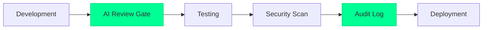

# SAFe Alignment Guide

Integrating LocalM™ AiD AI governance principles across SAFe levels for enterprise-scale AI-assisted development.

<div class="page-meta-table">
  <div class="page-meta-item">
    <span class="page-meta-label">FRAMEWORK</span>
    <span class="page-meta-value">SAFe 6.0</span>
  </div>
  <div class="page-meta-item">
    <span class="page-meta-label">AUDIENCE</span>
    <span class="page-meta-value">Agile Leaders & Architects</span>
  </div>
  <div class="page-meta-item">
    <span class="page-meta-label">ALIGNMENT</span>
    <span class="page-meta-value">Level Mapping</span>
  </div>
  <div class="page-meta-item">
    <span class="page-meta-label">STATUS</span>
    <span class="page-meta-value">✅ Available</span>
  </div>
</div>

---

## Overview

SAFe (Scaled Agile Framework) enables enterprise agility through four configuration levels. LocalM™ AiD principles integrate at each level to govern AI-assisted development at scale—from individual team practices to portfolio-level strategy.

```mermaid
flowchart TB
    subgraph safe["SAFe Levels"]
        portfolio["Portfolio"]
        solution["Large Solution"]
        essential["Essential"]
        team["Team"]
    end

    subgraph localm["LocalM™ AiD Integration"]
        ps["PS: Strategy<br/>& Planning"]
        gsc["GSC: Governance<br/>& Compliance"]
        dc["DC: Development<br/>& Coding"]
        tqc["TQC: Testing<br/>& Quality"]
    end

    portfolio --> ps
    portfolio --> gsc
    solution --> gsc
    essential --> dc
    team --> dc
    team --> tqc

    style safe fill:#1a1a2e,stroke:#4361ee
    style localm fill:#1a1a2e,stroke:#00ff94
```



---

## SAFe Portfolio Level

### Strategic Themes and AI Governance

**SAFe Focus**: Portfolio strategy, budgeting, Lean governance

**LocalM™ AiD Alignment**:

| LocalM™ AiD Principle                                                                           | SAFe Integration                          |
| :---------------------------------------------------------------------------------------------- | :---------------------------------------- |
| [PS-001: Architecture First](/principles/planning_and_strategy/01_architecture_first)           | Include AI governance in Strategic Themes |
| [PS-002: AI Integration Strategy](/principles/planning_and_strategy/02_ai_integration_strategy) | Define AI adoption as Portfolio Epic      |
| [PS-004: Risk-Based Adoption](/principles/planning_and_strategy/04_risk_based_adoption)         | Add AI risks to Lean Portfolio Management |

### Enabler Epics for AI Governance

| Enabler Epic             | LocalM™ AiD Principle | Description                                  |
| :----------------------- | :-------------------- | :------------------------------------------- |
| AI Governance Foundation | GSC-001               | Establish enterprise AI governance framework |
| AI Tool Platform         | TSI-001, TSI-002      | Build approved AI tool ecosystem             |
| AI Security Baseline     | GSC-003, GSC-006      | Implement AI security controls               |
| AI Training Program      | TTA-001, TTA-002      | Enable organization-wide AI readiness        |

### Portfolio Kanban AI Governance Items

- AI governance policy reviews
- AI tool evaluations
- AI security assessments
- AI compliance audits

---

## SAFe Large Solution Level

### Solution Train AI Governance

**SAFe Focus**: Coordinating multiple ARTs, solution-level architecture

**LocalM™ AiD Alignment**:

| LocalM™ AiD Principle                                                                                                 | SAFe Integration                         |
| :-------------------------------------------------------------------------------------------------------------------- | :--------------------------------------- |
| [GSC-001: Governance Framework](/principles/governance_security_and_compliance/01_governance_framework)               | Solution governance includes AI controls |
| [TSI-003: Interoperability & Portability](/principles/tool_selection_and_integration/03_interoperability_portability) | Cross-ART AI tool standardization        |
| [GSC-007: Audit & Accountability](/principles/governance_security_and_compliance/07_audit_accountability)             | Solution-level AI audit requirements     |

### Solution Intent AI Extensions

| Artifact         | AI Governance Content                   |
| :--------------- | :-------------------------------------- |
| Solution Context | AI tools in solution scope              |
| Fixed Intent     | AI security and compliance requirements |
| Variable Intent  | AI capability evolution                 |
| Compliance       | AI regulatory requirements              |

---

## SAFe Essential Level

### ART-Level AI Governance

**SAFe Focus**: Agile Release Train coordination, PI Planning, Architectural Runway

**LocalM™ AiD Alignment**:

| LocalM™ AiD Principle                                                                          | SAFe Integration                         |
| :--------------------------------------------------------------------------------------------- | :--------------------------------------- |
| [DC-001: Human-AI Collaboration](/principles/development_and_coding/01_human_ai_collaboration) | Define AI collaboration patterns for ART |
| [DC-002: Iterative Development](/principles/development_and_coding/02_iterative_development)   | Include AI governance in PI objectives   |
| [GSC-003: Access Control](/principles/governance_security_and_compliance/03_access_control)    | ART-level AI tool access policies        |

### PI Planning AI Considerations

**Program Board AI Items**:

- AI tool configuration across teams
- AI-generated code review dependencies
- AI security validation milestones

**PI Objectives AI Examples**:

- "Implement AI code review gates for all teams"
- "Achieve 100% AI tool access control compliance"
- "Complete AI security training for ART"

### System Demo AI Governance

- Demonstrate AI-assisted development practices
- Show AI code review compliance metrics
- Present AI security posture

---

## SAFe Team Level

### Team-Level AI Practices

**SAFe Focus**: Agile team practices, iteration execution, built-in quality

**LocalM™ AiD Alignment**:

| LocalM™ AiD Principle                                                                                              | SAFe Integration                       |
| :----------------------------------------------------------------------------------------------------------------- | :------------------------------------- |
| [DC-004: Code Review & Validation](/principles/development_and_coding/04_code_review_validation)                   | AI output review in Definition of Done |
| [DC-005: Responsible AI Usage](/principles/development_and_coding/05_responsible_ai_usage)                         | Team AI usage agreements               |
| [TQC-001: AI-Output Testing](/principles/testing_and_quality_control/01_ai_output_testing)                         | AI-specific testing in iteration       |
| [TQC-002: Quality Assurance Integration](/principles/testing_and_quality_control/02_quality_assurance_integration) | AI quality in CI/CD                    |

### Definition of Done AI Extensions

```markdown
## DoD - AI Governance Extensions

- [ ] AI-generated code reviewed by human developer
- [ ] AI suggestions documented in commit message
- [ ] AI tool usage logged for audit trail
- [ ] Security scan completed on AI-assisted code
- [ ] No sensitive data exposed to AI tools
```

### Team Iteration AI Practices

| Practice                    | AI Governance Element                           |
| :-------------------------- | :---------------------------------------------- |
| **Iteration Planning**      | Identify AI-heavy stories, allocate review time |
| **Daily Standup**           | Share AI tool learnings, flag concerns          |
| **Code Review**             | Apply AI-specific review criteria               |
| **Iteration Retrospective** | Reflect on AI collaboration effectiveness       |

---

## Built-in Quality and AI

### Test-First AI Integration

| Quality Practice                | AI Governance Integration                            |
| :------------------------------ | :--------------------------------------------------- |
| **Test-Driven Development**     | Write tests before AI generates code                 |
| **Behavior-Driven Development** | Human-written acceptance criteria, AI implementation |
| **Continuous Integration**      | AI code passes same gates as human code              |
| **Automated Testing**           | AI-generated code has test coverage requirements     |

### Architectural Runway AI Extensions

| Runway Element           | AI Governance Content                       |
| :----------------------- | :------------------------------------------ |
| **Technical Foundation** | AI tool infrastructure, integration APIs    |
| **Enabler Capabilities** | AI security controls, audit mechanisms      |
| **Patterns**             | AI collaboration patterns, review workflows |
| **Standards**            | AI coding standards, prompt guidelines      |

---

## DevOps and AI Governance

### Continuous Delivery Pipeline AI Gates



| Pipeline Stage | AI Governance Gate                 |
| :------------- | :--------------------------------- |
| **Commit**     | AI usage logged                    |
| **Build**      | AI-generated code identified       |
| **Test**       | AI-specific test coverage verified |
| **Security**   | AI code security scan              |
| **Release**    | AI compliance audit complete       |

### Release on Demand AI Considerations

- AI tool versions in release notes
- AI-generated component inventory
- AI security clearance verification

---

## Continuous Learning and AI

### Inspect & Adapt AI Focus

| I&A Component                | AI Governance Activity                |
| :--------------------------- | :------------------------------------ |
| **PI System Demo**           | Demonstrate AI governance metrics     |
| **Quantitative Measurement** | AI tool effectiveness, quality impact |
| **Retrospective**            | AI collaboration improvements         |
| **Problem Solving**          | Address AI governance gaps            |

### Innovation and Planning AI Time

- Explore new AI tools and capabilities
- Develop AI governance improvements
- Create AI collaboration experiments
- Build AI training content

---

## SAFe Core Values and AI Governance

| SAFe Core Value       | AI Governance Alignment                      |
| :-------------------- | :------------------------------------------- |
| **Alignment**         | AI governance aligned with business strategy |
| **Built-in Quality**  | AI code meets same quality standards         |
| **Transparency**      | AI usage visible and auditable               |
| **Program Execution** | AI enables, doesn't impede delivery          |

---

## Implementation Roadmap

### Stage 1: Foundation (Team Level)

**Focus**: Establish team-level AI practices

**Activities**:

- Add AI governance to Definition of Done
- Train teams on AI code review practices
- Implement AI logging in CI/CD

**LocalM™ AiD Principles**: DC-004, DC-005, TQC-001

### Stage 2: Coordination (Essential Level)

**Focus**: Coordinate AI governance across ART

**Activities**:

- Include AI governance in PI Planning
- Establish ART-level AI policies
- Implement cross-team AI standards

**LocalM™ AiD Principles**: DC-001, DC-002, GSC-003

### Stage 3: Scaling (Large Solution/Portfolio)

**Focus**: Enterprise-scale AI governance

**Activities**:

- Define AI governance Strategic Themes
- Create Enabler Epics for AI capability
- Establish portfolio-level AI governance

**LocalM™ AiD Principles**: PS-001, PS-002, GSC-001, GSC-007

---

## SAFe Roles and AI Governance

| SAFe Role                  | AI Governance Responsibility        |
| :------------------------- | :---------------------------------- |
| **Release Train Engineer** | Coordinate AI governance across ART |
| **System Architect**       | Define AI integration architecture  |
| **Product Manager**        | Prioritize AI governance features   |
| **Scrum Master**           | Facilitate AI governance practices  |
| **Developer**              | Follow AI collaboration practices   |

---

## Next Steps

1. **Assess your SAFe level** - Determine which SAFe configurations you're using
2. **Map current practices** - Identify existing AI governance practices
3. **Identify gaps** - Determine where LocalM™ AiD principles address needs
4. **Prioritize by level** - Start with Team level, scale up
5. **Integrate incrementally** - Add AI governance to existing ceremonies

---

## Related Resources

- [EA Framework Alignment Overview](/guides/ea-alignment/)
- [TOGAF Alignment Guide](/guides/ea-alignment/togaf)
- [Zachman Alignment Guide](/guides/ea-alignment/zachman)
