# TOGAF Alignment Guide

Mapping LocalM™ AiD Enterprise Architecture Principles to TOGAF ADM and architecture domains.

  

    FRAMEWORK
    TOGAF 10 / ADM
  

  

    AUDIENCE
    Enterprise Architects
  

  

    ALIGNMENT
    Full Mapping
  

  

    STATUS
    ✅ Available
  

---

## Overview

TOGAF (The Open Group Architecture Framework) provides a comprehensive approach to enterprise architecture through the Architecture Development Method (ADM). LocalM™ AiD principles extend TOGAF to address AI-assisted development governance—a domain that didn't exist when TOGAF was originally developed.

```mermaid
flowchart TB
    subgraph togaf["TOGAF ADM"]
        prelim["Preliminary"]
        a["A: Vision"]
        b["B: Business"]
        c["C: Information"]
        d["D: Technology"]
        e["E: Opportunities"]
        f["F: Migration"]
        g["G: Implementation"]
        h["H: Change Mgmt"]
        req["Requirements"]
    end

    subgraph localm["LocalM™ AiD Integration Points"]
        ps["PS: Planning & Strategy"]
        tsi["TSI: Tool Selection"]
        gsc["GSC: Governance"]
    end

    prelim --> ps
    a --> ps
    d --> tsi
    g --> gsc
    h --> gsc

    style togaf fill:#1a1a2e,stroke:#4361ee
    style localm fill:#1a1a2e,stroke:#00ff94
```

---

## ADM Phase Alignment

### Phase A: Architecture Vision

**TOGAF Focus**: Establishing architecture vision and stakeholder engagement

**LocalM™ AiD Alignment**:

| LocalM™ AiD Principle                                                                                         | TOGAF Integration                                 |
| :------------------------------------------------------------------------------------------------------------ | :------------------------------------------------ |
| [PS-001: Architecture First](/principles/planning_and_strategy/01_architecture_first)                         | Include AI tool governance in architecture vision |
| [PS-002: AI Integration Strategy](/principles/planning_and_strategy/02_ai_integration_strategy)               | Define AI adoption strategy as part of vision     |
| [PS-003: Capability Maturity Assessment](/principles/planning_and_strategy/03_capability_maturity_assessment) | Assess current AI governance maturity             |

**Key Artifacts**:

- AI Governance Vision Statement
- AI Tool Capability Requirements
- Stakeholder AI Concerns Matrix

---

### Phase B: Business Architecture

**TOGAF Focus**: Developing business architecture to support architecture vision

**LocalM™ AiD Alignment**:

| LocalM™ AiD Principle                                                                         | TOGAF Integration                      |
| :-------------------------------------------------------------------------------------------- | :------------------------------------- |
| [PS-004: Risk-Based Adoption](/principles/planning_and_strategy/04_risk_based_adoption)       | Map AI risks to business processes     |
| [TTA-001: Continuous Learning](/principles/team_training_and_adoption/01_continuous_learning) | Define AI training in capability model |

**Key Artifacts**:

- AI-Augmented Process Models
- AI Skills Capability Map
- AI Risk Business Impact Assessment

---

### Phase C: Information Systems Architecture

**TOGAF Focus**: Data and application architecture development

**LocalM™ AiD Alignment**:

| LocalM™ AiD Principle                                                                                           | TOGAF Integration                   |
| :-------------------------------------------------------------------------------------------------------------- | :---------------------------------- |
| [DC-003: Context Provision](/principles/development_and_coding/03_context_provision)                            | Define AI context data requirements |
| [GSC-002: Data Classification](/principles/governance_security_and_compliance/02_data_classification)           | Classify data for AI exposure       |
| [GSC-006: Prompt & Context Security](/principles/governance_security_and_compliance/06_prompt_context_security) | Secure AI data interfaces           |

**Key Artifacts**:

- AI Data Classification Schema
- AI-Accessible Data Catalog
- Context Security Architecture

---

### Phase D: Technology Architecture

**TOGAF Focus**: Technology infrastructure to support applications

**LocalM™ AiD Alignment**:

| LocalM™ AiD Principle                                                                                                 | TOGAF Integration                      |
| :-------------------------------------------------------------------------------------------------------------------- | :------------------------------------- |
| [TSI-001: Capability Assessment](/principles/tool_selection_and_integration/01_capability_assessment)                 | Evaluate AI tools against requirements |
| [TSI-002: Tool Integration Standards](/principles/tool_selection_and_integration/02_tool_integration_standards)       | Define AI tool integration patterns    |
| [TSI-003: Interoperability & Portability](/principles/tool_selection_and_integration/03_interoperability_portability) | Ensure AI tool independence            |

**Key Artifacts**:

- AI Tool Technology Reference Model
- AI Integration Standards Document
- AI Tool Selection Criteria

---

### Phase E: Opportunities and Solutions

**TOGAF Focus**: Identifying transformation opportunities

**LocalM™ AiD Alignment**:

| LocalM™ AiD Principle                                                                          | TOGAF Integration                |
| :--------------------------------------------------------------------------------------------- | :------------------------------- |
| [DC-001: Human-AI Collaboration](/principles/development_and_coding/01_human_ai_collaboration) | Define AI collaboration patterns |
| [DC-002: Iterative Development](/principles/development_and_coding/02_iterative_development)   | Plan incremental AI adoption     |

**Key Artifacts**:

- AI Adoption Roadmap
- AI Capability Gap Analysis
- AI Transformation Work Packages

---

### Phase F: Migration Planning

**TOGAF Focus**: Prioritizing and planning migration

**LocalM™ AiD Alignment**:

| LocalM™ AiD Principle                                                                                         | TOGAF Integration               |
| :------------------------------------------------------------------------------------------------------------ | :------------------------------ |
| [PS-003: Capability Maturity Assessment](/principles/planning_and_strategy/03_capability_maturity_assessment) | Define maturity-based migration |
| [TTA-002: Adoption Governance](/principles/team_training_and_adoption/02_adoption_governance)                 | Plan controlled rollout         |

**Key Artifacts**:

- AI Governance Maturity Roadmap
- AI Tool Migration Plan
- AI Training Deployment Schedule

---

### Phase G: Implementation Governance

**TOGAF Focus**: Providing architectural oversight of implementation

**LocalM™ AiD Alignment**:

| LocalM™ AiD Principle                                                                                     | TOGAF Integration                 |
| :-------------------------------------------------------------------------------------------------------- | :-------------------------------- |
| [GSC-001: Governance Framework](/principles/governance_security_and_compliance/01_governance_framework)   | Establish AI governance board     |
| [GSC-003: Access Control](/principles/governance_security_and_compliance/03_access_control)               | Implement AI tool access controls |
| [GSC-007: Audit & Accountability](/principles/governance_security_and_compliance/07_audit_accountability) | Deploy AI audit mechanisms        |

**Key Artifacts**:

- AI Governance Board Charter
- AI Tool Access Control Matrix
- AI Audit Trail Requirements

---

### Phase H: Architecture Change Management

**TOGAF Focus**: Managing changes to architecture

**LocalM™ AiD Alignment**:

| LocalM™ AiD Principle                                                                              | TOGAF Integration                |
| :------------------------------------------------------------------------------------------------- | :------------------------------- |
| [DM-001: Deployment Controls](/principles/deployment_and_maintenance/01_deployment_controls)       | Manage AI in deployment pipeline |
| [DM-002: Operational Monitoring](/principles/deployment_and_maintenance/02_operational_monitoring) | Monitor AI operations            |

**Key Artifacts**:

- AI Configuration Change Process
- AI Tool Update Procedures
- AI Operational Dashboard Requirements

---

## TOGAF Architecture Domains

### Business Architecture

- **LocalM™ AiD Categories**: PS (Planning & Strategy), TTA (Team Training & Adoption)
- **Focus**: AI adoption strategy, organizational readiness, skills development

### Data Architecture

- **LocalM™ AiD Categories**: GSC (Governance, Security & Compliance)
- **Focus**: Data classification for AI, context security, audit trails

### Application Architecture

- **LocalM™ AiD Categories**: DC (Development & Coding), TQC (Testing & Quality Control)
- **Focus**: AI-assisted development patterns, AI-generated code quality

### Technology Architecture

- **LocalM™ AiD Categories**: TSI (Tool Selection & Integration), DM (Deployment & Maintenance)
- **Focus**: AI tool selection, integration, deployment, and operations

---

## Implementation Approach

### Stage 1: Foundation

**TOGAF Activities**:

- Establish AI governance as Architecture Principle
- Add AI tools to Technology Reference Model
- Include AI governance in Architecture Vision template

**LocalM™ AiD Principles**: PS-001, PS-002, GSC-001

### Stage 2: Integration

**TOGAF Activities**:

- Map AI principles to ADM deliverables
- Train architecture team on AI governance
- Add AI review gates to Architecture Compliance process

**LocalM™ AiD Principles**: TSI-001, TSI-002, TTA-001

### Stage 3: Optimization

**TOGAF Activities**:

- Automate AI governance compliance checks
- Integrate AI audit trails with Architecture Repository
- Establish AI governance metrics in Architecture Performance

**LocalM™ AiD Principles**: GSC-007, DM-002, All maturity Level 3

---

## TOGAF Artifacts Extended for AI

| TOGAF Artifact                  | AI Governance Extension                                |
| :------------------------------ | :----------------------------------------------------- |
| Architecture Principles         | Add LocalM™ AiD principles as supplementary principles |
| Technology Reference Model      | Include AI tools category                              |
| Architecture Contract           | Add AI governance compliance clauses                   |
| Implementation Governance Model | Include AI-specific review gates                       |
| Architecture Repository         | Store AI governance artifacts                          |

---

## Next Steps

1. **Map your ADM** - Identify where you are in current architecture cycles
2. **Assess gaps** - Determine which LocalM™ AiD principles address unmet AI governance needs
3. **Extend artifacts** - Add AI governance content to existing TOGAF deliverables
4. **Train architects** - Ensure architecture team understands AI governance principles
5. **Establish governance** - Add AI review gates to your Architecture Compliance process

---

## Related Resources

- [EA Framework Alignment Overview](/guides/ea-alignment/)
- [Zachman Alignment Guide](/guides/ea-alignment/zachman)
- [SAFe Alignment Guide](/guides/ea-alignment/safe)

---

This Source Code Form is subject to the terms of the Mozilla Public License, v. 2.0. 
If a copy of the MPL was not distributed with this file, You can obtain one at 
<a href="https://mozilla.org/MPL/2.0/" target="_blank" rel="noopener">https://mozilla.org/MPL/2.0/</a>.

