# Zachman Framework Alignment Guide

Positioning LocalM™ AiD principles within the Zachman Framework classification schema.

  

    FRAMEWORK
    Zachman Framework 3.0
  

  

    AUDIENCE
    Enterprise Architects
  

  

    ALIGNMENT
    Cell Mapping
  

  

    STATUS
    ✅ Available
  

---

## Overview

The Zachman Framework is an enterprise architecture classification schema organized as a 6×6 matrix. Each cell represents the intersection of a perspective (rows) and an interrogative (columns). LocalM™ AiD principles map to specific cells where AI governance artifacts should be classified.

```mermaid
flowchart LR
    subgraph zachman["Zachman Framework"]
        what["What<br/>(Data)"]
        how["How<br/>(Function)"]
        where["Where<br/>(Network)"]
        who["Who<br/>(People)"]
        when["When<br/>(Time)"]
        why["Why<br/>(Motivation)"]
    end

    subgraph localm["LocalM™ AiD Mapping"]
        data["GSC: Data<br/>Classification"]
        func["DC: Development<br/>Patterns"]
        net["TSI: Tool<br/>Integration"]
        people["TTA: Training<br/>& Adoption"]
        time["DM: Deployment<br/>& Monitoring"]
        motiv["PS: Strategy<br/>& Planning"]
    end

    what --> data
    how --> func
    where --> net
    who --> people
    when --> time
    why --> motiv

    style zachman fill:#1a1a2e,stroke:#4361ee
    style localm fill:#1a1a2e,stroke:#00ff94
```

---

## Zachman Interrogatives Mapping

### What (Data)

**Zachman Focus**: Inventory sets, data entities, classifications

**LocalM™ AiD Alignment**:

| LocalM™ AiD Principle                                                                                           | Zachman Cell Application             |
| :-------------------------------------------------------------------------------------------------------------- | :----------------------------------- |
| [GSC-002: Data Classification](/principles/governance_security_and_compliance/02_data_classification)           | Classify data for AI exposure levels |
| [GSC-006: Prompt & Context Security](/principles/governance_security_and_compliance/06_prompt_context_security) | Define context data boundaries       |
| [DC-003: Context Provision](/principles/development_and_coding/03_context_provision)                            | Specify AI-accessible data sets      |

**AI Governance Artifacts**:

- AI Data Classification Schema
- Context Boundary Definitions
- AI-Accessible Data Inventory

---

### How (Function)

**Zachman Focus**: Process flows, function hierarchies, workflows

**LocalM™ AiD Alignment**:

| LocalM™ AiD Principle                                                                            | Zachman Cell Application              |
| :----------------------------------------------------------------------------------------------- | :------------------------------------ |
| [DC-001: Human-AI Collaboration](/principles/development_and_coding/01_human_ai_collaboration)   | Define AI collaboration workflows     |
| [DC-002: Iterative Development](/principles/development_and_coding/02_iterative_development)     | Map AI iteration processes            |
| [DC-004: Code Review & Validation](/principles/development_and_coding/04_code_review_validation) | Specify AI code review procedures     |
| [TQC-001: AI-Output Testing](/principles/testing_and_quality_control/01_ai_output_testing)       | Define AI output validation processes |

**AI Governance Artifacts**:

- AI-Assisted Development Workflow Models
- AI Code Review Process Specifications
- AI Output Validation Procedures

---

### Where (Network)

**Zachman Focus**: Locations, networks, distributed systems

**LocalM™ AiD Alignment**:

| LocalM™ AiD Principle                                                                                                 | Zachman Cell Application         |
| :-------------------------------------------------------------------------------------------------------------------- | :------------------------------- |
| [TSI-001: Capability Assessment](/principles/tool_selection_and_integration/01_capability_assessment)                 | Map AI tool deployment locations |
| [TSI-002: Tool Integration Standards](/principles/tool_selection_and_integration/02_tool_integration_standards)       | Define integration topology      |
| [TSI-003: Interoperability & Portability](/principles/tool_selection_and_integration/03_interoperability_portability) | Specify portability requirements |

**AI Governance Artifacts**:

- AI Tool Deployment Architecture
- AI Integration Network Diagram
- AI Tool Location Matrix

---

### Who (People)

**Zachman Focus**: Roles, responsibilities, organizations

**LocalM™ AiD Alignment**:

| LocalM™ AiD Principle                                                                                   | Zachman Cell Application         |
| :------------------------------------------------------------------------------------------------------ | :------------------------------- |
| [TTA-001: Continuous Learning](/principles/team_training_and_adoption/01_continuous_learning)           | Define AI training roles         |
| [TTA-002: Adoption Governance](/principles/team_training_and_adoption/02_adoption_governance)           | Assign adoption responsibilities |
| [GSC-003: Access Control](/principles/governance_security_and_compliance/03_access_control)             | Map AI tool access to roles      |
| [GSC-001: Governance Framework](/principles/governance_security_and_compliance/01_governance_framework) | Establish governance structure   |

**AI Governance Artifacts**:

- AI Governance RACI Matrix
- AI Tool Access Role Matrix
- AI Training Responsibility Chart

---

### When (Time)

**Zachman Focus**: Events, cycles, schedules, triggers

**LocalM™ AiD Alignment**:

| LocalM™ AiD Principle                                                                                     | Zachman Cell Application       |
| :-------------------------------------------------------------------------------------------------------- | :----------------------------- |
| [DM-001: Deployment Controls](/principles/deployment_and_maintenance/01_deployment_controls)              | Define AI deployment schedules |
| [DM-002: Operational Monitoring](/principles/deployment_and_maintenance/02_operational_monitoring)        | Specify monitoring intervals   |
| [GSC-007: Audit & Accountability](/principles/governance_security_and_compliance/07_audit_accountability) | Schedule audit cycles          |

**AI Governance Artifacts**:

- AI Tool Update Schedule
- AI Audit Calendar
- AI Monitoring Event Triggers

---

### Why (Motivation)

**Zachman Focus**: Goals, strategies, drivers, constraints

**LocalM™ AiD Alignment**:

| LocalM™ AiD Principle                                                                                         | Zachman Cell Application       |
| :------------------------------------------------------------------------------------------------------------ | :----------------------------- |
| [PS-001: Architecture First](/principles/planning_and_strategy/01_architecture_first)                         | Define AI governance goals     |
| [PS-002: AI Integration Strategy](/principles/planning_and_strategy/02_ai_integration_strategy)               | Articulate AI adoption drivers |
| [PS-003: Capability Maturity Assessment](/principles/planning_and_strategy/03_capability_maturity_assessment) | Set maturity targets           |
| [PS-004: Risk-Based Adoption](/principles/planning_and_strategy/04_risk_based_adoption)                       | Document risk constraints      |

**AI Governance Artifacts**:

- AI Governance Vision Statement
- AI Adoption Business Drivers
- AI Risk Constraint Matrix

---

## Zachman Perspectives Mapping

### Scope (Planner)

**Focus**: Business context and scope

| Interrogative | AI Governance Content         |
| :------------ | :---------------------------- |
| What          | AI-applicable data categories |
| How           | AI use case scope             |
| Where         | AI deployment boundaries      |
| Who           | AI stakeholder groups         |
| When          | AI adoption horizons          |
| Why           | AI strategic objectives       |

### Business Model (Owner)

**Focus**: Business concepts and models

| Interrogative | AI Governance Content            |
| :------------ | :------------------------------- |
| What          | AI data classification model     |
| How           | AI-assisted business processes   |
| Where         | AI tool business locations       |
| Who           | AI governance organization       |
| When          | AI business event triggers       |
| Why           | AI business goals and strategies |

### System Model (Designer)

**Focus**: Logical system specifications

| Interrogative | AI Governance Content            |
| :------------ | :------------------------------- |
| What          | AI context data model            |
| How           | AI workflow specifications       |
| Where         | AI integration architecture      |
| Who           | AI access control specifications |
| When          | AI event processing rules        |
| Why           | AI governance rules              |

### Technology Model (Builder)

**Focus**: Physical technology specifications

| Interrogative | AI Governance Content          |
| :------------ | :----------------------------- |
| What          | AI data storage specifications |
| How           | AI tool configurations         |
| Where         | AI network topology            |
| Who           | AI role-tool assignments       |
| When          | AI scheduling configurations   |
| Why           | AI configuration rationale     |

### Detailed Representations (Subcontractor)

**Focus**: Implementation details

| Interrogative | AI Governance Content          |
| :------------ | :----------------------------- |
| What          | AI data implementation details |
| How           | AI process implementation      |
| Where         | AI deployment specifications   |
| Who           | AI user accounts               |
| When          | AI timing parameters           |
| Why           | AI rule implementations        |

### Functioning Enterprise (User)

**Focus**: Operational instance

| Interrogative | AI Governance Content    |
| :------------ | :----------------------- |
| What          | Live AI data instances   |
| How           | Running AI workflows     |
| Where         | Deployed AI tools        |
| Who           | Active AI users          |
| When          | AI operational schedule  |
| Why           | AI operational decisions |

---

## Implementation Matrix

### LocalM™ AiD Category to Zachman Cell Mapping

| Category                                    | Primary Column | Secondary Columns |
| :------------------------------------------ | :------------- | :---------------- |
| **PS** (Planning & Strategy)                | Why            | When              |
| **TSI** (Tool Selection & Integration)      | Where          | How               |
| **TTA** (Team Training & Adoption)          | Who            | How               |
| **DC** (Development & Coding)               | How            | What              |
| **TQC** (Testing & Quality Control)         | How            | What, When        |
| **DM** (Deployment & Maintenance)           | When           | Where             |
| **GSC** (Governance, Security & Compliance) | Who, What      | All               |

---

## Using This Mapping

### Step 1: Identify Current Zachman Artifacts

Review your existing enterprise architecture artifacts and identify which cells are populated.

### Step 2: Locate AI Governance Gaps

For each cell, determine whether AI governance content is adequately addressed.

### Step 3: Apply LocalM™ AiD Principles

Use the mapping tables above to identify which LocalM™ AiD principles address gaps in each cell.

### Step 4: Create AI Governance Artifacts

Develop the artifacts recommended for each cell at the appropriate perspective level.

### Step 5: Integrate into Repository

Store AI governance artifacts in your architecture repository, properly classified by Zachman cell.

---

## Next Steps

1. **Audit your Zachman cells** - Identify which cells lack AI governance content
2. **Prioritize by risk** - Focus first on cells where AI governance gaps create business risk
3. **Map to LocalM™ AiD** - Use this guide to select applicable principles
4. **Create artifacts** - Develop AI governance content for priority cells
5. **Integrate and govern** - Add to your architecture repository and governance process

---

## Related Resources

- [EA Framework Alignment Overview](/guides/ea-alignment/)
- [TOGAF Alignment Guide](/guides/ea-alignment/togaf)
- [SAFe Alignment Guide](/guides/ea-alignment/safe)

---

This Source Code Form is subject to the terms of the Mozilla Public License, v. 2.0. 
If a copy of the MPL was not distributed with this file, You can obtain one at 
<a href="https://mozilla.org/MPL/2.0/" target="_blank" rel="noopener">https://mozilla.org/MPL/2.0/</a>.

