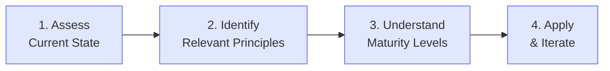

# Principle Application Guides

Guidance for understanding and applying LocalM™ AiD EA principles in your organization.

  

    AUDIENCE
    Practitioners & Leaders
  

  

    GUIDES
    Role-Based Guidance
  

  

    FORMAT
    EA Principles
  

  

    STATUS
    🔍 In Development
  

---

## How to Use These Principles

---

## Getting Started

### Foundation Principles

Begin with these high-impact principles that establish essential governance:

| Principle | Name | Why Start Here |
| --------- | ---- | -------------- |
| **GSC-002** | Permission Boundaries | Defines what AI can and cannot access |
| **TQC-002** | Review Process | Ensures human oversight of AI output |
| **DC-002** | Interaction Protocols | Establishes structured prompting practices |
| **GSC-006** | Audit Trails | Enables traceability of AI interactions |

### Assessment Questions

Rate your organization (1-5) on each dimension to identify focus areas:

| Dimension       | Question                               | L1 Target | L2 Target | L3 Target |
| --------------- | -------------------------------------- | --------- | --------- | --------- |
| **Governance**  | Do you have documented AI policies?    | 2         | 4         | 5         |
| **Training**    | Are developers trained on AI tools?    | 2         | 3         | 4         |
| **Security**    | Are AI permissions explicitly defined? | 3         | 4         | 5         |
| **Process**     | Is AI output systematically reviewed?  | 3         | 4         | 5         |
| **Measurement** | Do you track AI usage metrics?         | 1         | 3         | 4         |

### Scoring Guide

- **5-10 points**: Pre-Foundation — Focus on basics
- **11-15 points**: Ready for L1 (Foundation)
- **16-20 points**: Ready for L2 (Enhanced)
- **21-25 points**: Ready for L3 (Advanced)

---

## Principles by Role

### For Developers

**Focus Area**: Development & Coding (DC) Principles

| Principle | Focus | Application |
| --------- | ----- | ----------- |
| DC-001 | Human Agency | Maintain direction over AI assistance |
| DC-002 | Interaction Protocols | Use structured prompting |
| DC-003 | Review Process | Validate all AI output |
| DC-004 | Context Management | Engineer context effectively |

**Success Indicators**: Code review approval rate, AI-generated code quality, context utilization

### For Architects

**Focus Area**: Planning & Strategy (PS) Principles

| Principle | Focus | Application |
| --------- | ----- | ----------- |
| PS-001 | Architecture First | AI in architecture decisions |
| PS-002 | AI Application Taxonomy | Classify AI use cases |
| PS-003 | Spec-Driven Development | Contract-first AI development |
| PS-004 | Risk Assessment | AI risk governance |

**Success Indicators**: Architecture decision quality, technical debt trends, risk mitigation

### For Team Leads

**Focus Area**: Team Training & Adoption (TTA) Principles

| Principle | Focus | Application |
| --------- | ----- | ----------- |
| TTA-001 | Skills Development | Training programs |
| TTA-002 | Adoption Governance | Adoption metrics |
| TTA-003 | Knowledge Sharing | Sharing practices |

**Success Indicators**: Team adoption rate, training completion, knowledge sharing activity

### For Security Teams

**Focus Area**: Governance, Security & Compliance (GSC) Principles

| Principle | Focus | Application |
| --------- | ----- | ----------- |
| GSC-002 | Permission Boundaries | Define access controls |
| GSC-003 | Sandboxing | Isolate AI operations |
| GSC-006 | Audit Trails | Log all interactions |
| GSC-008 | Network Controls | Restrict AI network access |
| GSC-010 | Secrets Management | Protect credentials |

**Success Indicators**: Security incident rate, compliance audit results, vulnerability metrics

---

## Common Challenges

### Challenge: Developer Resistance

**Symptoms**: Low adoption, workarounds, complaints

**Solutions**:

- Start with enthusiasts (TTA-002)
- Show productivity benefits
- Provide excellent training (TTA-001)
- Create success stories

### Challenge: Security Concerns

**Symptoms**: Blocked rollout, excessive restrictions

**Solutions**:

- Implement GSC principles first
- Demonstrate audit capabilities (GSC-006)
- Start with low-risk use cases
- Involve security early

### Challenge: Unclear ROI

**Symptoms**: Budget resistance, skepticism

**Solutions**:

- Define metrics upfront
- Track productivity changes
- Measure quality improvements
- Document time savings

---

## Templates & Checklists

### Governance Checklist

- AI usage policy documented
- Permission boundaries defined
- Data classification applied
- Audit logging enabled
- Review process established
- Training program created
- Metrics defined
- Exception process documented

### Implementation Checklist

- Stakeholders identified
- Pilot team selected
- Tools evaluated
- Training scheduled
- Metrics baseline captured
- Success criteria defined
- Rollout plan created
- Feedback mechanism established

---

## Need Help?

- **Questions**: Post on [r/agentic_sdlc](https://www.reddit.com/r/agentic_sdlc/){:target="\_blank" rel="noopener"}
- **Feedback**: Share what's working (or not)
- **Contributions**: See [How to Contribute](../contributing)

<!--
  LocalM-AiD: Enterprise Architecture Framework for AI-Assisted Development
  
  Copyright (c) 2025 Nilay Parikh
  
  This Source Code Form is subject to the terms of the Mozilla Public
  License, v. 2.0. If a copy of the MPL was not distributed with this
  file, You can obtain one at http://mozilla.org/MPL/2.0/.
  
  Author: Nilay Parikh
  Contact: 
    - Twitter: @nilayparikh
    - LinkedIn: https://www.linkedin.com/in/niparikh/
  
  Feel free to contact for questions or queries.
-->
