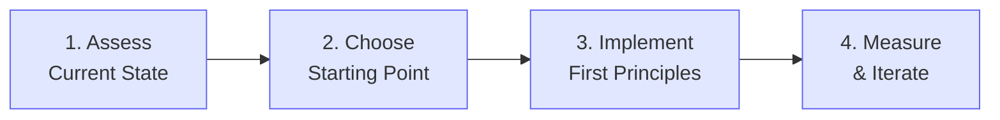

# Implementation Guides

Practical, actionable guides for implementing the LocalM™-AiD framework in your organization.

  

    AUDIENCE
    Practitioners & Leaders
  

  

    GUIDES
    5 Core Guides
  

  

    FORMAT
    Step-by-Step
  

  

    STATUS
    🔍 In Development
  

---

## Quick Start Path

---

## Getting Started Guide

### Week 1-2: Assessment

| Day  | Activity                   | Outcome              |
| ---- | -------------------------- | -------------------- |
| 1-2  | Inventory current AI tools | List of tools in use |
| 3-4  | Review existing policies   | Gap analysis         |
| 5-7  | Stakeholder interviews     | Buy-in assessment    |
| 8-10 | Risk assessment            | Priority areas       |

### Week 3-4: Foundation

| Day   | Activity                     | Outcome            |
| ----- | ---------------------------- | ------------------ |
| 11-12 | Select pilot team            | Team identified    |
| 13-14 | Define permission boundaries | GSC-002 compliance |
| 15-17 | Establish review process     | TQC-002 compliance |
| 18-20 | Create training plan         | TTA-001 compliance |

### Quick Wins

Start with these high-impact, low-effort principles:

1. **GSC-002: Permission Boundaries** - Define what AI can access
2. **TQC-002: Review Process** - Mandatory human review of AI output
3. **DC-002: Interaction Protocols** - Structured prompting practices
4. **GSC-006: Audit Trails** - Log AI interactions

---

## Maturity Assessment

### Self-Assessment Questions

Rate your organization (1-5) on each dimension:

| Dimension       | Question                               | L1 Target | L2 Target | L3 Target |
| --------------- | -------------------------------------- | --------- | --------- | --------- |
| **Governance**  | Do you have documented AI policies?    | 2         | 4         | 5         |
| **Training**    | Are developers trained on AI tools?    | 2         | 3         | 4         |
| **Security**    | Are AI permissions explicitly defined? | 3         | 4         | 5         |
| **Process**     | Is AI output systematically reviewed?  | 3         | 4         | 5         |
| **Measurement** | Do you track AI usage metrics?         | 1         | 3         | 4         |

### Scoring Guide

- **5-10 points**: Pre-Foundation - Focus on basics
- **11-15 points**: Ready for L1 (Foundation)
- **16-20 points**: Ready for L2 (Enhanced)
- **21-25 points**: Ready for L3 (Advanced)

---

## Role-Based Implementation

### For Developers

**Focus Principles**: DC-001 through DC-006

| Week | Focus                         | Key Actions                |
| ---- | ----------------------------- | -------------------------- |
| 1    | DC-002: Interaction Protocols | Learn structured prompting |
| 2    | DC-003: Review Process        | Establish review habits    |
| 3    | DC-004: Context Management    | Master context engineering |
| 4    | DC-001: Human Agency          | Practice directed AI use   |

**Success Metrics**:

- Code review approval rate
- Time to resolution
- AI-generated code quality scores

### For Architects

**Focus Principles**: PS-001 through PS-004

| Week | Focus                           | Key Actions                   |
| ---- | ------------------------------- | ----------------------------- |
| 1    | PS-001: Architecture First      | AI in architecture decisions  |
| 2    | PS-002: AI Application Taxonomy | Classify AI use cases         |
| 3    | PS-003: Spec-Driven Development | Contract-first AI development |
| 4    | PS-004: Risk Assessment         | AI risk governance            |

**Success Metrics**:

- Architecture decision quality
- Technical debt trends
- Risk mitigation effectiveness

### For Team Leads

**Focus Principles**: TTA-001 through TTA-003

| Week | Focus                        | Key Actions                 |
| ---- | ---------------------------- | --------------------------- |
| 1    | TTA-001: Skills Development  | Design training program     |
| 2    | TTA-002: Adoption Governance | Define adoption metrics     |
| 3    | TTA-003: Knowledge Sharing   | Establish sharing practices |
| 4    | All TTA                      | Monitor and iterate         |

**Success Metrics**:

- Team adoption rate
- Training completion
- Knowledge sharing activity

### For Security Teams

**Focus Principles**: GSC-001 through GSC-010

| Week | Focus            | Key Actions             |
| ---- | ---------------- | ----------------------- |
| 1-2  | GSC-002, GSC-003 | Permission & sandboxing |
| 3    | GSC-008, GSC-010 | Network & secrets       |
| 4    | GSC-006          | Audit implementation    |

**Success Metrics**:

- Security incident rate
- Compliance audit results
- Vulnerability metrics

---

## Implementation Roadmap

### Phase 1: Foundation (Months 1-3)

**Objective**: Establish baseline governance

| Month | Milestone             | Principles       |
| ----- | --------------------- | ---------------- |
| 1     | Policies documented   | GSC-001, GSC-002 |
| 2     | Pilot team trained    | TTA-001          |
| 3     | Review process active | TQC-002          |

### Phase 2: Expansion (Months 4-6)

**Objective**: Scale to all teams

| Month | Milestone                 | Principles       |
| ----- | ------------------------- | ---------------- |
| 4     | Organization-wide rollout | TTA-002          |
| 5     | Advanced practices        | DC-004, DC-005   |
| 6     | Integration complete      | TSI-001, TSI-002 |

### Phase 3: Optimization (Months 7-12)

**Objective**: Achieve advanced maturity

| Month | Milestone                  | Principles     |
| ----- | -------------------------- | -------------- |
| 7-8   | Metrics-driven improvement | All            |
| 9-10  | Process automation         | DM-001, DM-002 |
| 11-12 | Continuous improvement     | All            |

---

## Common Challenges

### Challenge: Developer Resistance

**Symptoms**: Low adoption, workarounds, complaints

**Solutions**:

- Start with enthusiasts (TTA-002)
- Show productivity benefits
- Provide excellent training (TTA-001)
- Create success stories

### Challenge: Security Concerns

**Symptoms**: Blocked rollout, excessive restrictions

**Solutions**:

- Implement GSC principles first
- Demonstrate audit capabilities (GSC-006)
- Start with low-risk use cases
- Involve security early

### Challenge: Unclear ROI

**Symptoms**: Budget resistance, skepticism

**Solutions**:

- Define metrics upfront
- Track productivity changes
- Measure quality improvements
- Document time savings

---

## Templates & Checklists

### Governance Checklist

- AI usage policy documented
- Permission boundaries defined
- Data classification applied
- Audit logging enabled
- Review process established
- Training program created
- Metrics defined
- Exception process documented

### Implementation Checklist

- Stakeholders identified
- Pilot team selected
- Tools evaluated
- Training scheduled
- Metrics baseline captured
- Success criteria defined
- Rollout plan created
- Feedback mechanism established

---

## Need Help?

- **Questions**: Post on [r/agentic_sdlc](https://www.reddit.com/r/agentic_sdlc/){:target="\_blank" rel="noopener"}
- **Feedback**: Share what's working (or not)
- **Contributions**: See [How to Contribute](../contributing)

---

Developed with ❤️ by <a href="https://localm.ai/" target="_blank" rel="noopener">localm.ai</a>

