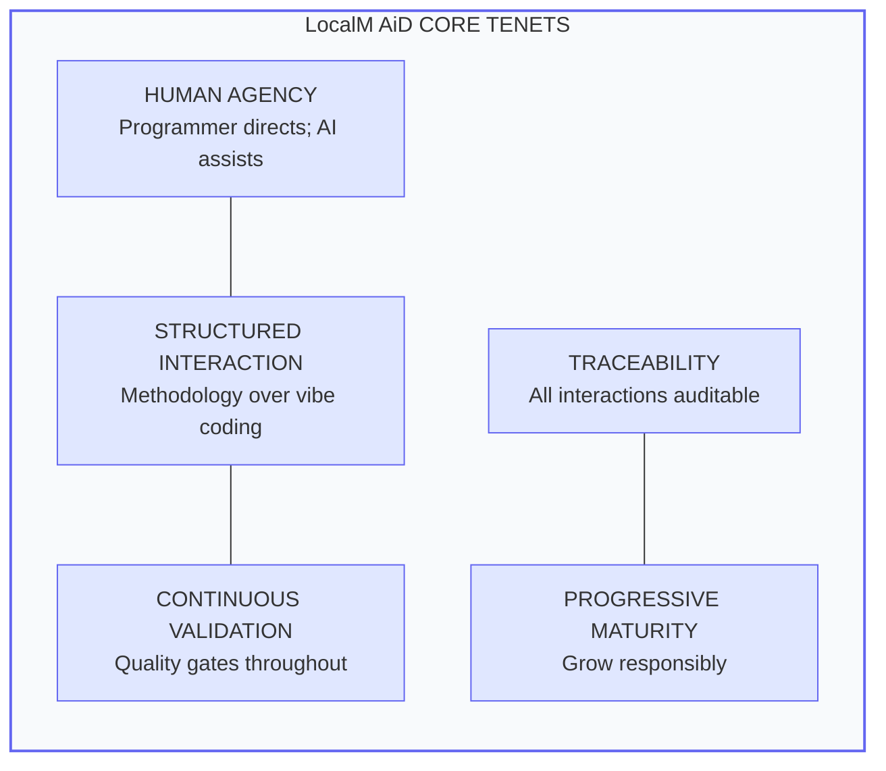

# LocalM™ AiD Framework

**Enterprise Architecture Principles for AI-Assisted Software Development**

  v0.0.1
  In Peer Review

---

## Framework Purpose

LocalM™ AiD defines **27 Enterprise Architecture Principles** organized across seven categories to enable organizations to adopt AI-assisted software development with appropriate governance, quality standards, and human oversight.

> **Scope**: This framework is 100% focused on EA Principles - foundational statements that guide technology decisions for AI-assisted development.

---

## Core Tenets

These five tenets underpin all principles in the framework:

---

## Principle Structure

Every LocalM AiD principle follows the **TOGAF-aligned four-part structure**:

| Component        | Description                                  |
| ---------------- | -------------------------------------------- |
| **Name**         | Short, memorable identifier (e.g., DM-001)   |
| **Statement**    | Clear, declarative principle (1-2 sentences) |
| **Rationale**    | Business/technical justification ("why")     |
| **Implications** | Consequences and requirements for adoption   |

Plus LocalM AiD-specific additions:

| Component              | Description                               |
| ---------------------- | ----------------------------------------- |
| **Maturity Alignment** | Requirements at Base, Medium, High levels |
| **Governance**         | Exception handling, compliance measures   |
| **Related Principles** | Cross-references within the framework     |

---

## Seven Principle Categories

**Total: 22 Principles**

| Category                          | Code | Principles | Focus Area                   |
| --------------------------------- | ---- | ---------- | ---------------------------- |
| Planning & Strategy               | PS   | 4          | Strategic AI integration     |
| Tool Selection & Integration      | TSI  | 3          | AI tool ecosystem choices    |
| Team Training & Adoption          | TTA  | 2          | Human capability development |
| Development & Coding              | DC   | 6          | AI-assisted coding practices |
| Testing & Quality Control         | TQC  | 3          | AI quality assurance         |
| Deployment & Maintenance          | DM   | 2          | AI operations lifecycle      |
| Governance, Security & Compliance | GSC  | 2          | AI risk management           |

---

## Maturity Model

**Legend**: Each level builds on requirements of levels below

| Level      | Name       | AI Autonomy               | Requirements             |
| ---------- | ---------- | ------------------------- | ------------------------ |
| **Base**   | Foundation | L1: AI-Assisted Options   | Mandatory for all        |
| **Medium** | Enhanced   | L2: AI-Assisted Selection | Base + expanded controls |
| **High**   | Advanced   | L3: Partial Automation    | Medium + autonomous caps |

---

## Navigate Principles

| Category                          | Link                                                               | Principle Count |
| --------------------------------- | ------------------------------------------------------------------ | --------------- |
| All Principles                    | [View All →](principles/)                                          | 22              |
| Planning & Strategy               | [PS Principles →](principles/planning_and_strategy/)               | 4               |
| Tool Selection & Integration      | [TSI Principles →](principles/tool_selection_and_integration/)     | 3               |
| Team Training & Adoption          | [TTA Principles →](principles/team_training_and_adoption/)         | 2               |
| Development & Coding              | [DC Principles →](principles/development_and_coding/)              | 6               |
| Testing & Quality Control         | [TQC Principles →](principles/testing_and_quality_control/)        | 3               |
| Deployment & Maintenance          | [DM Principles →](principles/deployment_and_maintenance/)          | 2               |
| Governance, Security & Compliance | [GSC Principles →](principles/governance_security_and_compliance/) | 2               |

---

## Standards Alignment

LocalM AiD principles align with established EA and AI development standards:

| Standard      | Alignment                                                      |
| ------------- | -------------------------------------------------------------- |
| **TOGAF**     | Principle structure (Name, Statement, Rationale, Implications) |
| **AGENTS.md** | Agent configuration principles (DC-005)                        |
| **SKILL.md**  | Capability definition standards                                |
| **MCP**       | Model Context Protocol integration (TSI)                       |
| **A2A**       | Agent-to-Agent coordination (TSI)                              |
