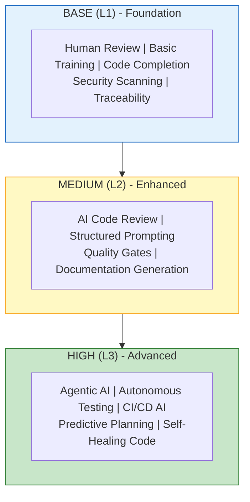

<!--
  LocalM-AiD: Enterprise Architecture Framework for AI-Assisted Development
  
  Copyright (c) 2025 Nilay Parikh
  
  This Source Code Form is subject to the terms of the Mozilla Public
  License, v. 2.0. If a copy of the MPL was not distributed with this
  file, You can obtain one at http://mozilla.org/MPL/2.0/.
  
  Author: Nilay Parikh
  Contact: 
    - Twitter: @nilayparikh
    - LinkedIn: https://www.linkedin.com/in/niparikh/
  
  Feel free to contact for questions or queries.
-->
---
layout: default
title: Maturity Model
---

# Maturity Model

The LocalM™ AiD Framework defines three maturity levels for AI-assisted software development operations.

  

    LEVELS
    3 (L1, L2, L3)
  

  

    PURPOSE
    Progressive AI Adoption
  

  

    SCOPE
    AI Tool Operations
  

  

    ASSESSMENT
    Self-Service
  

---

## Maturity Levels Overview

---

## Level Definitions

### L1: Foundation (Base)

**AI Autonomy**: AI-Assisted Options

| Dimension           | Requirement                                      |
| ------------------- | ------------------------------------------------ |
| **Human Oversight** | All AI output requires human review before use   |
| **Permissions**     | AI has read-only access to approved repositories |
| **Training**        | Basic AI tool training completed                 |
| **Documentation**   | AI interactions logged for audit                 |
| **Quality**         | Manual review of all AI-generated code           |

**Suitable For**: Organizations new to AI-assisted development

---

### L2: Enhanced (Medium)

**AI Autonomy**: AI-Assisted Selection

| Dimension           | Requirement                                        |
| ------------------- | -------------------------------------------------- |
| **Human Oversight** | AI can suggest, human approves significant changes |
| **Permissions**     | AI can create branches, submit PRs for review      |
| **Training**        | Advanced prompt engineering training               |
| **Documentation**   | Structured prompting standards enforced            |
| **Quality**         | Automated quality gates + selective human review   |

**Suitable For**: Teams with established AI practices

---

### L3: Advanced (High)

**AI Autonomy**: Partial Automation

| Dimension           | Requirement                                           |
| ------------------- | ----------------------------------------------------- |
| **Human Oversight** | AI autonomous for low-risk tasks, human for high-risk |
| **Permissions**     | AI can merge to non-protected branches                |
| **Training**        | Continuous AI capability development                  |
| **Documentation**   | Full context engineering practices                    |
| **Quality**         | AI-assisted testing and self-healing capabilities     |

**Suitable For**: Mature organizations with strong governance

---

## Self-Assessment Tool

### Instructions

Rate your organization (1-5) on each dimension below. Be honest - underestimating your maturity leads to better outcomes than overestimating.

### Assessment Questions

| #   | Dimension       | Question                                            | Score (1-5) |
| --- | --------------- | --------------------------------------------------- | ----------- |
| 1   | **Governance**  | Do you have documented AI usage policies?           |             |
| 2   | **Governance**  | Are AI tool permissions explicitly defined?         |             |
| 3   | **Training**    | Have developers completed AI tool training?         |             |
| 4   | **Training**    | Do teams practice structured prompting?             |             |
| 5   | **Security**    | Are AI permissions sandboxed appropriately?         |             |
| 6   | **Security**    | Is sensitive data classified and protected from AI? |             |
| 7   | **Process**     | Is all AI-generated code reviewed before merge?     |             |
| 8   | **Process**     | Do you have quality gates for AI output?            |             |
| 9   | **Measurement** | Do you track AI usage and effectiveness?            |             |
| 10  | **Measurement** | Can you audit AI interactions when needed?          |             |

### Scoring Guide

| Total Score | Recommended Level | Next Steps                              |
| ----------- | ----------------- | --------------------------------------- |
| **10-20**   | Pre-Foundation    | Focus on basic governance and training  |
| **21-30**   | Ready for L1      | Implement Foundation-level principles   |
| **31-40**   | Ready for L2      | Expand to Enhanced-level practices      |
| **41-50**   | Ready for L3      | Progress to Advanced-level capabilities |

---

## Maturity by Category

Each principle category has specific requirements at each maturity level:

| Category | L1 (Foundation)   | L2 (Enhanced)          | L3 (Advanced)       |
| -------- | ----------------- | ---------------------- | ------------------- |
| **PS**   | Basic AI planning | Integrated AI strategy | AI-native planning  |
| **TSI**  | Tool evaluation   | MCP integration        | Full A2A protocols  |
| **TTA**  | Basic training    | Advanced prompting     | Continuous learning |
| **DC**   | Human review all  | Selective review       | Autonomous low-risk |
| **TQC**  | Manual QA         | Automated gates        | AI-assisted testing |
| **DM**   | Manual deployment | AI-monitored           | AI-assisted ops     |
| **GSC**  | Basic permissions | Full sandboxing        | Predictive security |

---

## Progression Path

```mermaid
flowchart LR
    subgraph Phase1["PHASE 1: Foundation"]
        direction TB
        A1["Establish Governance<br/>(GSC-001, GSC-002)"]
        A2["Basic Training<br/>(TTA-001)"]
        A3["Review Process<br/>(TQC-002)"]
    end

    subgraph Phase2["PHASE 2: Enhancement"]
        direction TB
        B1["Structured Prompting<br/>(DC-002)"]
        B2["Quality Gates<br/>(TQC-003)"]
        B3["Tool Integration<br/>(TSI-002)"]
    end

    subgraph Phase3["PHASE 3: Advanced"]
        direction TB
        C1["Agentic Development<br/>(DC-004)"]
        C2["AI Operations<br/>(DM-002)"]
        C3["Predictive Security<br/>(GSC-010)"]
    end

    Phase1 --> Phase2 --> Phase3

    style Phase1 fill:#e3f2fd,stroke:#1565c0
    style Phase2 fill:#fff9c4,stroke:#f9a825
    style Phase3 fill:#c8e6c9,stroke:#2e7d32
```

---

## Key Success Factors

### For L1 → L2 Transition

1. **Governance maturity** - Policies documented and followed
2. **Training completion** - Team proficient with structured prompting
3. **Quality consistency** - Review process producing reliable results
4. **Audit capability** - Can trace AI interactions when needed

### For L2 → L3 Transition

1. **Risk classification** - Clear criteria for autonomous vs. supervised
2. **Tooling maturity** - MCP/A2A protocols fully implemented
3. **Measurement culture** - Data-driven AI effectiveness tracking
4. **Security hardening** - Sandboxing and permissions comprehensive

---

## Common Pitfalls

| Pitfall                    | Impact                                      | Prevention                           |
| -------------------------- | ------------------------------------------- | ------------------------------------ |
| Skipping L1                | Governance gaps, security incidents         | Complete Foundation before advancing |
| Overestimating maturity    | Premature autonomy, quality issues          | Honest self-assessment               |
| Underinvesting in training | Inconsistent AI usage, poor prompts         | Structured TTA implementation        |
| Ignoring measurement       | Cannot demonstrate value or identify issues | Implement GSC-006 early              |

---

## Related Resources

| Resource                                                          | Purpose                            |
| ----------------------------------------------------------------- | ---------------------------------- |
| [Principles Overview](../principles/)                             | All 22 principles by category      |
| [Implementation Guides](../guides/)                               | Practical adoption guidance        |
| [GSC Category](../principles/governance_security_and_compliance/) | Security and governance principles |
| [TTA Category](../principles/team_training_and_adoption/)         | Training and adoption principles   |
