[comment]: # (LocalM-AiD: Enterprise Architecture Framework for AI-Assisted Development)
[comment]: # (Copyright (c) 2025 Nilay Parikh)
[comment]: # (This Source Code Form is subject to the terms of the Mozilla Public License, v. 2.0.)
[comment]: # (If a copy of the MPL was not distributed with this file, You can obtain one at http://mozilla.org/MPL/2.0/.)
[comment]: # (SPDX-License-Identifier: MPL-2.0)

<!-- 
  LocalM-AiD: Enterprise Architecture Framework for AI-Assisted Development
  
  Copyright (c) 2025 Nilay Parikh
  
  This Source Code Form is subject to the terms of the Mozilla Public
  License, v. 2.0. If a copy of the MPL was not distributed with this
  file, You can obtain one at http://mozilla.org/MPL/2.0/.
  
  Author: Nilay Parikh
  Contact: 
    - Twitter: @nilayparikh
    - LinkedIn: https://www.linkedin.com/in/niparikh/
  
  Feel free to contact on Twitter/LinkedIn for questions or queries.
-->

---
layout: default
title: Deployment & Maintenance Principles
category: DM
---

# Deployment & Maintenance (DM) Principles

**Category Code**: DM
**Principle Count**: 2
**Focus**: AI Operations Lifecycle

---

## Category Overview

**Key Concerns:**

- CI/CD pipeline architecture for AI-generated code
- Quality gates with human approval points
- Monitoring AI-assisted system behavior
- Incident response for AI-related issues
- Continuous improvement feedback loops

---

## Principles in This Category

| ID     | Principle Name                  | Statement Summary                                    |
| ------ | ------------------------------- | ---------------------------------------------------- |
| DM-001 | [Pipeline Integration](#dm-001) | Integrate AI-generated code through quality gates    |
| DM-002 | [Observability First](#dm-002)  | Establish comprehensive monitoring before deployment |

---

## Relationship to Other Categories

---

## DM-001: Pipeline Integration with Quality Gates

### Statement

> **All AI-generated code must pass through automated quality gates with mandatory human approval before production deployment.**

### Rationale

| Dimension                | Justification                                                                                 |
| ------------------------ | --------------------------------------------------------------------------------------------- |
| **Business Value**       | Reduces production incidents caused by AI-generated defects                                   |
| **Technical Foundation** | Automated pipelines catch issues faster than manual review alone                              |
| **Risk Mitigation**      | Quality gates prevent AI hallucinations and security vulnerabilities from reaching production |
| **Human Agency**         | Maintains human oversight while leveraging automation efficiency                              |

### Implications

#### Quality Gates

| GATE 1: Build | GATE 2: Test | GATE 3: Security  | GATE 4: Review |
| ------------- | ------------ | ----------------- | -------------- |
| Compilation   | Unit tests   | SAST/DAST         | Human approval |
| Linting       | Integration  | Dependency scan   | Sign-off       |
| Style         | Coverage     | Secrets detection |                |

| Area        | Implication                                                     |
| ----------- | --------------------------------------------------------------- |
| Development | Must configure CI/CD pipelines with AI-specific quality gates   |
| Governance  | Define mandatory vs. advisory gates; document exception process |
| Skills      | Train teams on pipeline configuration and gate interpretation   |
| Tools       | Integrate security scanners, coverage tools, approval workflows |

### Maturity Alignment

| Level           | Requirements                                                           |
| --------------- | ---------------------------------------------------------------------- |
| **Base (L1)**   | Basic pipeline with human review gate before production                |
| **Medium (L2)** | Automated quality gates with security scanning; structured approval    |
| **High (L3)**   | AI-assisted gate decisions; predictive quality analysis; auto-rollback |

### Governance

#### Compliance Measures

- [ ] All repositories have CI/CD pipeline configured
- [ ] Security scanning enabled for all code paths
- [ ] Human approval required before production deployment
- [ ] Gate failures documented and tracked
- [ ] Exception requests require documented justification

#### Exception Process

| Condition            | Approval Required | Documentation        |
| -------------------- | ----------------- | -------------------- |
| Emergency hotfix     | Tech Lead + Ops   | Post-incident review |
| Gate timeout         | Release Manager   | Root cause analysis  |
| Security gate bypass | Security Team     | Risk acceptance form |

### Related Principles

- **TQC-003**: Quality Assurance Framework (quality standards for gates)
- **TQC-002**: Security Practices (security gate requirements)
- **DC-003**: Code Review Practices (human review requirements)
- **GSC-001**: Governance Framework (compliance requirements)

---

## DM-002: Observability First

### Statement

> **Establish comprehensive observability (logs, metrics, traces) for AI-assisted systems before deployment to production.**

### Rationale

| Dimension                  | Justification                                                                  |
| -------------------------- | ------------------------------------------------------------------------------ |
| **Business Value**         | Enables rapid incident detection and resolution, minimizing downtime           |
| **Technical Foundation**   | AI-generated code may have subtle behavioral issues only visible in production |
| **Risk Mitigation**        | Early detection prevents cascading failures from AI-related defects            |
| **Continuous Improvement** | Monitoring data informs AI tool effectiveness and training improvements        |

### Implications

```mermaid
flowchart TB
    subgraph Pillars["THREE PILLARS OF OBSERVABILITY"]
        Logs["📋 LOGS<br/><i>What happened</i><br/>Errors, Warnings, Info, Debug"]
        Metrics["📊 METRICS<br/><i>How much/many</i><br/>Latency, Throughput, Error rate"]
        Traces["🔍 TRACES<br/><i>Request flow</i><br/>Span data, Context, Timing"]
    end

    subgraph Engine["CORRELATION ENGINE"]
        Unified["Unified view of system behavior and health"]
    end

    subgraph Outputs["OUTPUTS"]
        Dashboards["Dashboards"]
        Alerts["Alerts"]
        Runbooks["Runbooks"]
    end

    Logs --> Engine
    Metrics --> Engine
    Traces --> Engine
    Engine --> Outputs
```

| Area        | Implication                                                         |
| ----------- | ------------------------------------------------------------------- |
| Development | Instrument code with logging, metrics, and trace context            |
| Governance  | Define SLOs/SLIs; establish alerting policies                       |
| Skills      | Train teams on observability tools and incident response            |
| Tools       | Deploy logging aggregation, metrics collection, trace visualization |

### Key Monitoring Areas

#### Monitoring Coverage Matrix

| Area           | Metrics | Logs | Traces | Alerts |
| -------------- | :-----: | :--: | :----: | :----: |
| Application    |    ●    |  ●   |   ●    |   ●    |
| Infrastructure |    ●    |  ●   |   ○    |   ●    |
| Security       |    ●    |  ●   |   ●    |   ●    |
| Business       |    ●    |  ○   |   ○    |   ●    |

> **Legend:** ● Required | ○ Recommended

### Alert Classification

| Severity | Response Time | Example                 | Action       |
| -------- | ------------- | ----------------------- | ------------ |
| Critical | Immediate     | Service down            | Page on-call |
| High     | < 15 min      | Error rate spike        | Page team    |
| Medium   | < 1 hour      | Performance degradation | Notification |
| Low      | < 24 hours    | Warning threshold       | Ticket       |

### Maturity Alignment

| Level           | Requirements                                                         |
| --------------- | -------------------------------------------------------------------- |
| **Base (L1)**   | Basic logging and error alerting; manual incident response           |
| **Medium (L2)** | Full observability stack; SLOs defined; structured runbooks          |
| **High (L3)**   | AI-assisted anomaly detection; predictive alerting; auto-remediation |

### Governance

#### Compliance Measures

- [ ] All services have logging, metrics, and traces configured
- [ ] Critical alerts have associated runbooks
- [ ] SLOs defined and tracked for key services
- [ ] Incident response procedures documented
- [ ] Regular observability audits conducted

#### Incident Response Process

**AI-Specific Considerations:**

- Check if AI-generated code is involved
- Review recent AI-assisted changes
- Document AI tool involvement in incident
- Feed learnings back to AI training/configuration

### Related Principles

- **DM-001**: Pipeline Integration (deployment triggers monitoring setup)
- **TQC-002**: Security Practices (security monitoring requirements)
- **GSC-001**: Governance Framework (audit and compliance monitoring)
- **DC-004**: Agentic Development (autonomous agent monitoring)

---

## Category Summary

### Principle Matrix

| Principle                       | BASE (L1)                | MEDIUM (L2)                  | HIGH (L3)                             |
| ------------------------------- | ------------------------ | ---------------------------- | ------------------------------------- |
| **DM-001** Pipeline Integration | Basic pipeline + review  | Quality gates + security     | AI-assisted decisions + auto-rollback |
| **DM-002** Observability First  | Basic logging + alerting | Full stack + SLOs + runbooks | Predictive + auto-remediate           |

> **Legend:** Requirements increase with maturity level

### Key Takeaways

1. **Quality gates are non-negotiable** - Every deployment path includes automated and human checkpoints
2. **Human approval remains mandatory** - Production deployments require explicit human sign-off
3. **Observability enables confidence** - You can't manage what you can't measure
4. **Maturity unlocks automation** - Higher levels enable AI-assisted operations
5. **Feedback loops improve AI** - Monitoring data informs AI tool effectiveness

---

## Next Steps

| Action                | Link                                                     |
| --------------------- | -------------------------------------------------------- |
| View all principles   | [Principles Index](../)                                  |
| Related: Testing & QC | [TQC Principles](../testing_and_quality_control/)        |
| Related: Governance   | [GSC Principles](../governance_security_and_compliance/) |
| Maturity assessment   | [Maturity Model](/maturity/)                             |
