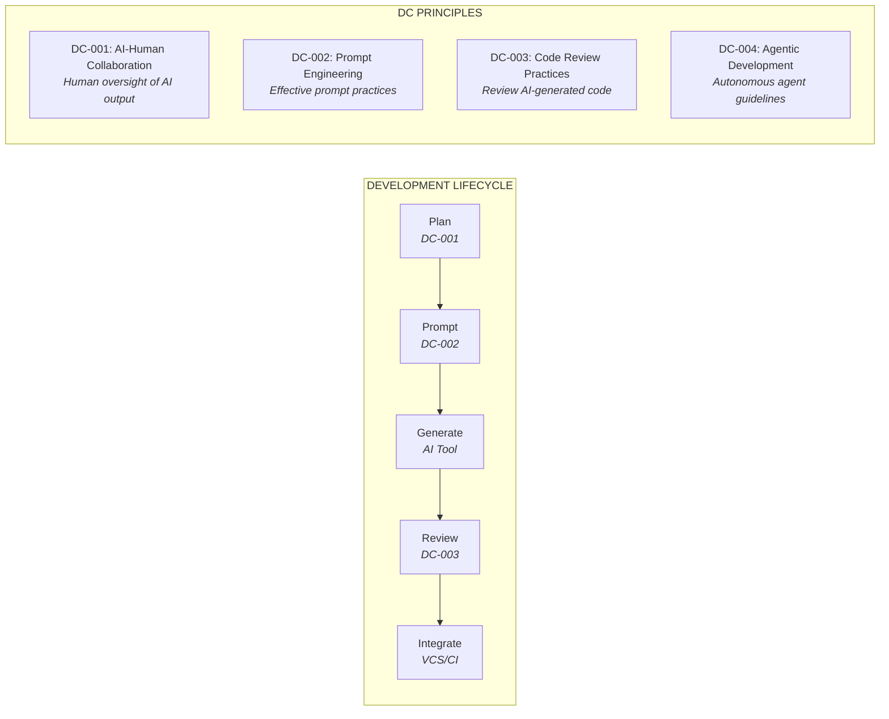
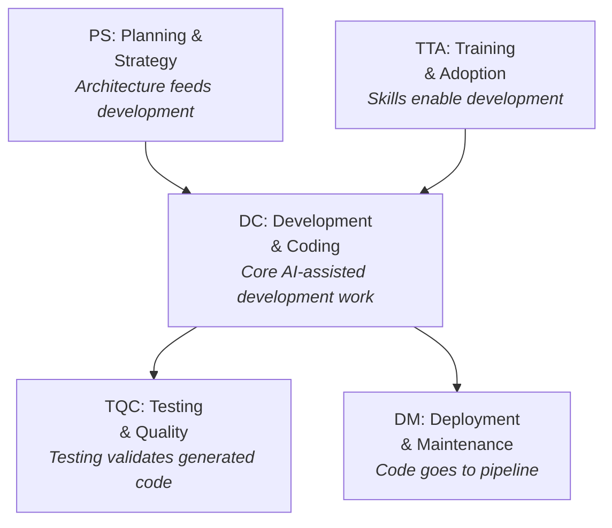
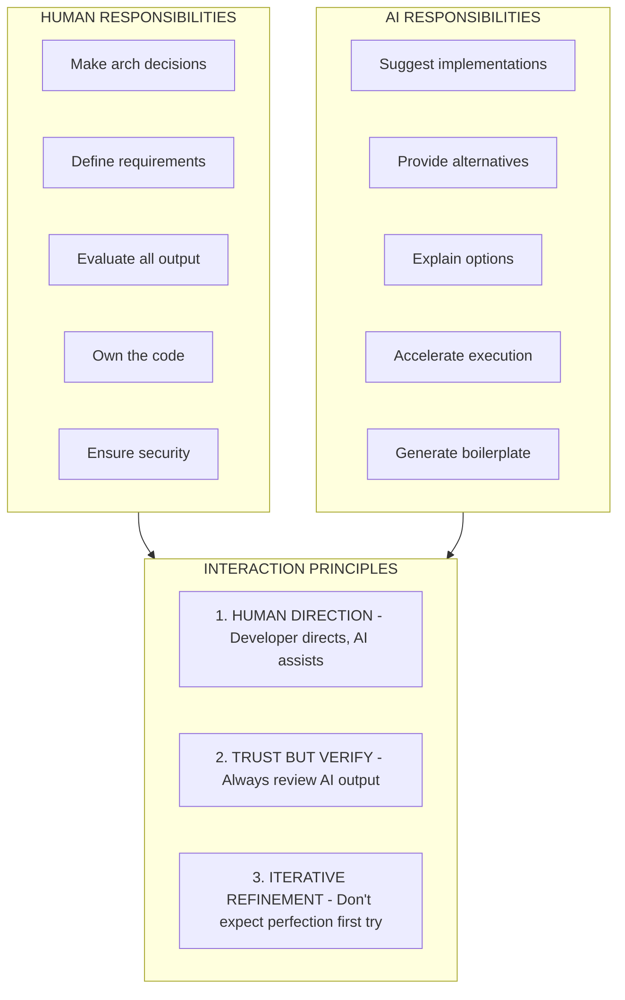
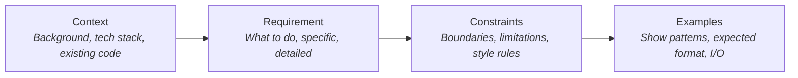
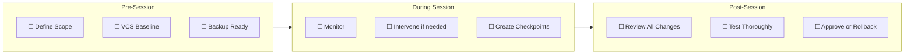

# Development & Coding (DC) Principles

Enterprise Architecture principles for AI-assisted code generation and development practices.

  

    Category
    DC
  

  

    Principles
    4
  

  

    Focus
    AI-Assisted Code Generation and Development Practices
  

  

    Status
    🔍 Under Peer Review
  

---

## Category Overview

**Key Concerns:**

- Planning before code generation
- Human-AI interaction protocols
- Code review for AI-generated code
- Autonomous agent governance

---

## Principles in This Category

| ID     | Principle Name                    | Statement Summary                      |
| ------ | --------------------------------- | -------------------------------------- |
| DC-001 | [AI-Human Collaboration](#dc-001) | Human oversight of AI code generation  |
| DC-002 | [Prompt Engineering](#dc-002)     | Standardize effective prompt practices |
| DC-003 | [Code Review Practices](#dc-003)  | Review standards for AI-generated code |
| DC-004 | [Agentic Development](#dc-004)    | Guidelines for autonomous AI agents    |

---

## Relationship to Other Categories

---

## DC-001: AI-Human Collaboration

### Statement

> **Human developers direct AI tools and maintain responsibility for understanding, validating, and owning all generated code.**

### Rationale

| Dimension                | Justification                                                              |
| ------------------------ | -------------------------------------------------------------------------- |
| **Business Value**       | Human oversight ensures code meets business requirements and constraints   |
| **Technical Foundation** | AI excels at generation but requires human judgment for correctness        |
| **Risk Mitigation**      | Human review catches AI hallucinations, security flaws, and logical errors |
| **Human Agency**         | Core tenet: the developer directs, the AI assists                          |

### Implications

| Area        | Implication                                      |
| ----------- | ------------------------------------------------ |
| Development | Developers must understand all code they commit  |
| Governance  | Code ownership remains with human developers     |
| Skills      | Train developers on effective AI collaboration   |
| Tools       | Configure AI tools to support iterative workflow |

### Maturity Alignment

| Level           | Requirements                                                   |
| --------------- | -------------------------------------------------------------- |
| **Base (L1)**   | Human review mandatory; developer explains all code            |
| **Medium (L2)** | Structured collaboration workflow; metrics on AI contribution  |
| **High (L3)**   | AI suggests review focus; automated collaboration optimization |

### Governance

#### Compliance Measures

- [ ] Developer can explain all code they commit
- [ ] AI-generated code identified in commits
- [ ] No AI output deployed without human review
- [ ] Iteration history preserved for audit
- [ ] Responsibility documented for all code

#### Exception Process

| Condition              | Approval Required | Documentation       |
| ---------------------- | ----------------- | ------------------- |
| Auto-generated tests   | Tech Lead         | Coverage validation |
| Boilerplate automation | Team Lead         | Pattern approval    |
| Prototype code         | None              | Not for production  |

### Related Principles

- **PS-001**: Architecture First (architecture guides collaboration)
- **DC-002**: Prompt Engineering (prompts enable collaboration)
- **DC-003**: Code Review Practices (review validates collaboration)

---

## DC-002: Prompt Engineering

### Statement

> **Use structured, specific prompts with clear context and requirements to achieve consistent, high-quality AI outputs.**

### Rationale

| Dimension                | Justification                                                          |
| ------------------------ | ---------------------------------------------------------------------- |
| **Business Value**       | Better prompts reduce iterations and produce more usable outputs       |
| **Technical Foundation** | AI output quality is directly proportional to prompt quality           |
| **Risk Mitigation**      | Vague prompts lead to incorrect assumptions and flawed implementations |
| **Human Agency**         | Well-crafted prompts ensure AI operates within intended boundaries     |

### Implications

#### Prompt Quality Comparison

| ❌ Poor                               | ✅ Good                                                                                                                                                                                                                                                                          |
| ------------------------------------- | -------------------------------------------------------------------------------------------------------------------------------------------------------------------------------------------------------------------------------------------------------------------------------- |
| "Write a function for authentication" | "Write a function that: • Takes username (string) and password (string) • Validates against the user store • Returns { success: boolean, message: string } • Hashes password before comparison • Logs failed attempts • Uses existing auth.utils module" |

| Area        | Implication                                                  |
| ----------- | ------------------------------------------------------------ |
| Development | Prompts include context, requirements, constraints, examples |
| Governance  | Production prompts reviewed and version controlled           |
| Skills      | Prompt engineering included in training curriculum           |
| Tools       | Prompt templates available for common scenarios              |

### Maturity Alignment

| Level           | Requirements                                        |
| --------------- | --------------------------------------------------- |
| **Base (L1)**   | Prompts follow basic structure; documented patterns |
| **Medium (L2)** | Prompt library; A/B testing; effectiveness metrics  |
| **High (L3)**   | AI-optimized prompts; dynamic context injection     |

### Governance

#### Compliance Measures

- [ ] Prompts follow structured format
- [ ] Production prompts version controlled
- [ ] Prompt templates available and used
- [ ] Effectiveness tracked and measured
- [ ] Failed prompts analyzed for improvement

#### Exception Process

| Condition            | Approval Required | Documentation      |
| -------------------- | ----------------- | ------------------ |
| Ad-hoc exploration   | None              | Not for production |
| Novel prompt pattern | Tech Lead         | Document outcome   |
| Skip structure       | Senior Developer  | Justification      |

### Related Principles

- **PS-004**: Structured Prompting (organizational prompt governance)
- **DC-001**: AI-Human Collaboration (prompts guide collaboration)
- **TTA-001**: Skills Development (prompt training)

---

## DC-003: Code Review Practices

### Statement

> **Review AI-generated code with at least as much rigor as human-written code, using structured checklists for understanding, correctness, quality, and security.**

### Rationale

| Dimension                | Justification                                                        |
| ------------------------ | -------------------------------------------------------------------- |
| **Business Value**       | Reviews catch defects before they reach production                   |
| **Technical Foundation** | AI-generated code can contain subtle errors masked by correct syntax |
| **Risk Mitigation**      | Security vulnerabilities and logic errors require human detection    |
| **Human Agency**         | Review ensures humans understand and can maintain generated code     |

### Implications

#### Code Review Checklist

**1. UNDERSTANDING** - _"Can I explain this code?"_

| ✅ Check | Criteria                                                    |
| -------- | ----------------------------------------------------------- |
| ☐        | **Logic comprehension** - Can I explain the algorithm?      |
| ☐        | **Pattern recognition** - Do I recognize the patterns?      |
| ☐        | **Modification ability** - Could I modify this if needed?   |
| ☐        | **Behavior prediction** - Can I predict edge case behavior? |

> ⚠️ **IF ANY UNCHECKED: DO NOT APPROVE**

**2. CORRECTNESS** - _"Does it do what was requested?"_

| ✅ Check | Criteria                                                    |
| -------- | ----------------------------------------------------------- |
| ☐        | **Functional correctness** - Does the logic appear correct? |
| ☐        | **Edge case handling** - Are boundaries handled?            |
| ☐        | **Error handling** - Are errors handled appropriately?      |
| ☐        | **Return values** - Are returns correct and consistent?     |

**3. QUALITY** - _"Does it meet standards?"_

| ✅ Check | Criteria                                            |
| -------- | --------------------------------------------------- |
| ☐        | **Style compliance** - Follows project style guide? |
| ☐        | **Naming clarity** - Names clear and consistent?    |
| ☐        | **Complexity** - Is there unnecessary complexity?   |
| ☐        | **Documentation** - Comments where needed?          |

**4. SECURITY** - _"Is it secure?"_

| ✅ Check | Criteria                                                |
| -------- | ------------------------------------------------------- |
| ☐        | **Input validation** - All inputs validated?            |
| ☐        | **Authentication/AuthZ** - Proper access control?       |
| ☐        | **Data protection** - Sensitive data handled correctly? |
| ☐        | **Known vulnerabilities** - No OWASP top 10 issues?     |

| Area        | Implication                                               |
| ----------- | --------------------------------------------------------- |
| Development | All AI-generated code reviewed using structured checklist |
| Governance  | Review completion required before merge                   |
| Skills      | Train reviewers on AI-specific review considerations      |
| Tools       | Integrate review checklists into code review tools        |

### Maturity Alignment

| Level           | Requirements                                                  |
| --------------- | ------------------------------------------------------------- |
| **Base (L1)**   | Manual checklist review; reviewer approval required           |
| **Medium (L2)** | Automated lint/security checks; AI-specific review guidelines |
| **High (L3)**   | AI-assisted review suggestions; predictive quality assessment |

### Governance

#### Compliance Measures

- [ ] All AI-generated code reviewed before merge
- [ ] Review checklist completed for each review
- [ ] Reviewer can explain approved code
- [ ] Review comments preserved for audit
- [ ] Defects tracked and analyzed

#### Exception Process

| Condition              | Approval Required | Documentation        |
| ---------------------- | ----------------- | -------------------- |
| Emergency hotfix       | Tech Lead         | Post-merge review    |
| Generated test code    | Automated tools   | Coverage validation  |
| Self-review (solo dev) | Manager           | Documented rationale |

### Related Principles

- **DC-001**: AI-Human Collaboration (review validates collaboration)
- **TQC-002**: Security Practices (security review requirements)
- **DM-001**: Pipeline Integration (review as quality gate)

---

## DC-004: Agentic Development

### Statement

> **Deploy autonomous AI agents only for appropriate use cases with defined boundaries, human oversight points, and rollback capabilities.**

### Rationale

| Dimension                | Justification                                                           |
| ------------------------ | ----------------------------------------------------------------------- |
| **Business Value**       | Agents accelerate repetitive tasks and large-scale changes              |
| **Technical Foundation** | Agentic AI operates at L3 (partial automation) requiring oversight      |
| **Risk Mitigation**      | Unbounded agents can make widespread, difficult-to-reverse changes      |
| **Human Agency**         | Human defines boundaries; agent operates within; human approves results |

### Implications

#### Appropriate vs Inappropriate Use Cases

| ✅ Appropriate         | ❌ Inappropriate       |
| ---------------------- | ---------------------- |
| Rapid prototyping      | Production deploys     |
| Multi-file refactor    | Security-sensitive     |
| Boilerplate generation | Complex business logic |
| Test generation        | Compliance-critical    |
| Documentation updates  | Unsupervised runs      |

#### Control Mechanisms

- Time limits on agent sessions
- File/directory scope restrictions
- Tool access limitations
- Mandatory checkpoints
- Rollback capability

| Area        | Implication                                                   |
| ----------- | ------------------------------------------------------------- |
| Development | Agent sessions have defined scope and supervision             |
| Governance  | Approval required for agent deployment; boundaries documented |
| Skills      | Train developers on agent capabilities and limitations        |
| Tools       | Configure agent tools with appropriate restrictions           |

### Maturity Alignment

| Level           | Requirements                                                |
| --------------- | ----------------------------------------------------------- |
| **Base (L1)**   | Agents for low-risk tasks only; constant human supervision  |
| **Medium (L2)** | Defined use case catalog; checkpoint-based workflows        |
| **High (L3)**   | Broader autonomy for proven scenarios; automated guardrails |

### Governance

#### Compliance Measures

- [ ] Agent use cases documented and approved
- [ ] Scope boundaries defined before each session
- [ ] Baseline committed before agent runs
- [ ] Human review required for all agent output
- [ ] Rollback tested and available

#### Exception Process

| Condition              | Approval Required   | Documentation       |
| ---------------------- | ------------------- | ------------------- |
| Extended agent session | Tech Lead           | Checkpoint schedule |
| Broader scope          | Architect           | Risk assessment     |
| Production-adjacent    | Director + Security | Isolation measures  |

### Related Principles

- **TSI-003**: Protocol Adoption (MCP/A2A for agent coordination)
- **DC-001**: AI-Human Collaboration (agents require oversight)
- **GSC-001**: Governance Framework (agent compliance)

---

## Category Summary

### Principle Matrix

| Principle                         | BASE (L1)           | MEDIUM (L2)            | HIGH (L3)                |
| --------------------------------- | ------------------- | ---------------------- | ------------------------ |
| **DC-001** AI-Human Collaboration | Mandatory review    | Structured workflow    | AI-assisted optimization |
| **DC-002** Prompt Engineering     | Basic structure     | Library + metrics      | AI-optimized dynamic     |
| **DC-003** Code Review Practices  | Manual checklist    | Automated + guidelines | AI-assisted review       |
| **DC-004** Agentic Development    | Low-risk supervised | Catalog + checkpoints  | Broader + guardrails     |

> **Legend:** Requirements increase with maturity level

### Key Takeaways

1. **Human directs, AI assists** - Developers own all code, regardless of generation method
2. **Prompt quality = output quality** - Structured, specific prompts produce better results
3. **Review rigor unchanged** - AI code requires same (or more) review as human code
4. **Agents need boundaries** - Autonomous agents require scope, supervision, and rollback
5. **Understand before commit** - Never deploy code you cannot explain

---

## Next Steps

| Action              | Link                                              |
| ------------------- | ------------------------------------------------- |
| View all principles | [Principles Index](../)                           |
| Related: Testing    | [TQC Principles](../testing_and_quality_control/) |
| Related: Deployment | [DM Principles](../deployment_and_maintenance/)   |
| Maturity assessment | [Maturity Model](/maturity/)                      |

---

## License

**LocalM-AiD Framework Principles**

Copyright (c) 2025 Nilay Parikh

This Source Code Form is subject to the terms of the Mozilla Public License, v. 2.0. If a copy of the MPL was not distributed with this file, You can obtain one at [http://mozilla.org/MPL/2.0/](http://mozilla.org/MPL/2.0/).

### Attribution Required

When using or redistributing these principles, you must:

- ✅ **Provide visible credit** to the LocalM-AiD Framework and Nilay Parikh
- ✅ **Keep this license** with any modified versions
- ✅ **Release modifications** under MPL 2.0
- ✅ **Indicate changes** you've made to the original

**Contact**: [@nilayparikh](https://twitter.com/nilayparikh) | [LinkedIn](https://www.linkedin.com/in/niparikh/)
