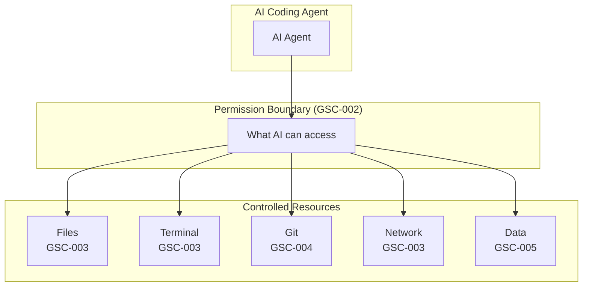
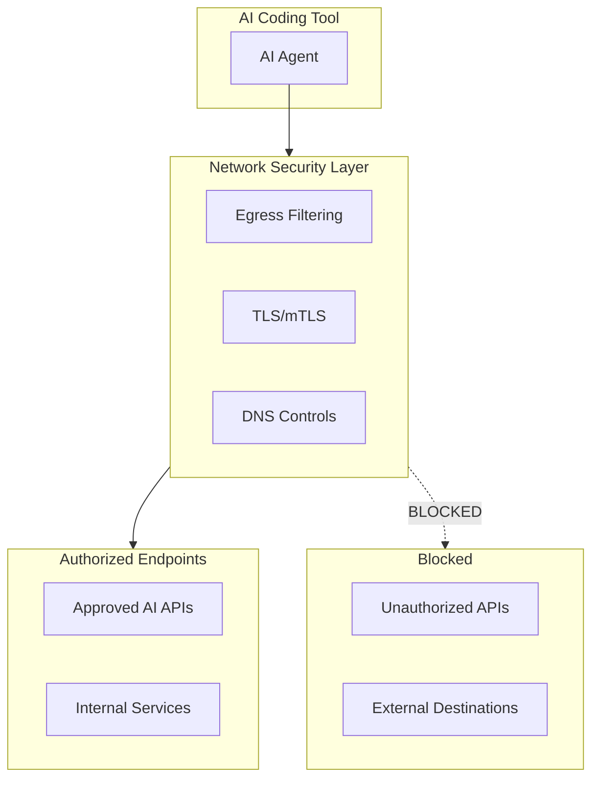
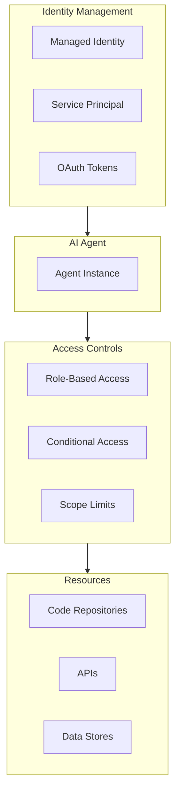
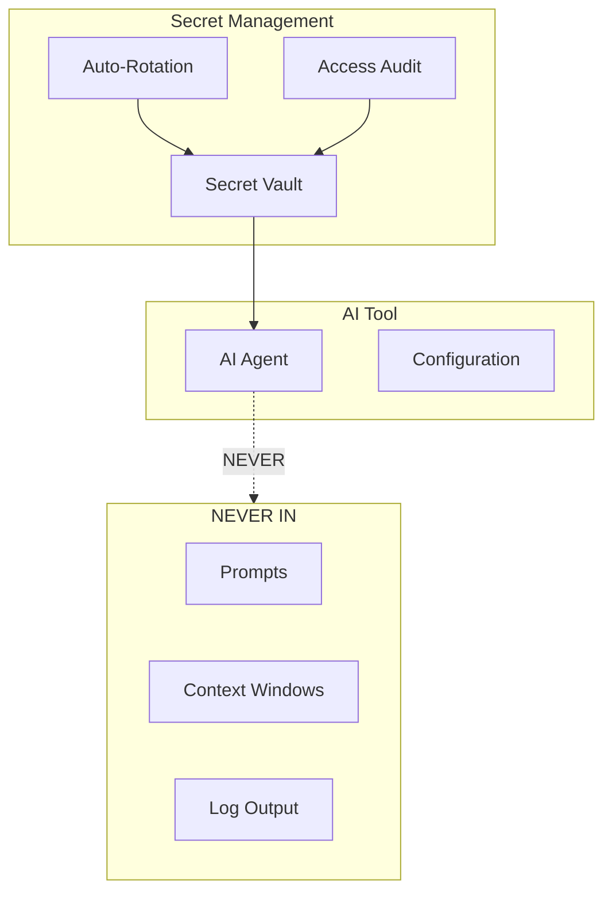

# Governance, Security & Compliance (GSC) Principles

Enterprise Architecture principles for AI tool permissions, sandboxing, access controls, and compliance.

<div class="page-meta-table">
  <div class="page-meta-item">
    <span class="page-meta-label">Category</span>
    <span class="page-meta-value">GSC</span>
  </div>
  <div class="page-meta-item">
    <span class="page-meta-label">Principles</span>
    <span class="page-meta-value">10</span>
  </div>
  <div class="page-meta-item">
    <span class="page-meta-label">Focus</span>
    <span class="page-meta-value">AI Tool Permissions, Sandboxing, Access Controls, and Compliance</span>
  </div>
  <div class="page-meta-item">
    <span class="page-meta-label">Status</span>
    <span class="page-meta-value">🔍 Under Peer Review</span>
  </div>
</div>

---

## Category Overview



**GSC Principles:**

| ID      | Principle              | Focus                        |
| ------- | ---------------------- | ---------------------------- |
| GSC-001 | Governance Framework   | Accountability & oversight   |
| GSC-002 | Permission Boundaries  | AI access limits             |
| GSC-003 | Sandboxing & Isolation | Execution environment        |
| GSC-004 | Git Access Controls    | Version control restrictions |
| GSC-005 | Data Classification    | Data exposure controls       |
| GSC-006 | Audit & Traceability   | Logging and compliance       |
| GSC-007 | Responsible AI Ops     | Ethical operations           |
| GSC-008 | Network Security       | AI network access controls   |
| GSC-009 | AI Agent Identity      | Service account management   |
| GSC-010 | Secret Management      | Credential protection        |

---

## Principles in This Category

| ID      | Principle Name                        | Statement Summary                 |
| ------- | ------------------------------------- | --------------------------------- |
| GSC-001 | [Governance Framework](#gsc-001)      | Accountability and oversight      |
| GSC-002 | [Permission Boundaries](#gsc-002)     | Define AI agent access limits     |
| GSC-003 | [Sandboxing & Isolation](#gsc-003)    | Isolate AI execution environments |
| GSC-004 | [Git Access Controls](#gsc-004)       | Restrict AI git operations        |
| GSC-005 | [Data Classification](#gsc-005)       | Control data exposure to AI       |
| GSC-006 | [Audit & Traceability](#gsc-006)      | Maintain AI activity audit trails |
| GSC-007 | [Responsible AI Operations](#gsc-007) | Ethical AI tool usage             |
| GSC-008 | [Network Security](#gsc-008)          | Control AI network access         |
| GSC-009 | [AI Agent Identity](#gsc-009)         | Manage AI service identities      |
| GSC-010 | [Secret Management](#gsc-010)         | Protect AI-related credentials    |

---

<a name="gsc-001"></a>

## GSC-001: Governance Framework

### Statement

> **Establish clear accountability structures where humans remain responsible for all AI tool operations, with documented ownership chains and approval requirements.**

### Rationale

| Dimension                | Justification                                                       |
| ------------------------ | ------------------------------------------------------------------- |
| **Business Value**       | Clear accountability reduces risk and enables confident AI adoption |
| **Technical Foundation** | Structured governance enables safe scaling of AI tool capabilities  |
| **Risk Mitigation**      | Defined ownership prevents gaps in responsibility for AI operations |
| **Human Agency**         | Humans remain in control; AI tools operate under human supervision  |

### Implications


| Area        | Implication                                        |
| ----------- | -------------------------------------------------- |
| Development | All AI tool usage attributed and governed          |
| Governance  | AI governance board or equivalent established      |
| Skills      | Governance training for all AI tool users          |
| Tools       | Tooling supports governance workflows and tracking |

### Maturity Alignment

| Level           | Requirements                                      |
| --------------- | ------------------------------------------------- |
| **Base (L1)**   | Manual governance; documented AI tool policies    |
| **Medium (L2)** | Automated tracking; defined approval workflows    |
| **High (L3)**   | Integrated governance; predictive risk management |

### Governance

#### Compliance Measures

- AI governance board established
- AI tool policies documented
- Approval workflows defined
- Exception process established
- Governance training completed

#### Exception Process

| Condition            | Approval Required | Documentation       |
| -------------------- | ----------------- | ------------------- |
| New AI tool adoption | Governance Board  | Risk assessment     |
| Policy exception     | Director          | Exception rationale |
| Emergency tool usage | Manager           | Post-hoc review     |

### Related Principles

- **GSC-002**: Permission Boundaries (governance defines permissions)
- **GSC-006**: Audit & Traceability (governance requires auditability)
- **TSI-001**: Evaluation Framework (governance drives evaluation)

---

<a name="gsc-002"></a>

## GSC-002: Permission Boundaries

### Statement

> **Define explicit permission boundaries for AI agents, limiting access to file systems, terminals, networks, and sensitive resources based on operational requirements.**

### Rationale

| Dimension                | Justification                                                        |
| ------------------------ | -------------------------------------------------------------------- |
| **Business Value**       | Controlled permissions prevent unintended consequences and data loss |
| **Technical Foundation** | Explicit boundaries enable safe AI tool operation                    |
| **Risk Mitigation**      | Limited permissions reduce blast radius of AI errors                 |
| **Human Agency**         | Humans define boundaries; AI operates within them                    |

### Implications

#### Permission Matrix

| Permission Type         | Restriction    | Rationale              |
| ----------------------- | -------------- | ---------------------- |
| File System Read        | Workspace only | Limit context exposure |
| File System Write       | Workspace only | Prevent system damage  |
| Terminal Read           | Allowed        | Needed for feedback    |
| Terminal Execute        | Approval req.  | Commands have effects  |
| Git Read                | Allowed        | Needed for context     |
| Git Write (feature)     | Allowed        | Normal development     |
| Git Write (main/master) | **NEVER**      | Protected branches     |
| Git Merge               | **NEVER**      | Human-only operation   |
| Network Outbound        | Filtered       | Prevent exfiltration   |
| Network Inbound         | Blocked        | No external access     |
| Secrets/Credentials     | **NEVER**      | Security requirement   |
| Production Systems      | **NEVER**      | Safety requirement     |

#### Permission Modes by Capability

| Capability Level | Suggestion Mode      | Auto-Edit Mode               |
| ---------------- | -------------------- | ---------------------------- |
| Basic            | Code completion only | Edit with explicit approval  |
| Standard         | Multi-file awareness | Edit with diff preview       |
| Advanced         | Full context access  | Agent mode (file + terminal) |
| Autonomous       | PR/MR creation       | Auto-commit (feature only)   |

| Area        | Implication                                           |
| ----------- | ----------------------------------------------------- |
| Development | Configure AI tools with minimal necessary permissions |
| Governance  | Permission policies documented and enforced           |
| Skills      | Train developers on permission configuration          |
| Tools       | Use tools that support permission controls            |

### Maturity Alignment

| Level           | Requirements                                             |
| --------------- | -------------------------------------------------------- |
| **Base (L1)**   | Manual permission configuration; documented policies     |
| **Medium (L2)** | Centralized permission management; automated enforcement |
| **High (L3)**   | Dynamic permission adjustment; context-aware controls    |

### Governance

#### Compliance Measures

- Permission matrix documented for each AI tool
- Default permissions set to minimum required
- Permission escalation process defined
- Regular permission audits conducted
- Violations tracked and remediated

#### Exception Process

| Condition                | Approval Required | Documentation       |
| ------------------------ | ----------------- | ------------------- |
| Extended file access     | Tech Lead         | Scope justification |
| Terminal auto-execute    | Manager           | Risk acknowledgment |
| Network access expansion | Security Team     | Security review     |

### Related Principles

- **GSC-003**: Sandboxing (permissions within sandbox)
- **GSC-004**: Git Access Controls (git-specific permissions)
- **DC-004**: Agentic Development (agent permissions)

---

<a name="gsc-003"></a>

## GSC-003: Sandboxing & Isolation

### Statement

> **Execute AI agents in sandboxed environments that isolate them from production systems, sensitive data, and critical infrastructure.**

### Rationale

| Dimension                | Justification                                                    |
| ------------------------ | ---------------------------------------------------------------- |
| **Business Value**       | Isolation protects business-critical systems from AI errors      |
| **Technical Foundation** | Sandboxing provides defense-in-depth for AI operations           |
| **Risk Mitigation**      | Contained execution limits damage from malicious or erroneous AI |
| **Human Agency**         | Humans control sandbox boundaries and escape conditions          |

### Implications



```mermaid
flowchart TB
    subgraph Untrusted["🔴 UNTRUSTED ZONE"]
        Sandbox["AI Agent Sandbox<br/>• Containerized execution<br/>• Network filtering<br/>• Resource limits (CPU, memory, disk)<br/>• Time limits for operations"]
    end

    subgraph Gateway["🟡 PERMISSION GATEWAY"]
        Validation["Request validation"]
        Approval["Approval workflow"]
        Audit["Audit logging"]
    end

    subgraph Trusted["🟢 TRUSTED ZONE"]
        Prod["Production systems<br/><i>NO AI access</i>"]
        Secrets["Secrets/credentials<br/><i>NO AI access</i>"]
        Protected["Protected branches<br/><i>Human-only</i>"]
    end

    Sandbox --> Validation
    Validation --> Approval
    Approval --> Audit
    Audit -.->|"Controlled Access"| Trusted
```

#### Sandboxing Capability Assessment

| Capability       | Required for L1 | Required for L2 | Required for L3 |
| ---------------- | --------------- | --------------- | --------------- |
| Built-in Sandbox | Recommended     | Required        | Required        |
| Network Control  | Recommended     | Required        | Required        |
| Resource Limits  | Optional        | Recommended     | Required        |
| Audit Logging    | Required        | Required        | Required        |

| Area        | Implication                                            |
| ----------- | ------------------------------------------------------ |
| Development | Use AI tools with sandboxing support when possible     |
| Governance  | Sandboxing requirements documented by risk level       |
| Skills      | Train teams on sandbox configuration and monitoring    |
| Tools       | Evaluate sandboxing capabilities during tool selection |

### Maturity Alignment

| Level           | Requirements                                           |
| --------------- | ------------------------------------------------------ |
| **Base (L1)**   | Workspace isolation; no production access              |
| **Medium (L2)** | Container-based sandboxing; network filtering          |
| **High (L3)**   | Full isolation with approval gateways; resource limits |

### Governance

#### Compliance Measures

- Sandboxing requirements defined by use case
- Tools evaluated for sandboxing capabilities
- Production isolation verified
- Resource limits configured
- Sandbox escapes monitored and investigated

#### Exception Process

| Condition                | Approval Required | Documentation   |
| ------------------------ | ----------------- | --------------- |
| Reduced isolation        | Security Team     | Risk acceptance |
| Extended resource limits | Manager           | Justification   |
| Network filter exception | Security Lead     | Security review |

### Related Principles

- **GSC-002**: Permission Boundaries (permissions within sandbox)
- **TSI-001**: Evaluation Framework (evaluate sandboxing)
- **TQC-002**: Security Scanning (scan sandbox outputs)

---

<a name="gsc-004"></a>

## GSC-004: Git Access Controls

### Statement

> **Restrict AI agent git operations to feature branches, prohibit direct commits to protected branches, and NEVER allow AI merge authority.**

### Rationale

| Dimension                | Justification                                                   |
| ------------------------ | --------------------------------------------------------------- |
| **Business Value**       | Protected branches ensure code quality and review processes     |
| **Technical Foundation** | Git controls prevent unauthorized changes to production code    |
| **Risk Mitigation**      | Merge restrictions ensure human review of all AI-generated code |
| **Human Agency**         | Humans retain final authority over what enters the codebase     |

### Implications

#### Git Permission Matrix

| Operation            | AI Agent | Human Dev | Lead/Admin |
| -------------------- | :------: | :-------: | :--------: |
| Clone/Fetch          |    ✅    |    ✅     |     ✅     |
| Create Branch        |    ✅    |    ✅     |     ✅     |
| Commit (feature)     |   ✅\*   |    ✅     |     ✅     |
| Commit (main/master) |    ❌    |    ❌     |     ✅     |
| Push (feature)       |    ✅    |    ✅     |     ✅     |
| Push (protected)     |    ❌    |    ❌     |     ✅     |
| Create PR            |    ✅    |    ✅     |     ✅     |
| Approve PR           |    ❌    |    ✅     |     ✅     |
| Merge PR             |    ❌    |  ⚠️\*\*   |     ✅     |
| Force Push           |    ❌    |    ❌     |     ⚠️     |
| Delete Branch        |    ❌    |    ✅     |     ✅     |
| Modify Branch Rules  |    ❌    |    ❌     |     ✅     |

> \* AI commits must include attribution (e.g., "Co-authored-by")
> \*\* Requires approval from another human

#### Branch Naming for AI

**Pattern:** `ai/<task-type>/<description>`

**Examples:**

- `ai/bugfix/fix-auth-validation`
- `ai/feature/implement-user-auth`
- `ai/refactor/optimize-api-handler`

#### Commit Attribution

**Required trailer for AI-generated commits:**

```
Co-authored-by: AI Assistant <ai@organization.com>
AI-Tool: <tool-identifier>
AI-Session: <session-id>
```

| Area        | Implication                                          |
| ----------- | ---------------------------------------------------- |
| Development | AI tools configured to use feature branches only     |
| Governance  | Branch protection rules enforced at repository level |
| Skills      | Train developers on AI branch naming and attribution |
| Tools       | Configure git hooks to enforce AI commit attribution |

### Maturity Alignment

| Level           | Requirements                                         |
| --------------- | ---------------------------------------------------- |
| **Base (L1)**   | Protected branches; manual attribution               |
| **Medium (L2)** | Automated branch rules; commit hooks for attribution |
| **High (L3)**   | Integrated attribution; automated compliance checks  |

### Governance

#### Compliance Measures

- Branch protection rules configured
- AI branch naming convention enforced
- Commit attribution required and validated
- Merge authority limited to humans
- Regular audits of AI commit activity

#### Exception Process

| Condition                | Approval Required | Documentation  |
| ------------------------ | ----------------- | -------------- |
| Direct push to protected | Never allowed     | N/A            |
| AI merge authority       | Never allowed     | N/A            |
| Attribution waiver       | Tech Lead         | Temporary only |

### Related Principles

- **GSC-002**: Permission Boundaries (git permissions)
- **DC-004**: Agentic Development (agent git operations)
- **GSC-006**: Audit & Traceability (git audit trail)

---

<a name="gsc-005"></a>

## GSC-005: Data Classification

### Statement

> **Classify all data according to sensitivity levels and enforce restrictions on what data can be exposed to AI tools based on classification.**

### Rationale

| Dimension                | Justification                                                     |
| ------------------------ | ----------------------------------------------------------------- |
| **Business Value**       | Data protection prevents breaches and maintains customer trust    |
| **Technical Foundation** | Classification enables consistent data handling policies          |
| **Risk Mitigation**      | Restricted data never reaches AI tools that could expose it       |
| **Human Agency**         | Humans define classifications; AI operates within data boundaries |

### Implications

#### Data Classification Matrix

| Classification | AI Tool Usage       | Controls                   |
| -------------- | ------------------- | -------------------------- |
| PUBLIC         | Unrestricted        | Standard logging           |
| INTERNAL       | Approved tools only | Enhanced logging, no cloud |
| CONFIDENTIAL   | On-premise AI only  | Air-gapped, full audit     |
| RESTRICTED     | **NO AI TOOLS**     | Prohibited                 |
| SECRETS        | **NEVER**           | Technical enforcement      |
| PII/PHI        | Special approval    | Privacy controls, no cloud |

#### Secrets That Must NEVER Reach AI

- API keys and tokens
- Database credentials
- Private keys and certificates
- Connection strings with credentials
- OAuth client secrets
- Encryption keys

| Area        | Implication                                           |
| ----------- | ----------------------------------------------------- |
| Development | Check data classification before including in context |
| Governance  | Data classification policy documented and enforced    |
| Skills      | Train developers on data classification rules         |
| Tools       | Use tools with data classification awareness          |

### Maturity Alignment

| Level           | Requirements                                     |
| --------------- | ------------------------------------------------ |
| **Base (L1)**   | Manual classification check; secret scanning     |
| **Medium (L2)** | Automated classification; pattern detection      |
| **High (L3)**   | Integrated data catalog; AI-aware classification |

### Governance

#### Compliance Measures

- Data classification policy documented
- Secret scanning enabled in AI tools
- PII/PHI detection configured
- Classification violations tracked
- Regular data exposure audits

#### Exception Process

| Condition                | Approval Required | Documentation  |
| ------------------------ | ----------------- | -------------- |
| Confidential in cloud AI | Never allowed     | N/A            |
| PII exposure             | Privacy Officer   | Privacy review |
| Internal data exception  | Manager           | Business case  |

### Related Principles

- **GSC-002**: Permission Boundaries (data access permissions)
- **GSC-006**: Audit & Traceability (data access logging)
- **TQC-002**: Security Scanning (secret detection)

---

<a name="gsc-006"></a>

## GSC-006: Audit & Traceability

### Statement

> **Maintain comprehensive audit trails of all AI tool activities, enabling traceability, compliance verification, and incident investigation.**

### Rationale

| Dimension                | Justification                                                        |
| ------------------------ | -------------------------------------------------------------------- |
| **Business Value**       | Audit trails enable compliance and build stakeholder trust           |
| **Technical Foundation** | Logging infrastructure supports investigation and improvement        |
| **Risk Mitigation**      | Traceability enables rapid incident response and root cause analysis |
| **Human Agency**         | Audit trails ensure human oversight of AI activities                 |

### Implications

#### Minimum Audit Fields

| Field          | Description                     |
| -------------- | ------------------------------- |
| Timestamp      | When the AI activity occurred   |
| User ID        | Who initiated the AI operation  |
| Tool Name      | Which AI tool was used          |
| Tool Version   | Version of the AI tool          |
| Activity Type  | Completion, chat, agent, etc.   |
| Input Hash     | Hash of input for traceability  |
| Output Hash    | Hash of output for traceability |
| Files Accessed | Which files were read/written   |
| Commands Run   | Terminal commands executed      |
| Git Operations | Commits, branches, PRs created  |
| Review Status  | Pending, approved, rejected     |
| Reviewer ID    | Who reviewed (if applicable)    |

#### Retention Requirements

- **Standard activities:** Minimum 1 year
- **Compliance-relevant activities:** Minimum 7 years
- **Storage:** Immutable for audit integrity
- **Access:** Searchable for incident investigation

| Area        | Implication                                          |
| ----------- | ---------------------------------------------------- |
| Development | AI tools configured with audit logging enabled       |
| Governance  | Audit requirements documented and verified           |
| Skills      | Train teams on audit log interpretation              |
| Tools       | Select tools with comprehensive logging capabilities |

### Maturity Alignment

| Level           | Requirements                                          |
| --------------- | ----------------------------------------------------- |
| **Base (L1)**   | Basic logging; manual audit review                    |
| **Medium (L2)** | Centralized logging; automated compliance reports     |
| **High (L3)**   | Real-time monitoring; anomaly detection; AI forensics |

### Governance

#### Compliance Measures

- Audit logging enabled for all AI tools
- Retention policies configured
- Regular audit reviews conducted
- Compliance reports generated
- Incident investigation procedures documented

#### Exception Process

| Condition           | Approval Required | Documentation     |
| ------------------- | ----------------- | ----------------- |
| Reduced logging     | Security Team     | Risk acceptance   |
| Shortened retention | Compliance Lead   | Regulatory review |
| Log deletion        | Never allowed     | N/A               |

### Related Principles

- **GSC-001**: Governance Framework (audit supports governance)
- **GSC-004**: Git Access Controls (git audit trail)
- **DM-002**: AI Operations (operational monitoring)

---

<a name="gsc-007"></a>

## GSC-007: Responsible AI Operations

### Statement

> **Operate AI tools ethically, ensuring fairness, transparency, and accountability in all AI-assisted development activities.**

### Rationale

| Dimension                | Justification                                                    |
| ------------------------ | ---------------------------------------------------------------- |
| **Business Value**       | Responsible operations build trust and prevent reputation damage |
| **Technical Foundation** | Ethical guidelines translate into operational controls           |
| **Risk Mitigation**      | Proactive ethics prevents harm and regulatory issues             |
| **Human Agency**         | Humans define ethical boundaries; AI operates within them        |

### Implications

#### Operational Ethics Principles

**1. TRANSPARENCY**

- Disclose AI assistance in code and documentation
- Be clear about AI capabilities and limitations

**2. ACCOUNTABILITY**

- Humans remain responsible for all AI outputs
- No "the AI did it" excuses

**3. FAIRNESS**

- Equal access to AI tools within teams
- Consider accessibility in AI tool selection

**4. SECURITY**

- Prioritize security over convenience
- Never bypass security controls for AI efficiency

#### Prohibited Practices

| ❌ Prohibited                            | Rationale                     |
| ---------------------------------------- | ----------------------------- |
| Using AI to bypass code review           | Undermines quality controls   |
| Claiming AI code as solely human-written | Violates transparency         |
| Using AI on unauthorized data            | Data classification violation |
| Disabling AI safety controls             | Security risk                 |
| Using AI to generate malicious code      | Ethical violation             |

| Area        | Implication                                        |
| ----------- | -------------------------------------------------- |
| Development | Follow responsible AI practices in daily work      |
| Governance  | Responsible AI guidelines documented and enforced  |
| Skills      | Ethics training for all AI tool users              |
| Tools       | Select tools that support responsible AI practices |

### Maturity Alignment

| Level           | Requirements                                     |
| --------------- | ------------------------------------------------ |
| **Base (L1)**   | Documented guidelines; basic training            |
| **Medium (L2)** | Integrated into workflows; regular reinforcement |
| **High (L3)**   | Culture of responsibility; proactive improvement |

### Governance

#### Compliance Measures

- Responsible AI guidelines documented
- Training completed by all AI tool users
- Prohibited practices communicated
- Ethics violations tracked and addressed
- Regular ethics assessments conducted

#### Exception Process

| Condition               | Approval Required | Documentation     |
| ----------------------- | ----------------- | ----------------- |
| Ethics guideline waiver | Ethics Board      | Ethical review    |
| New use case evaluation | Governance Board  | Ethics assessment |
| Reported violation      | HR + Legal        | Investigation     |

### Related Principles

- **GSC-001**: Governance Framework (ethics governance)
- **TTA-002**: Adoption Governance (responsible adoption)
- **DC-001**: AI-Human Collaboration (ethical collaboration)

---

## Category Summary

### Key Takeaways

1. **Permissions define boundaries** - Explicit limits on what AI can access
2. **Sandboxing contains risk** - Isolate AI from critical systems
3. **Git controls protect code** - AI never gets merge authority
4. **Data classification prevents exposure** - Secrets never reach AI
5. **Audit trails enable oversight** - Log everything for accountability
6. **Responsible operations build trust** - Ethics are non-negotiable
7. **Network controls prevent exfiltration** - AI cannot access unauthorized endpoints
8. **Identity management enables accountability** - Every AI action has an identity
9. **Secret management protects credentials** - No credentials in AI context

---

<a name="gsc-008"></a>

## GSC-008: Network Security

### Statement

> **Control and monitor all network communications for AI coding tools, preventing unauthorized data transmission and ensuring secure connectivity.**

### Rationale

| Dimension                | Justification                                             |
| ------------------------ | --------------------------------------------------------- |
| **Business Value**       | Prevents intellectual property and sensitive data leakage |
| **Technical Foundation** | Network controls are fundamental security layer           |
| **Risk Mitigation**      | Blocks data exfiltration and unauthorized API access      |
| **Human Agency**         | Humans define network boundaries; AI operates within them |

### Implications



#### Network Controls Matrix

| Control Type         | Requirement | Purpose                         |
| -------------------- | ----------- | ------------------------------- |
| Egress Filtering     | Required    | Block unauthorized destinations |
| TLS Encryption       | Required    | Protect data in transit         |
| DNS Control          | Recommended | Prevent rogue endpoint access   |
| Network Segmentation | Recommended | Isolate AI workloads            |
| Rate Limiting        | Required    | Prevent abuse and exfiltration  |
| Traffic Logging      | Required    | Enable security monitoring      |

| Area        | Implication                                   |
| ----------- | --------------------------------------------- |
| Development | Configure allowed endpoints for AI tools      |
| Governance  | Network policies documented and enforced      |
| Skills      | Train teams on network security configuration |
| Tools       | Use tools that support network isolation      |

### Maturity Alignment

| Level           | Requirements                                   |
| --------------- | ---------------------------------------------- |
| **Base (L1)**   | Basic egress filtering; TLS required           |
| **Medium (L2)** | Network segmentation; traffic logging          |
| **High (L3)**   | Zero-trust network; real-time threat detection |

### Governance

#### Compliance Measures

- Allowed endpoint list maintained
- Network policies configured and tested
- Traffic monitoring enabled
- Incident response procedures defined

### Related Principles

- **GSC-003**: Sandboxing & Isolation
- **GSC-005**: Data Classification
- **GSC-006**: Audit & Traceability

---

<a name="gsc-009"></a>

## GSC-009: AI Agent Identity

### Statement

> **Assign distinct, managed identities to all AI agents and tools, enabling accountability, access control, and audit trail attribution.**

### Rationale

| Dimension                | Justification                                       |
| ------------------------ | --------------------------------------------------- |
| **Business Value**       | Enables accountability for all AI-initiated actions |
| **Technical Foundation** | Identity is the foundation of access control        |
| **Risk Mitigation**      | Prevents over-privileged AI operations              |
| **Human Agency**         | Humans control identity assignment and permissions  |

### Implications



#### Identity Requirements

| Requirement             | Base (L1) | Medium (L2) | High (L3) |
| ----------------------- | --------- | ----------- | --------- |
| Distinct AI Identity    | Required  | Required    | Required  |
| No Shared Credentials   | Required  | Required    | Required  |
| Identity Lifecycle Mgmt | Manual    | Automated   | Automated |
| Scope Limitation        | Basic     | Granular    | Dynamic   |
| Activity Attribution    | Required  | Required    | Required  |

| Area        | Implication                                |
| ----------- | ------------------------------------------ |
| Development | Configure AI tools with managed identities |
| Governance  | Identity policies and lifecycle documented |
| Skills      | Train teams on identity configuration      |
| Tools       | Use tools that support managed identity    |

### Maturity Alignment

| Level           | Requirements                                        |
| --------------- | --------------------------------------------------- |
| **Base (L1)**   | Distinct identities; no embedded credentials        |
| **Medium (L2)** | Managed identities; automated lifecycle             |
| **High (L3)**   | Just-in-time access; continuous identity validation |

### Governance

#### Compliance Measures

- AI identity inventory maintained
- No embedded credentials in tools
- Identity lifecycle procedures documented
- Regular access review conducted

### Related Principles

- **GSC-001**: Governance Framework
- **GSC-002**: Permission Boundaries
- **GSC-006**: Audit & Traceability

---

<a name="gsc-010"></a>

## GSC-010: Secret Management

### Statement

> **Protect all credentials, API keys, and tokens used with AI tools through centralized secret management, automatic rotation, and strict access controls.**

### Rationale

| Dimension                | Justification                                          |
| ------------------------ | ------------------------------------------------------ |
| **Business Value**       | Prevents credential compromise and unauthorized access |
| **Technical Foundation** | Secrets are primary attack vector for AI tool abuse    |
| **Risk Mitigation**      | Automatic rotation limits exposure window              |
| **Human Agency**         | Humans control secret policies and access              |

### Implications



#### Secret Handling Rules

| Secret Type         | Storage          | Rotation    | AI Exposure |
| ------------------- | ---------------- | ----------- | ----------- |
| API Keys            | Secret Vault     | 90 days     | **NEVER**   |
| Service Credentials | Managed Identity | Automatic   | **NEVER**   |
| Database Passwords  | Secret Vault     | 90 days     | **NEVER**   |
| Encryption Keys     | Key Management   | Annual      | **NEVER**   |
| Session Tokens      | Memory Only      | Per-session | **NEVER**   |

| Area        | Implication                                       |
| ----------- | ------------------------------------------------- |
| Development | Use environment variables for secret injection    |
| Governance  | Secret policies and rotation schedules documented |
| Skills      | Train teams on secure secret handling             |
| Tools       | Use tools with secret vault integration           |

### Maturity Alignment

| Level           | Requirements                            |
| --------------- | --------------------------------------- |
| **Base (L1)**   | Centralized vault; no hardcoded secrets |
| **Medium (L2)** | Automatic rotation; access logging      |
| **High (L3)**   | Just-in-time secrets; anomaly detection |

### Governance

#### Compliance Measures

- All secrets in centralized vault
- Rotation schedules configured
- No secrets in prompts or context
- Secret access audited

### Related Principles

- **GSC-005**: Data Classification
- **GSC-006**: Audit & Traceability
- **GSC-009**: AI Agent Identity

---

## Category Summary

| Action               | Link                                                 |
| -------------------- | ---------------------------------------------------- |
| View all principles  | [Principles Index](../)                              |
| Related: Development | [DC Principles](../development_and_coding/)          |
| Related: Tools       | [TSI Principles](../tool_selection_and_integration/) |
| Constitution         | [Framework Constitution](/docs/constitution/)        |

---

## License

<div class="license-cards">
  <a href="{{ '/attribution' | relative_url }}" class="license-card">
    <div class="license-card-header">
      <span class="license-card-badge mpl">MPL 2.0 + Attribution</span>
    </div>
    <div class="license-card-title">Open Source</div>
    <div class="license-card-desc">Free for any use including commercial. Credit required to LocalM™ AiD Framework, Nilay Parikh, and localm.ai.</div>
    <span class="license-card-link">View requirements →</span>
  </a>
  <a href="https://localm.ai/enterprise" target="_blank" rel="noopener" class="license-card">
    <div class="license-card-header">
      <span class="license-card-badge enterprise">Enterprise</span>
    </div>
    <div class="license-card-title">Commercial License</div>
    <div class="license-card-desc">No attribution required. Keep modifications private. Includes expert support and training.</div>
    <span class="license-card-link">Contact sales →</span>
  </a>
</div>