# Enterprise Architecture Principles

The LocalM AiD Framework defines **27 principles** across **7 categories** for **operating, managing, and securing AI-assisted software development**.

  

    Total Principles
    27
  

  

    Categories
    7
  

  

    Scope
    AI Tool Operations
  

  

    Status
    🔍 Under Peer Review
  

> **Scope**: These principles govern **how to operate AI coding tools safely** — NOT general software engineering practices. See [Mandate](/docs/mandate/) for scope definition.

---

## Framework Scope

| ✅ IN SCOPE                  | ❌ OUT OF SCOPE              |
| ---------------------------- | ---------------------------- |
| AI tool configuration        | Software design patterns     |
| Agent permissions/sandboxing | Architecture styles          |
| Git access controls for AI   | General testing methodology  |
| Data classification for AI   | DevOps practices (general)   |
| Audit trails & compliance    | Coding standards (general)   |
| Autonomy level governance    | Language/framework selection |

**Applicable Tool Categories:**

- IDE-integrated AI assistants
- Terminal-based AI agents
- Agentic coding environments
- Model Context Protocol (MCP) servers
- Agent-to-Agent (A2A) protocols
- Code completion and suggestion tools

---

## Principles Architecture

```mermaid
flowchart TB
    subgraph Tenets["CORE TENETS"]
        T1["1. Human Agency"]
        T2["2. Structured Interaction"]
        T3["3. Continuous Validation"]
        T4["4. Traceability"]
        T5["5. Progressive Maturity"]
    end

    subgraph Categories["7 CATEGORIES"]
        PS["PS"]
        TSI["TSI"]
        TTA["TTA"]
        DC["DC"]
        TQC["TQC"]
        DM["DM"]
        GSC["GSC"]
    end

    subgraph Principles["27 PRINCIPLES"]
        Structure["Each principle follows TOGAF structure:<br/>• Statement - What the principle declares<br/>• Rationale - Why it matters<br/>• Implications - How it affects development<br/>• Maturity - Requirements by level<br/>• Governance - Compliance measures"]
    end

    Tenets --> Categories
    Categories --> Principles
```

---

## Categories Overview

| Code | Category                                  | Principles | Focus                                 |
| ---- | ----------------------------------------- | :--------: | ------------------------------------- |
| PS   | [Planning & Strategy](#ps)                |     4      | AI tool adoption planning             |
| TSI  | [Tool Selection & Integration](#tsi)      |     3      | Tool evaluation & MCP governance      |
| TTA  | [Team Training & Adoption](#tta)          |     3      | AI tool proficiency                   |
| DC   | [Development & Coding](#dc)               |     4      | AI interaction & autonomy             |
| TQC  | [Testing & Quality Control](#tqc)         |     4      | AI output validation                  |
| DM   | [Deployment & Maintenance](#dm)           |     2      | AI pipeline controls                  |
| GSC  | [Governance, Security & Compliance](#gsc) |     7      | Permissions, sandboxing, git controls |

---

## PS: Planning & Strategy

**Focus**: AI tool adoption planning, capability assessment, maturity roadmap

| ID     | Principle Name           | Statement Summary                          |
| ------ | ------------------------ | ------------------------------------------ |
| PS-001 | AI Operations Planning   | Plan AI tool deployment before adoption    |
| PS-002 | Strategic AI Integration | Align AI adoption with business strategy   |
| PS-003 | Risk-Based Planning      | Assess AI operational risks upfront        |
| PS-004 | Structured Communication | Establish prompt and interaction standards |

[View PS Principles →](planning_and_strategy/)

---

## TSI: Tool Selection & Integration

**Focus**: AI tool evaluation criteria, approval process, MCP/protocol governance

| ID      | Principle Name        | Statement Summary                            |
| ------- | --------------------- | -------------------------------------------- |
| TSI-001 | Evaluation Framework  | Standardize AI tool evaluation criteria      |
| TSI-002 | Integration Standards | Define integration requirements for AI tools |
| TSI-003 | Protocol Adoption     | Govern MCP servers and A2A protocol usage    |

[View TSI Principles →](tool_selection_and_integration/)

---

## TTA: Team Training & Adoption

**Focus**: Building team capability for AI-assisted development

| ID      | Principle Name      | Statement Summary                             |
| ------- | ------------------- | --------------------------------------------- |
| TTA-001 | Skills Development  | Structured training for AI tool proficiency   |
| TTA-002 | Adoption Governance | Manage organizational AI adoption responsibly |
| TTA-003 | Knowledge Sharing   | Establish mechanisms for AI practice sharing  |

[View TTA Principles →](team_training_and_adoption/)

---

## DC: Development & Coding

**Focus**: AI interaction modes, agent collaboration, autonomy level governance

| ID     | Principle Name         | Statement Summary                      |
| ------ | ---------------------- | -------------------------------------- |
| DC-001 | AI-Human Collaboration | Human oversight of AI code generation  |
| DC-002 | Prompt Engineering     | Standardize effective prompt practices |
| DC-003 | Code Attribution       | Track and attribute AI-generated code  |
| DC-004 | Agentic Development    | Govern autonomous AI agent operations  |

[View DC Principles →](development_and_coding/)

---

## TQC: Testing & Quality Control

**Focus**: AI output validation, security scanning of AI-generated code

| ID      | Principle Name        | Statement Summary                          |
| ------- | --------------------- | ------------------------------------------ |
| TQC-001 | AI Output Validation  | Validate AI-generated code before use      |
| TQC-002 | Security Scanning     | Security validation of AI-generated code   |
| TQC-003 | Quality Gates         | Quality checkpoints for AI outputs         |
| TQC-004 | Continuous Validation | Ongoing validation throughout AI lifecycle |

[View TQC Principles →](testing_and_quality_control/)

---

## DM: Deployment & Maintenance

**Focus**: AI-specific pipeline controls, AI tool monitoring, incident response

| ID     | Principle Name    | Statement Summary                    |
| ------ | ----------------- | ------------------------------------ |
| DM-001 | AI Pipeline Gates | AI-specific quality gates in CI/CD   |
| DM-002 | AI Operations     | Monitor AI tool usage and operations |

[**View DM Principles →**](deployment_and_maintenance/)

---

## GSC: Governance, Security & Compliance

**Focus**: Permissions, sandboxing, git controls, data classification, audit trails

| ID      | Principle Name          | Statement Summary                      |
| ------- | ----------------------- | -------------------------------------- |
| GSC-001 | Governance Framework    | Establish AI development governance    |
| GSC-002 | Permission Boundaries   | Define AI agent permission limits      |
| GSC-003 | Sandboxing Requirements | Isolate AI tool execution environments |
| GSC-004 | Git Access Controls     | Restrict AI agent git operations       |
| GSC-005 | Data Classification     | Control data exposure to AI tools      |
| GSC-006 | Audit & Compliance      | Maintain AI activity audit trails      |
| GSC-007 | Responsible AI          | Ethical AI implementation practices    |

[View GSC Principles →](governance_security_and_compliance/)

---

## Principle Structure

Each principle follows the **TOGAF-aligned structure** with LocalM AiD extensions:

```mermaid
flowchart TB
    Statement["📋 STATEMENT<br/><i>What the principle declares - clear, concise, actionable</i>"]
    Rationale["💡 RATIONALE<br/><i>Why it matters: Business Value, Technical Foundation, Risk</i>"]
    Implications["⚙️ IMPLICATIONS<br/><i>Development, Governance, Skills, Tools requirements</i>"]
    Maturity["📊 MATURITY ALIGNMENT<br/><i>[LocalM AiD Extension]</i><br/>Requirements at Base (L1), Medium (L2), High (L3)"]
    Governance["🔒 GOVERNANCE<br/><i>[LocalM AiD Extension]</i><br/>Compliance checklists, exception processes, audit"]

    Statement --> Rationale --> Implications --> Maturity --> Governance
```

---

## Maturity Integration

> Each principle defines specific requirements at each level. Organizations implement based on their current maturity.

| Level           | AI Autonomy           | Focus                                      |
| --------------- | --------------------- | ------------------------------------------ |
| **Base (L1)**   | AI-Assisted Options   | Minimum requirements; core practices       |
| **Medium (L2)** | AI-Assisted Selection | Extended automation; structured governance |
| **High (L3)**   | Partial Automation    | Advanced/autonomous capabilities           |

---

## Navigation

| Destination                  | Purpose                       |
| ---------------------------- | ----------------------------- |
| [Framework Home](/)          | Return to framework overview  |
| [Maturity Model](/maturity/) | Understand maturity levels    |
| [Governance](/governance/)   | Compliance and audit guidance |

---

## License

**LocalM AiD Framework Principles**

This Source Code Form is subject to the terms of the Mozilla Public License, v. 2.0. If a copy of the MPL was not distributed with this file, You can obtain one at [http://mozilla.org/MPL/2.0/](http://mozilla.org/MPL/2.0/){:target="\_blank" rel="noopener"}.

### Attribution Required

When using or redistributing these principles, you must:

- ✅ **Provide visible credit** to the LocalM™ AiD Framework, Nilay Parikh, and localm.ai
- ✅ **Keep this license** with any modified versions
- ✅ **Release modifications** under MPL 2.0
- ✅ **Indicate changes** you've made to the original

<!--
  LocalM-AiD: Enterprise Architecture Framework for AI-Assisted Development
  
  Copyright (c) 2025 Nilay Parikh
  
  This Source Code Form is subject to the terms of the Mozilla Public
  License, v. 2.0. If a copy of the MPL was not distributed with this
  file, You can obtain one at http://mozilla.org/MPL/2.0/.
  
  Author: Nilay Parikh
  Contact: 
    - Twitter: @nilayparikh
    - LinkedIn: https://www.linkedin.com/in/niparikh/
  
  Feel free to contact for questions or queries.
-->
