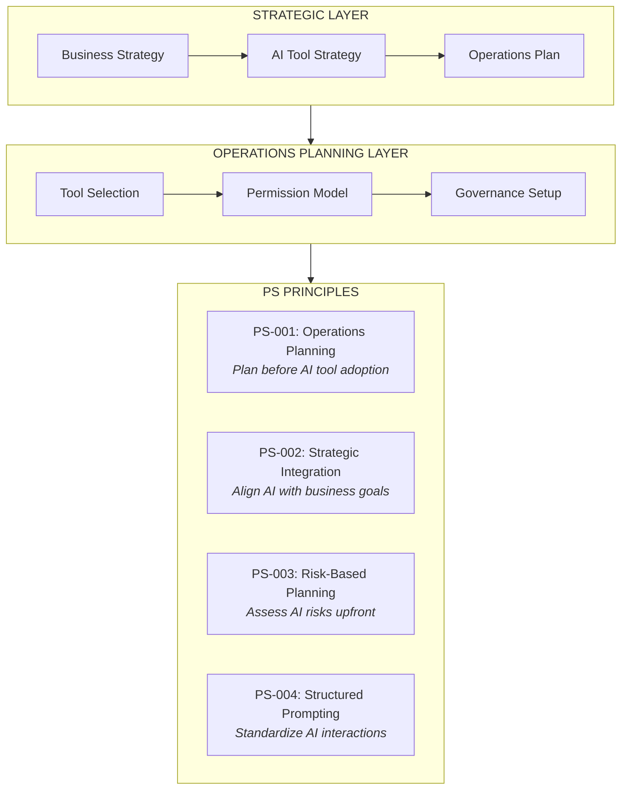
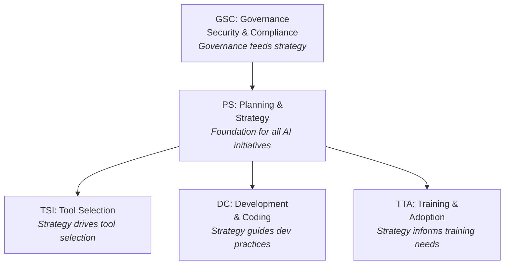
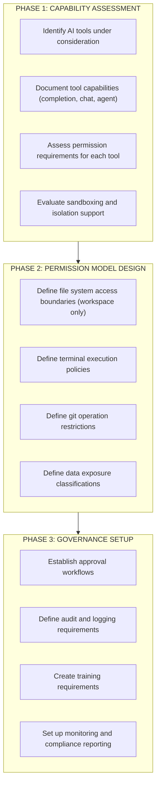
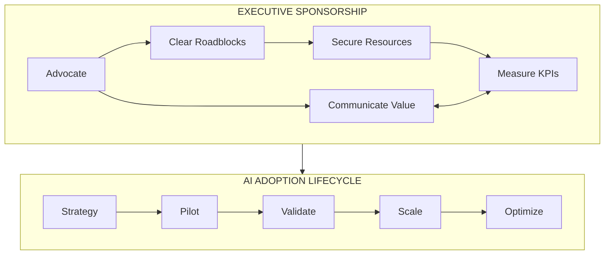
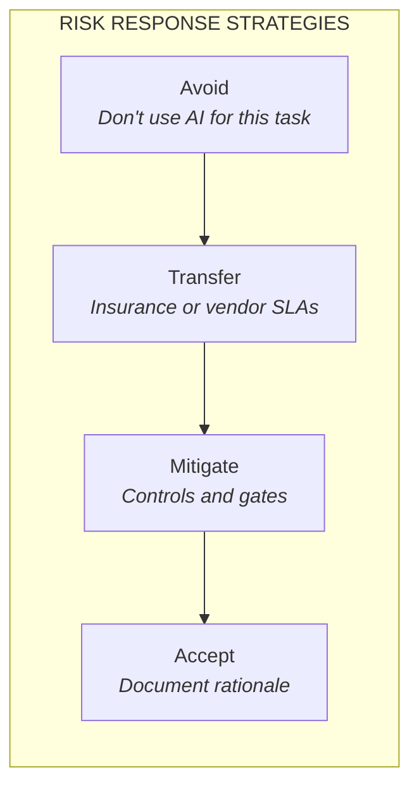
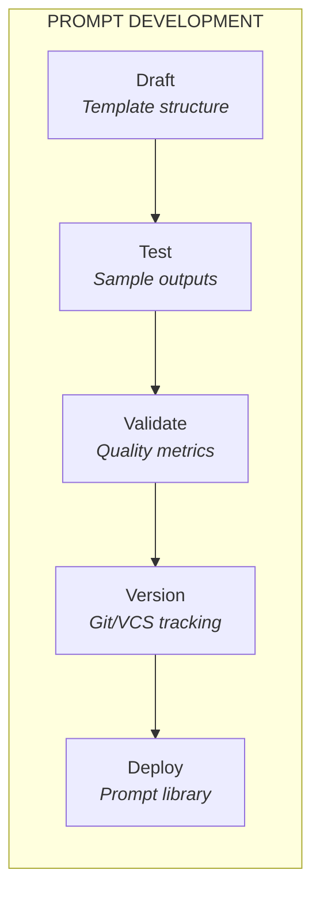

# Planning & Strategy (PS) Principles

Enterprise Architecture principles for strategic AI tool adoption and operations planning.

<div class="page-meta-table">
  <div class="page-meta-item">
    <span class="page-meta-label">Category</span>
    <span class="page-meta-value">PS</span>
  </div>
  <div class="page-meta-item">
    <span class="page-meta-label">Principles</span>
    <span class="page-meta-value">4</span>
  </div>
  <div class="page-meta-item">
    <span class="page-meta-label">Focus</span>
    <span class="page-meta-value">Strategic AI Tool Adoption & Operations Planning</span>
  </div>
  <div class="page-meta-item">
    <span class="page-meta-label">Status</span>
    <span class="page-meta-value">🔍 Under Peer Review</span>
  </div>
</div>

---

## Category Overview



**Key Concerns:**

- AI tool operations planning before adoption
- Executive sponsorship and strategic alignment
- Permission and governance model definition
- Prompt engineering standards and governance

---

## Principles in This Category

| ID     | Principle Name                   | Statement Summary                           |
| ------ | -------------------------------- | ------------------------------------------- |
| PS-001 | [Operations Planning](#ps-001)   | Plan AI tool operations before adoption     |
| PS-002 | [Strategic Integration](#ps-002) | Align AI adoption with business strategy    |
| PS-003 | [Risk-Based Planning](#ps-003)   | Assess AI risks during project planning     |
| PS-004 | [Structured Prompting](#ps-004)  | Standardize prompt practices and governance |

---

## Relationship to Other Categories



---

<a name="ps-001"></a>

## PS-001: Operations Planning

### Statement

> **Plan AI tool operations, permissions, and governance models before adopting AI development tools.**

### Rationale

| Dimension                | Justification                                                             |
| ------------------------ | ------------------------------------------------------------------------- |
| **Business Value**       | Structured planning prevents costly remediation and security incidents    |
| **Technical Foundation** | Clear operational parameters enable safe and effective AI tool deployment |
| **Risk Mitigation**      | Upfront planning identifies risks before tools are introduced             |
| **Human Agency**         | Humans define operational boundaries; AI operates within them             |

### Implications



| Area        | Implication                                        |
| ----------- | -------------------------------------------------- |
| Development | Operations plan documented before AI tool rollout  |
| Governance  | Operations review required before AI tool adoption |
| Skills      | Train teams on operations planning methodology     |
| Tools       | Evaluate tools against operational requirements    |

### Maturity Alignment

| Level           | Requirements                                                    |
| --------------- | --------------------------------------------------------------- |
| **Base (L1)**   | Basic operations documentation; manual approval workflow        |
| **Medium (L2)** | Structured operations templates; automated compliance checks    |
| **High (L3)**   | Integrated operations governance; continuous policy enforcement |

### Governance

#### Compliance Measures

- Operations plan documented for each AI tool
- Permission model defined and approved
- Governance setup completed before rollout
- Training requirements identified and scheduled
- Monitoring and audit capabilities configured

#### Exception Process

| Condition        | Approval Required | Documentation     |
| ---------------- | ----------------- | ----------------- |
| Rapid pilot      | Manager           | Scope limitations |
| Emergency use    | Director          | Post-hoc review   |
| Extended rollout | Governance Board  | Risk assessment   |

### Related Principles

- **GSC-002**: Permission Boundaries (operations define permissions)
- **GSC-003**: Sandboxing & Isolation (operations define isolation)
- **TSI-001**: Evaluation Framework (operations inform evaluation)
- **GSC-001**: Governance Framework (operations support governance)

---

<a name="ps-002"></a>

## PS-002: Strategic Integration

### Statement

> **Align AI tool adoption with business strategy and ensure executive sponsorship for AI initiatives.**

### Rationale

| Dimension                | Justification                                                            |
| ------------------------ | ------------------------------------------------------------------------ |
| **Business Value**       | AI projects solve real business problems and deliver measurable ROI      |
| **Technical Foundation** | Strategic alignment ensures appropriate investment in tools and training |
| **Risk Mitigation**      | Executive sponsorship provides governance and accountability             |
| **Human Agency**         | Business leaders direct AI strategy; teams implement within boundaries   |

### Implications



> **Executive Oversight Throughout** all lifecycle phases

| Area        | Implication                                             |
| ----------- | ------------------------------------------------------- |
| Development | AI initiatives tied to measurable business outcomes     |
| Governance  | Executive sponsor assigned for all AI adoption programs |
| Skills      | Leaders trained on AI capabilities and governance       |
| Tools       | Tool selection driven by strategic requirements         |

### Maturity Alignment

| Level           | Requirements                                                    |
| --------------- | --------------------------------------------------------------- |
| **Base (L1)**   | Documented AI strategy; identified executive sponsor            |
| **Medium (L2)** | KPIs defined and tracked; regular executive reviews             |
| **High (L3)**   | AI integrated into enterprise strategy; continuous optimization |

### Governance

#### Compliance Measures

- AI strategy documented and approved by leadership
- Executive sponsor identified and actively engaged
- Business KPIs defined for AI initiatives
- Regular progress reviews conducted
- ROI measured and reported

#### Exception Process

| Condition             | Approval Required | Documentation        |
| --------------------- | ----------------- | -------------------- |
| Team-level experiment | Manager           | Scope and time limit |
| Tool evaluation pilot | Director          | Success criteria     |
| Strategic pivot       | Executive Sponsor | Updated strategy doc |

### Related Principles

- **TSI-001**: Evaluation Framework (strategic criteria for tools)
- **TTA-002**: Adoption Governance (organizational readiness)
- **GSC-001**: Governance Framework (compliance alignment)

---

<a name="ps-003"></a>

## PS-003: Risk-Based Planning

### Statement

> **Assess AI-specific risks during project planning and establish mitigation strategies before implementation.**

### Rationale

| Dimension                | Justification                                                                   |
| ------------------------ | ------------------------------------------------------------------------------- |
| **Business Value**       | Proactive risk management reduces costly failures and delays                    |
| **Technical Foundation** | AI introduces unique risks (hallucination, bias, security) requiring assessment |
| **Risk Mitigation**      | Early identification enables appropriate controls and contingency planning      |
| **Human Agency**         | Humans evaluate and accept risks; AI operates within risk boundaries            |

### Implications

#### AI Risk Categories

| Quality       | Security         | Compliance     | Operational |
| ------------- | ---------------- | -------------- | ----------- |
| Hallucination | Data exposure    | IP violation   | Tool outage |
| Code defects  | Vulnerabilities  | License breach | Skill gaps  |
| Tech debt     | Prompt injection | Privacy breach | Dependency  |



| Area        | Implication                                                  |
| ----------- | ------------------------------------------------------------ |
| Development | Risk assessment required before AI tool adoption per project |
| Governance  | Risk acceptance documented with appropriate approval level   |
| Skills      | Train teams on AI-specific risk identification               |
| Tools       | Risk registry includes AI-specific risk categories           |

### Maturity Alignment

| Level           | Requirements                                                |
| --------------- | ----------------------------------------------------------- |
| **Base (L1)**   | Basic risk checklist; risks documented before AI use        |
| **Medium (L2)** | Formal risk assessment framework; mitigation plans required |
| **High (L3)**   | Predictive risk analysis; continuous risk monitoring        |

### Governance

#### Compliance Measures

- AI risk assessment completed for each project
- Risk mitigation strategies documented
- Risk acceptance documented with approval
- Risk register maintained and reviewed
- Incidents analyzed for risk pattern updates

#### Exception Process

| Condition               | Approval Required | Documentation          |
| ----------------------- | ----------------- | ---------------------- |
| Low-risk prototype      | Team Lead         | Risk acknowledgment    |
| Accept elevated risk    | Director          | Business justification |
| Security risk exception | Security + Legal  | Formal risk acceptance |

### Related Principles

- [TQC-002: Security Practices](../testing_and_quality_control/#tqc-002) — security risk mitigation
- [GSC-002: Permission Boundaries](../governance_security_and_compliance/#gsc-002) — compliance risk
- [DM-002: Observability First](../deployment_and_maintenance/#dm-002) — operational risk monitoring

---

<a name="ps-004"></a>

## PS-004: Structured Prompting

### Statement

> **Establish and maintain standardized prompt engineering practices with version control and governance.**

### Rationale

| Dimension                | Justification                                                             |
| ------------------------ | ------------------------------------------------------------------------- |
| **Business Value**       | Consistent prompts produce consistent, quality outputs                    |
| **Technical Foundation** | Prompts are engineering artifacts requiring the same rigor as code        |
| **Risk Mitigation**      | Ungoverned prompts lead to unpredictable AI behavior and quality variance |
| **Human Agency**         | Humans craft and approve prompts; AI responds within defined parameters   |

### Implications



#### Prompt Library Structure

```
├── prompts/
│   ├── code_generation/
│   ├── code_review/
│   ├── testing/
│   ├── documentation/
│   └── templates/
```

| Area        | Implication                                            |
| ----------- | ------------------------------------------------------ |
| Development | Prompts stored in version control alongside code       |
| Governance  | Prompt review process for production use               |
| Skills      | Train teams on effective prompt engineering techniques |
| Tools       | Integrate prompt libraries into AI development tools   |

### Maturity Alignment

| Level           | Requirements                                              |
| --------------- | --------------------------------------------------------- |
| **Base (L1)**   | Prompts documented; basic version control                 |
| **Medium (L2)** | Prompt library with categories; testing and validation    |
| **High (L3)**   | AI-optimized prompts; continuous improvement from metrics |

### Governance

#### Compliance Measures

- Prompts stored in version control
- Prompt templates exist for common use cases
- Production prompts reviewed and approved
- Prompt effectiveness tracked and measured
- Prompt updates follow change management

#### Exception Process

| Condition                 | Approval Required | Documentation          |
| ------------------------- | ----------------- | ---------------------- |
| Ad-hoc exploration        | None              | Not for production use |
| Custom production prompt  | Tech Lead         | Effectiveness evidence |
| Security-sensitive prompt | Security Team     | Security review        |

### Related Principles

- **DC-002**: Prompt Engineering (detailed prompt practices)
- **DC-001**: AI-Human Collaboration (prompts guide collaboration)
- **TTA-001**: Skills Development (prompt engineering training)

---

## Category Summary

### Principle Matrix

| Principle                        | BASE (L1)            | MEDIUM (L2)          | HIGH (L3)               |
| -------------------------------- | -------------------- | -------------------- | ----------------------- |
| **PS-001** Operations Planning   | Basic docs + review  | Structured templates | AI-assisted validation  |
| **PS-002** Strategic Integration | Strategy + sponsor   | KPIs + reviews       | Enterprise integrated   |
| **PS-003** Risk-Based Planning   | Checklist + document | Formal framework     | Predictive analysis     |
| **PS-004** Structured Prompting  | Version control      | Library + testing    | AI-optimized continuous |

> **Legend:** Requirements increase with maturity level

### Key Takeaways

1. **Design before generate** - Architecture documentation is prerequisite to AI code generation
2. **Strategic alignment is mandatory** - AI initiatives must connect to business objectives
3. **Assess risks proactively** - AI-specific risks require explicit assessment
4. **Treat prompts as code** - Version control, testing, and governance apply to prompts
5. **Executive sponsorship matters** - Sustained AI success requires leadership commitment

---

## Next Steps

| Action                  | Link                                                 |
| ----------------------- | ---------------------------------------------------- |
| View all principles     | [Principles Index](../)                              |
| Related: Tool Selection | [TSI Principles](../tool_selection_and_integration/) |
| Related: Development    | [DC Principles](../development_and_coding/)          |
| Maturity assessment     | [Maturity Model](/maturity/)                         |

---

## License

<div class="license-cards">
  <a href="{{ '/attribution' | relative_url }}" class="license-card">
    <div class="license-card-header">
      <span class="license-card-badge mpl">MPL 2.0 + Attribution</span>
    </div>
    <div class="license-card-title">Open Source</div>
    <div class="license-card-desc">Free for any use including commercial. Credit required to LocalM™ AiD Framework, Nilay Parikh, and localm.ai.</div>
    <span class="license-card-link">View requirements →</span>
  </a>
  <a href="https://localm.ai/enterprise" target="_blank" rel="noopener" class="license-card">
    <div class="license-card-header">
      <span class="license-card-badge enterprise">Enterprise</span>
    </div>
    <div class="license-card-title">Commercial License</div>
    <div class="license-card-desc">No attribution required. Keep modifications private. Includes expert support and training.</div>
    <span class="license-card-link">Contact sales →</span>
  </a>
</div>
<!--
  LocalM-AiD: Enterprise Architecture Framework for AI-Assisted Development
  
  Copyright (c) 2025 Nilay Parikh
  
  This Source Code Form is subject to the terms of the Mozilla Public
  License, v. 2.0. If a copy of the MPL was not distributed with this
  file, You can obtain one at http://mozilla.org/MPL/2.0/.
  
  Author: Nilay Parikh
  Contact: 
    - Twitter: @nilayparikh
    - LinkedIn: https://www.linkedin.com/in/niparikh/
  
  Feel free to contact for questions or queries.
-->
