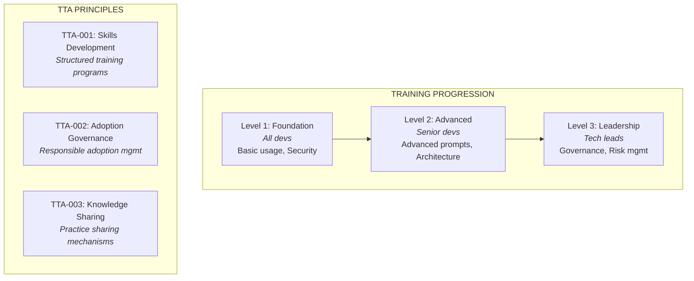
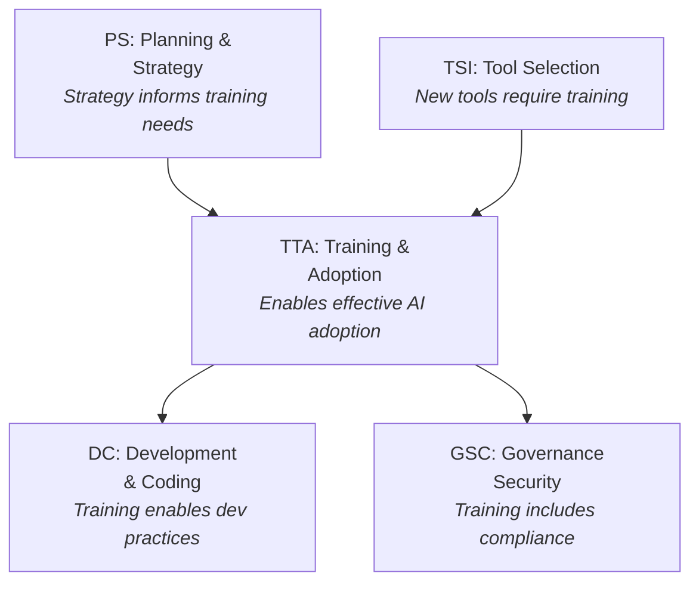
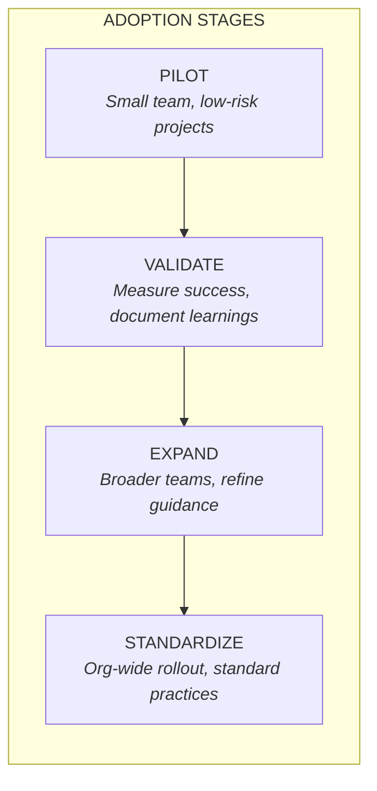
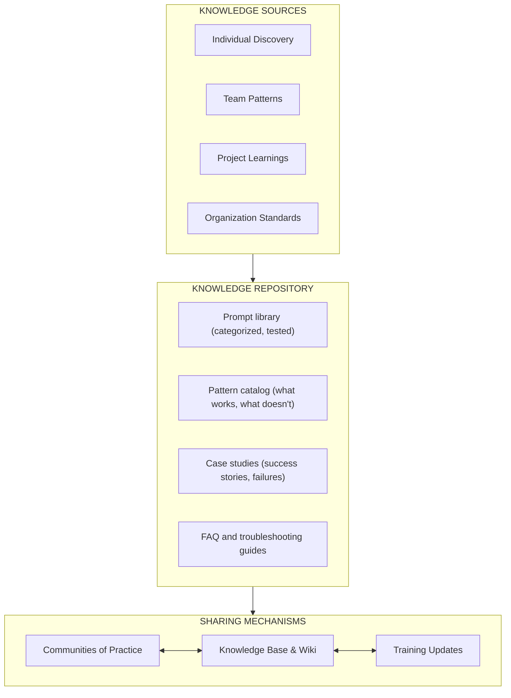

<!-- 
  LocalM-AiD: Enterprise Architecture Framework for AI-Assisted Development
  
  Copyright (c) 2025 Nilay Parikh
  
  This Source Code Form is subject to the terms of the Mozilla Public
  License, v. 2.0. If a copy of the MPL was not distributed with this
  file, You can obtain one at http://mozilla.org/MPL/2.0/.
  
  Author: Nilay Parikh
  Contact: 
    - Twitter: @nilayparikh
    - LinkedIn: https://www.linkedin.com/in/niparikh/
  
  Feel free to contact on Twitter/LinkedIn for questions or queries.
-->

---
layout: default
title: Team Training & Adoption Principles
category: TTA
---

# Team Training & Adoption (TTA) Principles

**Category Code**: TTA
**Principle Count**: 3
**Focus**: Building Team Capability for AI-Assisted Development

---

## Category Overview

**Key Concerns:**

- Training curriculum by role and level
- AI-assisted coding vs. "vibe coding" distinction
- Gradual adoption with success criteria
- Knowledge sharing and community building

---

## Principles in This Category

| ID      | Principle Name                  | Statement Summary                           |
| ------- | ------------------------------- | ------------------------------------------- |
| TTA-001 | [Skills Development](#tta-001)  | Structured training for AI tool proficiency |
| TTA-002 | [Adoption Governance](#tta-002) | Responsible organizational AI adoption      |
| TTA-003 | [Knowledge Sharing](#tta-003)   | Mechanisms for AI practice sharing          |

---

## Relationship to Other Categories

---

## TTA-001: Skills Development

### Statement

> **Implement structured training programs that build AI-assisted development skills progressively by role and experience level.**

### Rationale

| Dimension                | Justification                                                             |
| ------------------------ | ------------------------------------------------------------------------- |
| **Business Value**       | Trained developers produce higher quality AI-assisted outputs faster      |
| **Technical Foundation** | AI tools require specific skills (prompting, review) not taught elsewhere |
| **Risk Mitigation**      | Untrained users may misuse AI tools, creating security or quality issues  |
| **Human Agency**         | Training ensures humans can effectively direct and validate AI outputs    |

### Implications

#### Training Level Framework

**LEVEL 1: FOUNDATIONAL** _(All Developers)_

| Topic           | Content                                    |
| --------------- | ------------------------------------------ |
| AI Capabilities | Understand AI capabilities and limitations |
| Policies        | Enterprise policies and acceptable use     |
| Security        | Security awareness and data protection     |
| Basic Usage     | Basic tool usage and prompting             |

> **Duration:** 4-8 hours | **Format:** Online + hands-on

**LEVEL 2: ADVANCED** _(Senior Developers, Architects)_

| Topic              | Content                          |
| ------------------ | -------------------------------- |
| Advanced Prompting | Advanced prompting techniques    |
| Architecture       | Architecture assistance patterns |
| Code Review        | AI output code review            |
| Integration        | Custom AI integration            |

> **Duration:** 8-16 hours | **Format:** Workshop + projects

**LEVEL 3: LEADERSHIP** _(Tech Leads, Managers)_

| Topic      | Content                   |
| ---------- | ------------------------- |
| Governance | Governance and compliance |
| Risk       | Risk management           |
| Enablement | Team enablement           |
| Metrics    | Metrics and measurement   |

> **Duration:** 8 hours | **Format:** Seminar + case studies

| Area        | Implication                                           |
| ----------- | ----------------------------------------------------- |
| Development | All developers complete Level 1 before using AI tools |
| Governance  | Training completion tracked; certification required   |
| Skills      | Training curriculum maintained and updated regularly  |
| Tools       | Training environments with sandboxed AI tool access   |

### Maturity Alignment

| Level           | Requirements                                                 |
| --------------- | ------------------------------------------------------------ |
| **Base (L1)**   | Level 1 training required; completion tracked                |
| **Medium (L2)** | All three levels implemented; role-based requirements        |
| **High (L3)**   | Continuous learning; AI-assisted personalized training paths |

### Governance

#### Compliance Measures

- [ ] Training curriculum documented and approved
- [ ] Completion tracking system in place
- [ ] Level 1 completion required before AI tool access
- [ ] Annual refresher training required
- [ ] Training effectiveness measured

#### Exception Process

| Condition               | Approval Required | Documentation         |
| ----------------------- | ----------------- | --------------------- |
| Emergency tool access   | Manager           | Training deadline set |
| Experienced hire waiver | Director          | Skills assessment     |
| Contractor training     | Project Manager   | Scope limitations     |

### Related Principles

- **TSI-001**: Evaluation Framework (training for new tools)
- **DC-002**: Prompt Engineering (prompting skills training)
- **PS-004**: Structured Prompting (prompt governance training)

---

## TTA-002: Adoption Governance

### Statement

> **Manage AI tool adoption through defined governance stages with success criteria and responsible scaling.**

### Rationale

| Dimension                | Justification                                                    |
| ------------------------ | ---------------------------------------------------------------- |
| **Business Value**       | Phased adoption reduces risk and validates ROI before scaling    |
| **Technical Foundation** | Gradual rollout identifies integration and workflow issues early |
| **Risk Mitigation**      | Governance prevents uncontrolled AI proliferation and shadow IT  |
| **Human Agency**         | Humans control adoption pace; metrics guide decisions            |

### Implications

#### Success Criteria by Stage

| PILOT                 | VALIDATE              | EXPAND                    | STANDARDIZE            |
| --------------------- | --------------------- | ------------------------- | ---------------------- |
| Tool works            | Quality met           | Scaled to 3+ teams        | All teams trained      |
| No security incidents | Productivity improved | Best practices documented | Governance operational |
| Team positive         | ROI validated         |                           |                        |

| Area        | Implication                                        |
| ----------- | -------------------------------------------------- |
| Development | Teams participate in structured adoption programs  |
| Governance  | Stage gates with defined success criteria          |
| Skills      | Change management and adoption facilitation skills |
| Tools       | Metrics collection and reporting infrastructure    |

### Maturity Alignment

| Level           | Requirements                                                    |
| --------------- | --------------------------------------------------------------- |
| **Base (L1)**   | Pilot program defined; basic success criteria                   |
| **Medium (L2)** | Full governance model; metrics-driven stage progression         |
| **High (L3)**   | Automated adoption tracking; predictive scaling recommendations |

### Governance

#### Compliance Measures

- [ ] Adoption stages documented with success criteria
- [ ] Stage progression requires approval
- [ ] Metrics collected at each stage
- [ ] Learnings documented and shared
- [ ] Rollback procedures defined

#### Exception Process

| Condition            | Approval Required | Documentation          |
| -------------------- | ----------------- | ---------------------- |
| Accelerated adoption | Director          | Business justification |
| Skip stage           | VP + Governance   | Risk acceptance        |
| Emergency rollback   | Tech Lead         | Incident report        |

### Related Principles

- **PS-002**: Strategic Integration (strategy guides adoption)
- **TSI-001**: Evaluation Framework (tools evaluated before pilot)
- **GSC-001**: Governance Framework (adoption within governance)

---

## TTA-003: Knowledge Sharing

### Statement

> **Establish mechanisms for sharing AI-assisted development practices, patterns, and lessons learned across teams.**

### Rationale

| Dimension                | Justification                                                                       |
| ------------------------ | ----------------------------------------------------------------------------------- |
| **Business Value**       | Knowledge sharing multiplies ROI from AI investments across organization            |
| **Technical Foundation** | Patterns and anti-patterns emerge from collective experience                        |
| **Risk Mitigation**      | Sharing failures prevents repeated mistakes; sharing successes accelerates adoption |
| **Human Agency**         | Humans curate and validate shared knowledge; AI assists discovery                   |

### Implications

| Area        | Implication                                             |
| ----------- | ------------------------------------------------------- |
| Development | Teams contribute to and consume shared knowledge        |
| Governance  | Knowledge review process ensures quality and accuracy   |
| Skills      | Facilitation and curation skills for knowledge stewards |
| Tools       | Knowledge management platform with search and discovery |

### Maturity Alignment

| Level           | Requirements                                                   |
| --------------- | -------------------------------------------------------------- |
| **Base (L1)**   | Basic knowledge repository; voluntary contributions            |
| **Medium (L2)** | Community of practice; curated content; regular sharing events |
| **High (L3)**   | AI-assisted knowledge discovery; automated pattern detection   |

### Governance

#### Compliance Measures

- [ ] Knowledge repository established and accessible
- [ ] Contribution guidelines documented
- [ ] Content review process defined
- [ ] Sharing events scheduled regularly
- [ ] Knowledge usage metrics tracked

#### Exception Process

| Condition              | Approval Required | Documentation       |
| ---------------------- | ----------------- | ------------------- |
| Confidential learnings | Legal/Compliance  | Sanitization plan   |
| External sharing       | Communications    | Approval and review |
| Deprecated content     | Knowledge Steward | Archive decision    |

### Related Principles

- **TTA-001**: Skills Development (training integrates shared knowledge)
- **PS-004**: Structured Prompting (prompt library maintenance)
- **DC-002**: Prompt Engineering (prompt patterns shared)

---

## Category Summary

### Principle Matrix

| Principle                       | BASE (L1)              | MEDIUM (L2)               | HIGH (L3)                       |
| ------------------------------- | ---------------------- | ------------------------- | ------------------------------- |
| **TTA-001** Skills Development  | Level 1 required       | All levels + role-based   | AI-assisted personalized        |
| **TTA-002** Adoption Governance | Pilot + basic criteria | Full model metrics-driven | Automated tracking + predictive |
| **TTA-003** Knowledge Sharing   | Basic repo voluntary   | Community + curated       | AI-assisted discovery           |

> **Legend:** Requirements increase with maturity level

### Critical Distinction: AI-Assisted vs. "Vibe Coding"

| "VIBE CODING" ❌       | AI-ASSISTED CODING ✅    |
| ---------------------- | ------------------------ |
| Describe end product   | Iterative interaction    |
| AI handles all details | Developer guides AI      |
| No engineering needed  | Engineering required     |
| **Result: Unreliable** | **Result: High quality** |

> ⚠️ **Training MUST distinguish these approaches**

### Key Takeaways

1. **Training is prerequisite** - No AI tool access without appropriate training
2. **Levels match roles** - Different training for developers, seniors, leaders
3. **Adopt gradually** - Phased rollout with success criteria at each stage
4. **Share actively** - Knowledge multiplies when shared across organization
5. **Distinguish coding approaches** - AI-assisted ≠ "vibe coding"

---

## Next Steps

| Action                  | Link                                                 |
| ----------------------- | ---------------------------------------------------- |
| View all principles     | [Principles Index](../)                              |
| Related: Development    | [DC Principles](../development_and_coding/)          |
| Related: Tool Selection | [TSI Principles](../tool_selection_and_integration/) |
| Maturity assessment     | [Maturity Model](/maturity/)                         |
