# Testing & Quality Control (TQC) Principles

Enterprise Architecture principles for quality assurance in AI-assisted development.

  

    Category
    TQC
  

  

    Principles
    4
  

  

    Focus
    Quality Assurance for AI-Assisted Development
  

  

    Status
    🔍 Under Peer Review
  

---

## Category Overview

**Key Concerns:**

- Test-driven development with AI implementation
- Security validation of AI-generated code
- Quality metrics and standards enforcement
- Continuous validation throughout development

---

## Principles in This Category

| ID      | Principle Name                    | Statement Summary                        |
| ------- | --------------------------------- | ---------------------------------------- |
| TQC-001 | [AI-Aware Testing](#tqc-001)      | Testing strategies for AI-generated code |
| TQC-002 | [Security Practices](#tqc-002)    | Security standards for AI development    |
| TQC-003 | [Quality Framework](#tqc-003)     | Quality standards and metrics            |
| TQC-004 | [Continuous Validation](#tqc-004) | Ongoing validation throughout lifecycle  |

---

## Relationship to Other Categories

---

## TQC-001: AI-Aware Testing

### Statement

> **Write tests before AI code generation and verify that tests pass against generated code without AI modification of the tests.**

### Rationale

| Dimension                | Justification                                                                 |
| ------------------------ | ----------------------------------------------------------------------------- |
| **Business Value**       | Tests define requirements upfront, ensuring AI generates fit-for-purpose code |
| **Technical Foundation** | AI excels at implementing to spec; tests provide the specification            |
| **Risk Mitigation**      | Pre-written tests prevent AI from generating tests that match flawed code     |
| **Human Agency**         | Humans define expected behavior; AI implements to meet those expectations     |

### Implications

```mermaid
flowchart TB
    subgraph Step1["Step 1: Write Test Specification (Human)"]
        S1A["Define expected behaviors"]
        S1B["Write test cases (happy path, errors, edge cases)"]
        S1C["Establish boundaries and assumptions"]
    end

    subgraph Step2["Step 2: Share Context with AI"]
        S2A["Tests that must pass"]
        S2B["Project patterns and conventions"]
        S2C["Constraints and requirements"]
    end

    subgraph Step3["Step 3: Generate Implementation (AI)"]
        S3A["AI generates code to satisfy the tests"]
    end

    subgraph Step4["Step 4: Validate Output (Human)"]
        S4A["✓ All tests pass (RUN them!)"]
        S4B["✓ Tests actually test the code"]
        S4C["✓ No test modifications by AI"]
        S4D["✓ Code follows project patterns"]
        S4E["✓ Security review complete"]
    end

    Step1 --> Step2 --> Step3 --> Step4
```

| Area        | Implication                                                  |
| ----------- | ------------------------------------------------------------ |
| Development | Tests written by humans before AI generates implementation   |
| Governance  | Test modification by AI prohibited without explicit approval |
| Skills      | Train developers on TDD patterns for AI collaboration        |
| Tools       | Configure AI tools to implement against provided tests       |

### Maturity Alignment

| Level           | Requirements                                               |
| --------------- | ---------------------------------------------------------- |
| **Base (L1)**   | Tests required before generation; human runs and validates |
| **Medium (L2)** | Automated test execution; coverage requirements enforced   |
| **High (L3)**   | AI suggests missing test cases; mutation testing           |

### Governance

#### Compliance Measures

- Tests exist before AI code generation
- Test runs documented with results
- AI-modified tests flagged for review
- Test coverage meets thresholds
- Edge cases explicitly tested

#### Exception Process

| Condition           | Approval Required | Documentation         |
| ------------------- | ----------------- | --------------------- |
| Exploratory code    | None              | Tests before merge    |
| AI test suggestions | Tech Lead         | Human review of tests |
| Coverage exception  | Manager           | Risk acknowledgment   |

### Related Principles

- **DC-001**: AI-Human Collaboration (tests define collaboration)
- **DC-003**: Code Review Practices (tests inform review)
- **DM-001**: Pipeline Integration (tests as quality gates)

---

## TQC-002: Security Practices

### Statement

> **Apply security engineering practices to all AI-generated code, treating AI as an untrusted contributor requiring the same security validation as external code.**

### Rationale

| Dimension                | Justification                                                               |
| ------------------------ | --------------------------------------------------------------------------- |
| **Business Value**       | Security breaches are costly; prevention is cheaper than remediation        |
| **Technical Foundation** | AI can generate code with vulnerabilities, including subtle security flaws  |
| **Risk Mitigation**      | Treating AI as untrusted ensures security controls are consistently applied |
| **Human Agency**         | Humans remain accountable for security; AI is the assistant                 |

### Implications

#### Five Security Pillars

| #   | Pillar                    | Description                         |
| --- | ------------------------- | ----------------------------------- |
| 1   | **You Are Developer**     | Full control and responsibility     |
| 2   | **Best Practices Apply**  | No shortcuts for AI code            |
| 3   | **Be Security-Conscious** | Assume AI code has vulnerabilities  |
| 4   | **Guide the AI**          | Specify security requirements       |
| 5   | **AI Self-Review**        | Recursive criticism and improvement |

#### Security Validation Checklist

| Input Validation        | Authentication/Authorization |
| ----------------------- | ---------------------------- |
| ☐ All inputs validated  | ☐ No hardcoded credentials   |
| ☐ Format/length checked | ☐ Secure auth libraries      |
| ☐ Parameterized queries | ☐ Role-based access enforced |
| ☐ Output encoding       | ☐ Constant-time comparison   |

| Data Protection         | Dependency Security             |
| ----------------------- | ------------------------------- |
| ☐ Secrets in vaults     | ☐ Dependencies scanned          |
| ☐ Encryption at rest    | ☐ Known vulnerabilities checked |
| ☐ Encryption in transit | ☐ License compliance verified   |

| Area        | Implication                                       |
| ----------- | ------------------------------------------------- |
| Development | Security requirements included in all AI prompts  |
| Governance  | Security review mandatory for AI-generated code   |
| Skills      | Security training for all AI-assisted developers  |
| Tools       | SAST/DAST integrated; dependency scanning enabled |

### Maturity Alignment

| Level           | Requirements                                                  |
| --------------- | ------------------------------------------------------------- |
| **Base (L1)**   | Manual security review; basic security checklist              |
| **Medium (L2)** | Automated SAST/DAST; security gates in CI/CD                  |
| **High (L3)**   | AI-assisted vulnerability detection; predictive risk analysis |

### Governance

#### Compliance Measures

- Security requirements in prompts
- Security review completed before merge
- No hardcoded credentials
- Dependency vulnerabilities addressed
- Security scans passing

#### Exception Process

| Condition               | Approval Required    | Documentation         |
| ----------------------- | -------------------- | --------------------- |
| Security warning bypass | Security Team        | Risk acceptance form  |
| Deprecated dependency   | Tech Lead            | Migration plan        |
| Legacy code integration | Security + Architect | Security architecture |

### Related Principles

- **DC-003**: Code Review Practices (security in review)
- **DM-001**: Pipeline Integration (security gates)
- **GSC-002**: Compliance Management (security compliance)

---

## TQC-003: Quality Framework

### Statement

> **Apply identical quality standards to AI-generated code as human-written code, with human accountability for all quality outcomes.**

### Rationale

| Dimension                | Justification                                                       |
| ------------------------ | ------------------------------------------------------------------- |
| **Business Value**       | Consistent quality standards ensure reliable, maintainable software |
| **Technical Foundation** | AI code can have subtle quality issues that compound over time      |
| **Risk Mitigation**      | "AI wrote it" is not an excuse for quality shortcuts                |
| **Human Agency**         | Humans remain accountable for approving and maintaining all code    |

### Implications

#### Quality Principles

| #   | Principle                | Description                     |
| --- | ------------------------ | ------------------------------- |
| 1   | **Same Standards**       | No shortcuts for AI code        |
| 2   | **Human Accountability** | Humans responsible for outcomes |
| 3   | **Verification > Trust** | Verify rather than trust AI     |

#### Quality Dimensions

| Functional Correctness | Code Quality    | Performance      |
| ---------------------- | --------------- | ---------------- |
| Meets requirements     | Style compliant | Meets benchmarks |
| Handles edge cases     | Maintainable    | Scalable         |
| Correct logic          | Documented      | Efficient        |
| Error handling         | Testable        | Resource-aware   |

#### Quality Gates Flow

| Area        | Implication                                        |
| ----------- | -------------------------------------------------- |
| Development | All code meets same standards regardless of origin |
| Governance  | Quality metrics tracked and enforced               |
| Skills      | Train developers on quality standards for AI code  |
| Tools       | Automated quality gates in CI/CD pipeline          |

### Maturity Alignment

| Level           | Requirements                                                |
| --------------- | ----------------------------------------------------------- |
| **Base (L1)**   | Manual quality review; documented standards                 |
| **Medium (L2)** | Automated quality gates; metrics dashboards                 |
| **High (L3)**   | AI-assisted quality assessment; predictive quality analysis |

### Governance

#### Compliance Measures

- Quality standards documented
- All code passes lint/style checks
- Test coverage meets thresholds
- Code review completed and approved
- Quality metrics tracked and reported

#### Exception Process

| Condition             | Approval Required | Documentation         |
| --------------------- | ----------------- | --------------------- |
| Coverage exception    | Tech Lead         | Technical debt ticket |
| Style override        | Team Lead         | Documented rationale  |
| Performance exception | Architect         | Performance analysis  |

### Related Principles

- **DC-003**: Code Review Practices (review enforces quality)
- **DM-001**: Pipeline Integration (quality gates in pipeline)
- **GSC-001**: Governance Framework (quality governance)

---

## TQC-004: Continuous Validation

### Statement

> **Validate AI-assisted deliverables continuously throughout the development lifecycle, not just at completion.**

### Rationale

| Dimension                | Justification                                                    |
| ------------------------ | ---------------------------------------------------------------- |
| **Business Value**       | Early detection of issues reduces cost of remediation            |
| **Technical Foundation** | AI can introduce subtle issues that compound when left unchecked |
| **Risk Mitigation**      | Continuous validation prevents accumulation of technical debt    |
| **Human Agency**         | Regular checkpoints maintain human awareness and control         |

### Implications

#### Validation Checkpoints Flow

#### Validation Activities by Phase

| Phase                 | Activities                             |
| --------------------- | -------------------------------------- |
| **Pre-Generation**    | Requirements complete and clear        |
|                       | Tests written and passing (empty impl) |
|                       | Architecture documented                |
| **During Generation** | Incremental test runs                  |
|                       | Checkpoint reviews                     |
|                       | Early issue detection                  |
| **Post-Generation**   | Full test suite execution              |
|                       | Code review completion                 |
|                       | Security validation                    |
| **Pre-Merge**         | Quality gates pass                     |
|                       | Approval obtained                      |
|                       | Documentation updated                  |
| **Post-Deploy**       | Production monitoring                  |
|                       | Error tracking                         |
|                       | Performance validation                 |

| Area        | Implication                                          |
| ----------- | ---------------------------------------------------- |
| Development | Validation activities integrated throughout workflow |
| Governance  | Checkpoint completion required for progression       |
| Skills      | Train developers on continuous validation practices  |
| Tools       | Automated validation at each checkpoint              |

### Maturity Alignment

| Level           | Requirements                                           |
| --------------- | ------------------------------------------------------ |
| **Base (L1)**   | Manual checkpoints; basic validation at key phases     |
| **Medium (L2)** | Automated validation gates; metrics-driven progression |
| **High (L3)**   | AI-assisted validation; predictive issue detection     |

### Governance

#### Compliance Measures

- Validation checkpoints defined per phase
- Checkpoint completion documented
- Issues tracked and resolved before progression
- Validation metrics tracked
- Continuous improvement from validation learnings

#### Exception Process

| Condition          | Approval Required | Documentation        |
| ------------------ | ----------------- | -------------------- |
| Skip checkpoint    | Tech Lead         | Risk acknowledgment  |
| Reduced validation | Manager           | Scope limitations    |
| Emergency bypass   | Director          | Post-incident review |

### Related Principles

- **DM-001**: Pipeline Integration (validation gates)
- **DM-002**: Observability First (post-deploy validation)
- **DC-001**: AI-Human Collaboration (validation maintains control)

---

## Category Summary

### Principle Maturity Matrix

| Principle                         | Base (L1)               | Medium (L2)        | High (L3)             |
| --------------------------------- | ----------------------- | ------------------ | --------------------- |
| **TQC-001** AI-Aware Testing      | Tests first, human runs | Automated coverage | AI test suggestions   |
| **TQC-002** Security Practices    | Manual review           | SAST/DAST gates    | AI-assisted detection |
| **TQC-003** Quality Framework     | Documented standards    | Automated gates    | AI quality assessment |
| **TQC-004** Continuous Validation | Manual checkpoints      | Automated gates    | Predictive detection  |

### Key Takeaways

1. **Tests before code** - Write tests first; AI implements against specifications
2. **Same standards apply** - No quality shortcuts because "AI wrote it"
3. **Security is non-negotiable** - Treat AI as untrusted contributor
4. **Validate continuously** - Don't wait until the end to find issues
5. **Human accountability remains** - Developers own all quality outcomes

---

## Next Steps

| Action              | Link                                                     |
| ------------------- | -------------------------------------------------------- |
| View all principles | [Principles Index](../)                                  |
| Related: Deployment | [DM Principles](../deployment_and_maintenance/)          |
| Related: Governance | [GSC Principles](../governance_security_and_compliance/) |
| Maturity assessment | [Maturity Model](/maturity/)                             |

---

## License

**LocalM-AiD Framework Principles**

This Source Code Form is subject to the terms of the Mozilla Public License, v. 2.0. If a copy of the MPL was not distributed with this file, You can obtain one at <a href="http://mozilla.org/MPL/2.0/" target="_blank" rel="noopener">http://mozilla.org/MPL/2.0/</a>.

### Attribution Required

When using or redistributing these principles, you must:

- ✅ **Provide visible credit** to the LocalM-AiD Framework and <a href="https://localm.ai/" target="_blank" rel="noopener">localm.ai</a>
- ✅ **Keep this license** with any modified versions
- ✅ **Release modifications** under MPL 2.0
- ✅ **Indicate changes** you've made to the original
