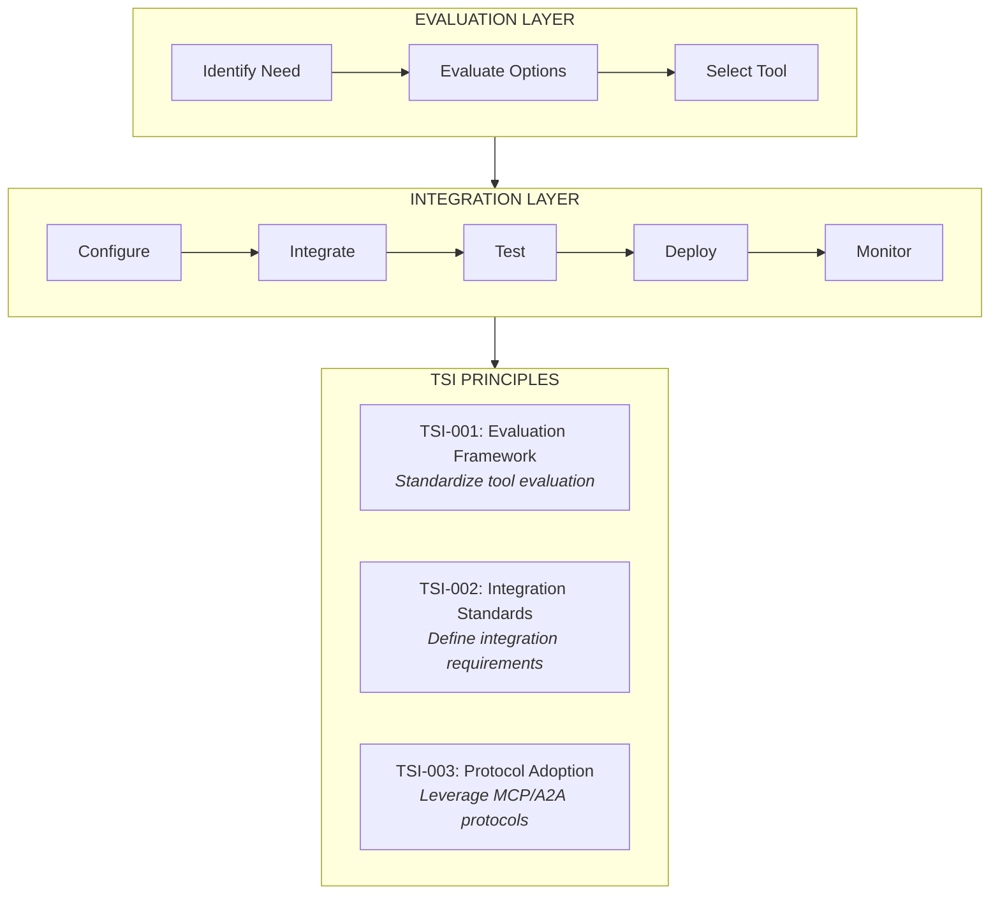
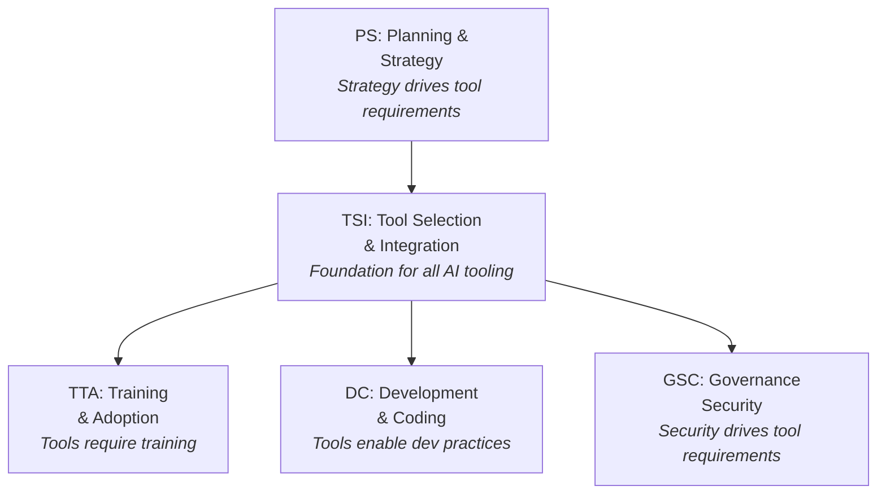
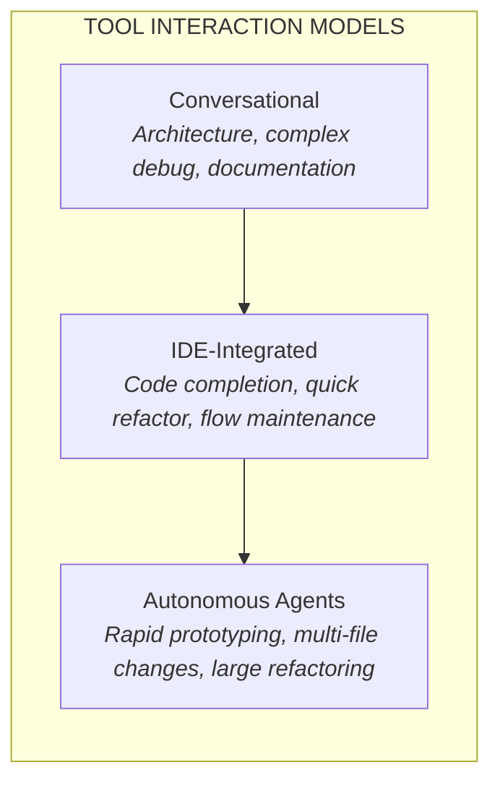
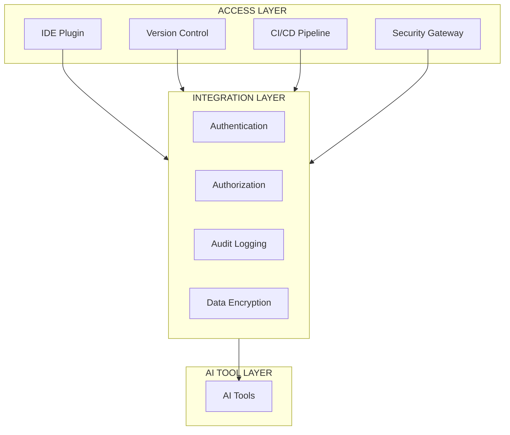
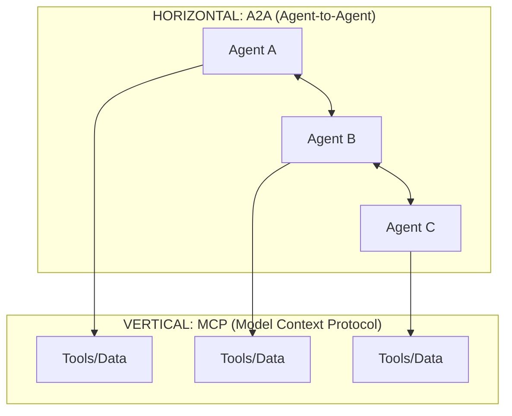

<!--
  LocalM-AiD: Enterprise Architecture Framework for AI-Assisted Development
  
  Copyright (c) 2025 Nilay Parikh
  
  This Source Code Form is subject to the terms of the Mozilla Public
  License, v. 2.0. If a copy of the MPL was not distributed with this
  file, You can obtain one at http://mozilla.org/MPL/2.0/.
  
  Author: Nilay Parikh
  Contact: 
    - Twitter: @nilayparikh
    - LinkedIn: https://www.linkedin.com/in/niparikh/
  
  Feel free to contact for questions or queries.
-->
---
layout: default
title: Tool Selection & Integration Principles
description: Enterprise Architecture principles for evaluating, selecting, and integrating AI development tools into software development workflows.
category: TSI
---

# Tool Selection & Integration (TSI) Principles

Enterprise Architecture principles for evaluating, selecting, and integrating AI development tools.

  

    Category
    TSI
  

  

    Principles
    3
  

  

    Focus
    AI Tool Evaluation, Selection, and Integration
  

  

    Status
    🔍 Under Peer Review
  

---

## Category Overview

**Key Concerns:**

- Security and compliance requirements for AI tools
- IDE and workflow integration capabilities
- Protocol standardization (MCP, A2A)
- Team collaboration and knowledge sharing

---

## Principles in This Category

| ID      | Principle Name                    | Statement Summary                            |
| ------- | --------------------------------- | -------------------------------------------- |
| TSI-001 | [Evaluation Framework](#tsi-001)  | Standardize AI tool evaluation criteria      |
| TSI-002 | [Integration Standards](#tsi-002) | Define integration requirements for AI tools |
| TSI-003 | [Protocol Adoption](#tsi-003)     | Leverage MCP and A2A protocols for tooling   |

---

## Relationship to Other Categories

---

## TSI-001: Evaluation Framework

### Statement

> **Evaluate AI development tools using a standardized framework covering security, integration, and team requirements.**

### Rationale

| Dimension                | Justification                                                               |
| ------------------------ | --------------------------------------------------------------------------- |
| **Business Value**       | Consistent evaluation ensures tools deliver expected ROI                    |
| **Technical Foundation** | Structured evaluation identifies integration and compatibility issues early |
| **Risk Mitigation**      | Security and compliance assessment prevents data exposure and violations    |
| **Human Agency**         | Humans define evaluation criteria; AI tools are selected based on merit     |

### Implications

#### Evaluation Dimensions

| SECURITY         | INTEGRATION     | TEAM           |
| ---------------- | --------------- | -------------- |
| Data privacy     | IDE support     | Learning curve |
| Compliance       | Version control | Collaboration  |
| Access control   | CI/CD pipeline  | Customization  |
| Network security | API access      | Cost model     |
| Classification   | SSO support     | Support SLA    |

| Area        | Implication                                            |
| ----------- | ------------------------------------------------------ |
| Development | Standard evaluation process before tool adoption       |
| Governance  | Security review mandatory for all AI tool approvals    |
| Skills      | Train evaluators on AI tool assessment criteria        |
| Tools       | Maintain approved tool registry with evaluation scores |

### Maturity Alignment

| Level           | Requirements                                              |
| --------------- | --------------------------------------------------------- |
| **Base (L1)**   | Checklist-based evaluation; security review required      |
| **Medium (L2)** | Weighted scoring model; proof-of-concept required         |
| **High (L3)**   | Automated evaluation pipeline; continuous tool assessment |

### Governance

#### Compliance Measures

- Evaluation framework documented and approved
- Security criteria defined with minimum thresholds
- Tool evaluations documented with scores
- Approved tool registry maintained
- Annual re-evaluation of existing tools

#### Exception Process

| Condition               | Approval Required   | Documentation          |
| ----------------------- | ------------------- | ---------------------- |
| Evaluation for pilot    | Manager             | Limited scope defined  |
| Fast-track approval     | Director + Security | Business justification |
| Waive security criteria | CISO                | Risk acceptance form   |

### Related Principles

- **PS-002**: Strategic Integration (strategy guides tool selection)
- **GSC-001**: Governance Framework (compliance requirements)
- **TTA-001**: Skills Development (training for new tools)

---

## TSI-002: Integration Standards

### Statement

> **Define and enforce integration standards for AI tools covering authentication, data flow, and workflow compatibility.**

### Rationale

| Dimension                | Justification                                                              |
| ------------------------ | -------------------------------------------------------------------------- |
| **Business Value**       | Standardized integration reduces implementation time and maintenance costs |
| **Technical Foundation** | Common integration patterns enable tool interoperability                   |
| **Risk Mitigation**      | Consistent integration prevents security gaps and data leakage             |
| **Human Agency**         | Humans define integration requirements; tools must conform                 |

### Implications

| Area        | Implication                                              |
| ----------- | -------------------------------------------------------- |
| Development | Standard integration patterns documented and enforced    |
| Governance  | Integration review required before production deployment |
| Skills      | Train teams on integration standards and patterns        |
| Tools       | Integration testing automated in CI/CD pipeline          |

### Maturity Alignment

| Level           | Requirements                                            |
| --------------- | ------------------------------------------------------- |
| **Base (L1)**   | Basic SSO; manual integration review                    |
| **Medium (L2)** | API-based integration; automated testing; audit logging |
| **High (L3)**   | Dynamic configuration; self-healing integrations        |

### Governance

#### Compliance Measures

- Integration standards documented
- Authentication via enterprise SSO required
- All data flows encrypted
- Audit logging enabled for all AI tool interactions
- Integration testing in CI/CD pipeline

#### Exception Process

| Condition                 | Approval Required | Documentation         |
| ------------------------- | ----------------- | --------------------- |
| Legacy system integration | Architect         | Migration plan        |
| Non-standard auth         | Security Team     | Compensating controls |
| Air-gapped deployment     | CISO + Architect  | Security architecture |

### Related Principles

- **TSI-001**: Evaluation Framework (integration criteria in evaluation)
- **TSI-003**: Protocol Adoption (standard protocols for integration)
- **DM-001**: Pipeline Integration (CI/CD integration standards)

---

## TSI-003: Protocol Adoption

### Statement

> **Adopt standardized protocols (MCP, A2A) for AI tool integration to ensure interoperability and future compatibility.**

### Rationale

| Dimension                | Justification                                                                |
| ------------------------ | ---------------------------------------------------------------------------- |
| **Business Value**       | Standard protocols prevent vendor lock-in and enable best-of-breed selection |
| **Technical Foundation** | MCP and A2A provide proven patterns for tool and agent integration           |
| **Risk Mitigation**      | Standard protocols have documented security models and audit capabilities    |
| **Human Agency**         | Protocols define boundaries for agent autonomy and human oversight points    |

### Implications

#### MCP Primitives

| TOOLS                      | RESOURCES                     | PROMPTS                     |
| -------------------------- | ----------------------------- | --------------------------- |
| _(Agent controlled)_       | _(Host controlled)_           | _(User controlled)_         |
| Agent invokes autonomously | Host provides structured data | User selects and configures |

| Area        | Implication                                            |
| ----------- | ------------------------------------------------------ |
| Development | New integrations must use MCP/A2A where applicable     |
| Governance  | Protocol compliance verified during integration review |
| Skills      | Train teams on MCP/A2A protocol implementation         |
| Tools       | Prefer tools with native MCP/A2A support               |

### Protocol Selection Guide

| Scenario                         | Recommended | Rationale                         |
| -------------------------------- | ----------- | --------------------------------- |
| Single agent with tools          | MCP         | Direct tool integration           |
| Cross-vendor agent collaboration | A2A         | Standardized discovery/delegation |
| On-device/offline agents         | MCP         | Local stdio transport             |
| Long-running workflows           | A2A         | Task lifecycle management         |
| Security-sensitive operations    | Both        | MCP for tools, A2A for auth       |

### Maturity Alignment

| Level           | Requirements                                             |
| --------------- | -------------------------------------------------------- |
| **Base (L1)**   | Awareness of protocols; MCP for new tool integrations    |
| **Medium (L2)** | Full MCP implementation; A2A for multi-agent scenarios   |
| **High (L3)**   | Dynamic protocol negotiation; custom protocol extensions |

### Governance

#### Compliance Measures

- Protocol standards documented
- New integrations evaluated for protocol support
- MCP servers include audit logging
- A2A communications authenticated and authorized
- Protocol versions tracked and managed

#### Exception Process

| Condition               | Approval Required    | Documentation           |
| ----------------------- | -------------------- | ----------------------- |
| Legacy tool integration | Architect            | Migration roadmap       |
| Custom protocol needed  | Principal Engineer   | Technical justification |
| Protocol bypass         | Security + Architect | Risk acceptance         |

### Related Principles

- **TSI-002**: Integration Standards (protocols enable standards)
- **DC-004**: Agentic Development (protocols for agent coordination)
- **GSC-001**: Governance Framework (protocol compliance)

---

## Category Summary

### Principle Matrix

| Principle                         | BASE (L1)                   | MEDIUM (L2)                    | HIGH (L3)                       |
| --------------------------------- | --------------------------- | ------------------------------ | ------------------------------- |
| **TSI-001** Evaluation Framework  | Checklist + security review | Weighted scoring + POC         | Automated continuous assessment |
| **TSI-002** Integration Standards | Basic SSO, manual review    | API + audit, automated testing | Dynamic + self-healing          |
| **TSI-003** Protocol Adoption     | Awareness + MCP             | Full MCP + A2A                 | Dynamic negotiation             |

> **Legend:** Requirements increase with maturity level

### Key Takeaways

1. **Standardize evaluation** - Use consistent criteria across all AI tool assessments
2. **Integration is architecture** - Treat AI tool integration as an architectural concern
3. **Protocols prevent lock-in** - Standard protocols (MCP, A2A) ensure interoperability
4. **Security is non-negotiable** - Every evaluation and integration requires security review
5. **Match tool to task** - Different interaction models suit different use cases

---

## Next Steps

| Action               | Link                                        |
| -------------------- | ------------------------------------------- |
| View all principles  | [Principles Index](../)                     |
| Related: Planning    | [PS Principles](../planning_and_strategy/)  |
| Related: Development | [DC Principles](../development_and_coding/) |
| Maturity assessment  | [Maturity Model](/maturity/)                |

---

## License

**LocalM AiD Framework Principles**

This Source Code Form is subject to the terms of the Mozilla Public License, v. 2.0. If a copy of the MPL was not distributed with this file, You can obtain one at <a href="http://mozilla.org/MPL/2.0/" target="_blank" rel="noopener">http://mozilla.org/MPL/2.0/</a>.

### Attribution Required

When using or redistributing these principles, you must:

- ✅ **Provide visible credit** to the LocalM AiD Framework and <a href="https://localm.ai/" target="_blank" rel="noopener">localm.ai</a>
- ✅ **Keep this license** with any modified versions
- ✅ **Release modifications** under MPL 2.0
- ✅ **Indicate changes** you've made to the original
